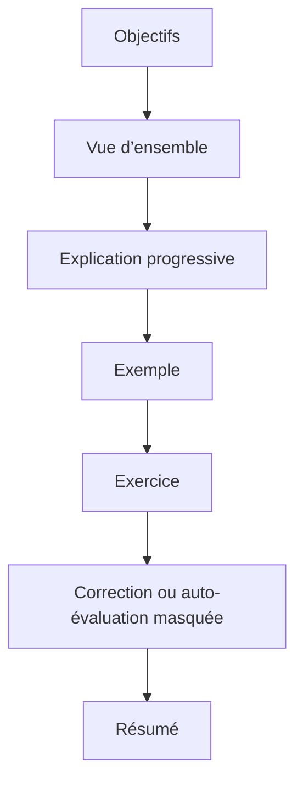

# 🌸 GUIDE PÉDAGOGIQUE ET CONVENTIONS MARKDOWN

## 🌺 STRUCTURE D’UN CHAPITRE



Chaque chapitre doit permettre au stagiaire de répondre à quatre questions :

1. Qu’est-ce que cette notion ?
2. À quoi sert-elle ?
3. Comment l’utiliser ?
4. Quelles erreurs faut-il éviter ?

## 🌺 ALERTES

```markdown
> [!NOTE]
> Information de contexte.

> [!TIP]
> Conseil pratique.

> [!IMPORTANT]
> Règle à retenir.

> [!WARNING]
> Risque fréquent.

> [!CAUTION]
> Risque de corruption, d’arrêt ou d’effet difficilement réversible.
```

## 🌺 CONTENU MASQUÉ

```html
<details>
<summary>Afficher la correction</summary>

Contenu Markdown, tableaux et blocs de code.

</details>
```

> [!IMPORTANT]
> Une ligne vide doit être conservée après `<summary>` pour que les blocs Markdown internes soient correctement interprétés par GitHub.

## 🌺 SCHÉMAS MERMAID

Les diagrammes servent à représenter :

- un enchaînement de traitement avec `flowchart` ;
- des interactions avec `sequenceDiagram` ;
- des états avec `stateDiagram-v2` ;
- des relations objet avec `classDiagram`.

<details>
<summary>Afficher la checklist de rédaction</summary>

- [ ] Un titre unique de niveau 1.
- [ ] Des objectifs observables.
- [ ] Au moins un diagramme Mermaid.
- [ ] Au moins une alerte pertinente.
- [ ] Au moins un bloc masqué.
- [ ] Les images existantes restent liées par un chemin relatif valide.
- [ ] Les exemples indiquent leur langage dans les blocs de code lorsque possible.
- [ ] Le résumé ne contient que les règles essentielles.

</details>
