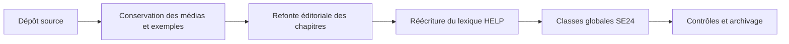

# 🌸 RAPPORT DE CONTRÔLE DE LA REFONTE

## 🌺 PÉRIMÈTRE

La refonte conserve l’arborescence pédagogique et les ressources existantes. Elle ajoute une structure uniforme, des diagrammes Mermaid, des alertes GitHub, des contenus masqués et des sommaires de cours.

## 🌺 RÉSULTATS

| 🍧 Contrôle | 🍧 Résultat |
|---|---:|
| Fichiers Markdown | **325** |
| Sommaires de cours | **40** |
| Fiches du lexique entièrement réécrites | **27** |
| Chapitres Classes réécrits pour `SE24` | **14** |
| Médias conservés | **977** |
| Fichiers non Markdown d’origine conservés à l’identique | **1020 / 1020** |
| Fichiers contenant Mermaid | **325 / 325** |
| Fichiers contenant une alerte Markdown | **325 / 325** |
| Fichiers contenant un spoiler | **325 / 325** |
| Liens Markdown analysés | **374** |
| Références d’images analysées | **383** |
| Liens locaux introuvables | **0** |
| Références d’images introuvables | **0** |
| Blocs de code déséquilibrés | **0** |
| Blocs `
` déséquilibrés | **0** |
| Spoilers sans ligne vide après `
` | **0** |
| Titres ne respectant pas les icônes demandées | **0** |
| Mentions de classes locales dans le module Classes | **0** |
| Dossiers `.git` présents dans le livrable | **0** |

> [!IMPORTANT]
> Le module Classes est exclusivement orienté vers les classes globales créées et maintenues avec la transaction `SE24`.

> [!WARNING]
> Les exemples ABAP, SAP Gateway/OData et SAPUI5 n’ont pas été compilés ou exécutés sur un système SAP réel. Les contrôles automatisés valident la structure documentaire, l’encodage, les liens locaux et les conventions demandées. Ils ne remplacent pas un test dans la version SAP cible.

> [!NOTE]
> Les blocs Mermaid ont été détectés et contrôlés structurellement. Leur rendu graphique dépend du moteur Markdown/Mermaid utilisé par la plateforme de consultation.

## 🌺 ANOMALIES

🍧 Afficher le résultat détaillé

- Aucune anomalie structurelle détectée par les contrôles automatisés.

## 🌺 RÉSUMÉ

> - Tous les fichiers Markdown possèdent au moins un diagramme Mermaid, une alerte et un bloc masqué.
> - Les médias et fichiers techniques du dépôt source sont conservés à l’identique.
> - Aucun lien local ou lien d’image analysé n’est cassé.
> - Le dépôt ne contient pas l’historique Git du dépôt source.
