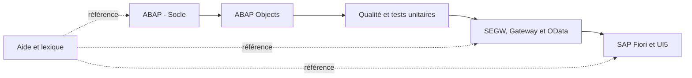

# 🌸 PARCOURS DE FORMATION TECHNIQUE SAP

## 🌺 OBJECTIF DU DÉPÔT

Ce dépôt regroupe les supports de formation consacrés au développement ABAP, à la qualité, aux services SAP Gateway/OData et au développement SAP Fiori/UI5.

> [!IMPORTANT]
> Les chapitres suivent une progression. Les exemples doivent être reproduits dans un système de formation avant d’être adaptés à un environnement projet.

## 🌺 PARCOURS GLOBAL

## 🌺 MODULES

| Module                               | Finalité                                                       |
| ------------------------------------ | -------------------------------------------------------------- |
| `000 - HELP`                         | Transactions, raccourcis, lexique et repères techniques        |
| `001 - DEVELOPPEMENT ABAP SOCLE`     | Bases du langage, DDIC, tables internes, SQL et rapports       |
| `002 - DEVELOPPEMENT ABAP OBJECT`    | Modules fonction et classes globales orientées `SE24`          |
| `003 - QUALITY & UNIT TESTS`         | Contrôles qualité, traces et ABAP Unit                         |
| `004 - SEGW GATEWAY & ODATA BACKEND` | Modélisation et implémentation de services OData classiques    |
| `005 - FIORI`                        | Création, architecture et consommation de services dans SAPUI5 |

## 🌺 CONVENTIONS DE LECTURE

- `# 🌸` : titre du chapitre ;
- `## 🌺` : section principale ;
- `### 🍧` : sous-section ;
- `#### 💮` : détail technique ;
- alertes GitHub : information, conseil, point critique ou danger ;
- blocs `
` : correction, approfondissement ou auto-évaluation masquée ;
- diagrammes Mermaid : représentation visuelle du processus ou de l’architecture.

Afficher la méthode de travail recommandée

1. Lire les objectifs.
2. Parcourir le schéma Mermaid.
3. Reproduire l’exemple.
4. Réaliser l’exercice sans ouvrir la correction.
5. Vérifier les points de l’auto-évaluation.

## 🌺 RÉSUMÉ

> - Le parcours va du socle ABAP au développement Fiori complet.
> - Le dossier `HELP` sert de référence transversale.
> - Les exercices doivent être exécutés, pas seulement lus.
