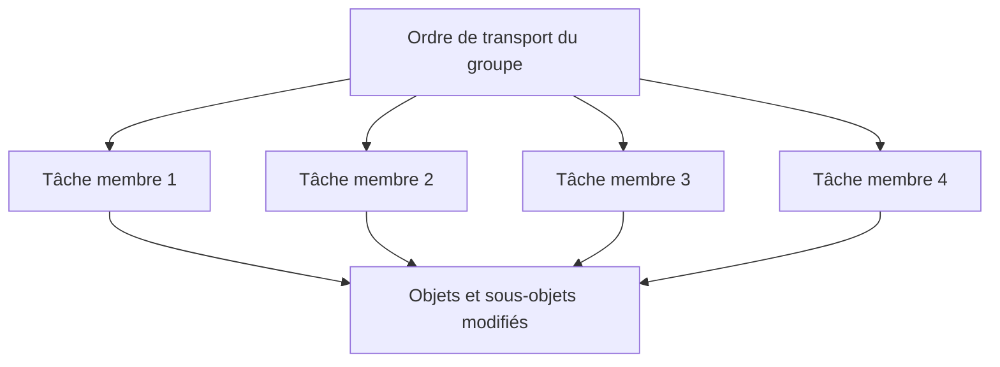

# 🌸 INTÉGRATION COLLECTIVE DANS UN ORDRE DE TRANSPORT

## 🌺 OBJECTIFS

- [ ] Organiser plusieurs stagiaires dans un même ordre de transport.
- [ ] Attribuer un propriétaire à chaque objet.
- [ ] Éviter les modifications concurrentes et les dépendances cassées.
- [ ] Contrôler l'ordre avant la remise.

## 🌺 STRUCTURE CTS

Un ordre de transport peut contenir plusieurs tâches, généralement une par utilisateur. Les tâches regroupent les modifications individuelles ; l'ordre regroupe le résultat collectif.

## 🌺 RÉPARTITION DES OBJETS

Avant de développer, écrire une table de responsabilité :

| Objet | Propriétaire | Dépendances | Validateur |
| --- | --- | --- | --- |
| programme exécutable | membre A | classe globale | membre D |
| classe globale | membre B | types, table, messages | membre A |
| table transparente | membre C | éléments DDIC | membre B |
| classe de messages | membre D | textes validés | membre C |

Un seul propriétaire modifie un objet à un instant donné. Travailler sur des méthodes différentes d'une même classe reste risqué : la classe peut être verrouillée et son activation concerne l'ensemble de l'objet.

## 🌺 RÈGLES DE TRAVAIL

1. Créer un ordre commun avec une tâche par membre.
2. Rattacher tous les objets au même package transportable.
3. Nommer un intégrateur responsable de l'état exécutable.
4. Annoncer avant toute modification d'un objet possédé par un autre membre.
5. Activer les dépendances avant leurs consommateurs : DDIC, table, messages, classe, programme.
6. Ne pas libérer une tâche pendant le développement sans accord de l'intégrateur.
7. Effectuer les tests finaux avec tous les objets actifs.

## 🌺 POINTS D'INTÉGRATION

Prévoir au minimum :

- validation des types et signatures avant développement parallèle ;
- première intégration quand le squelette compile ;
- intégration fonctionnelle du flux principal ;
- gel des signatures avant la campagne de tests ;
- gel du code avant la préparation de la démonstration.

## 🌺 CONTRÔLE DE L'ORDRE

Avant remise :

- afficher l'ordre et toutes ses tâches dans `SE09` ou `SE10` ;
- vérifier package, programme, classe, table, éléments DDIC et classe de messages ;
- rechercher les objets restés dans un autre ordre ou dans `$TMP` ;
- activer tous les objets ;
- exécuter contrôle étendu et Code Inspector ;
- lancer le scénario complet avec un autre membre ;
- libérer d'abord les tâches, puis l'ordre, uniquement si la procédure d'évaluation le demande.

## 🌺 INCIDENTS FRÉQUENTS

| Incident | Prévention |
| --- | --- |
| objet verrouillé par un autre membre | propriétaire unique et communication avant modification |
| signature changée tardivement | gel des interfaces avant intégration |
| objet absent de l'ordre | revue de la liste d'objets |
| activation impossible | respecter l'ordre des dépendances |
| code fonctionnel uniquement chez l'auteur | test croisé par un autre membre |
| tâche libérée trop tôt | décision centralisée par l'intégrateur |

## 🌺 SOURCE

SAP SE, *Transport Organizer — Concept*, ABAP Platform 2025 FPS01, février 2026 : https://help.sap.com/docs/PRODUCT_ID/4a368c163b08418890a406d413933ba7/5738dd924eb711d182bf0000e829fbfe.html

## 🌺 RÉSUMÉ

> - L'ordre représente le livrable collectif ; les tâches tracent les contributions individuelles.
> - Le partage du travail ne justifie pas la modification simultanée du même objet.
> - L'intégrateur contrôle dépendances, activation, tests et contenu de l'ordre.
