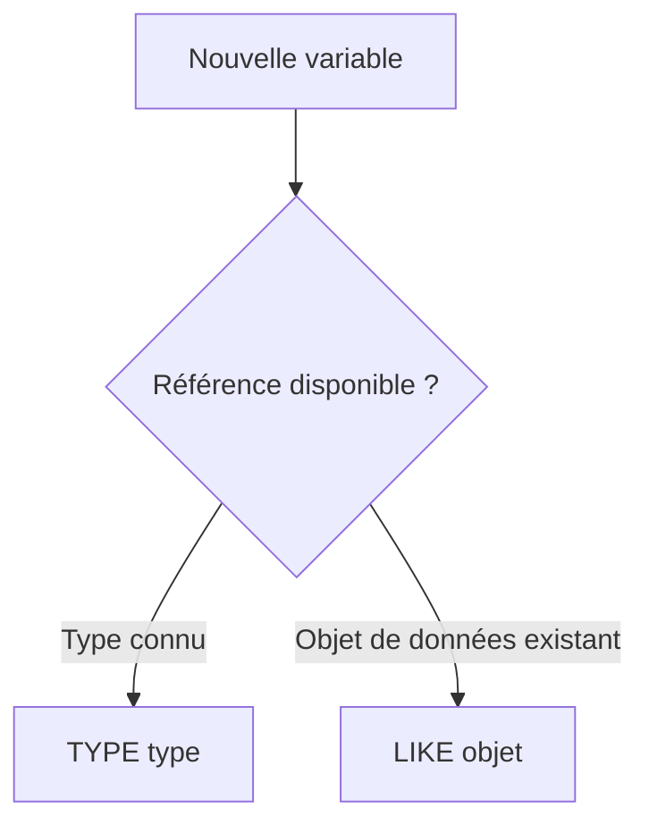

# 🌸 VARIABLES ABAP

## 🌺 OBJECTIFS

- [ ] Expliquer la différence entre une donnée, un type et une variable.
- [ ] Déclarer une variable avec `DATA`, `TYPE` et `LIKE`.
- [ ] Choisir un type élémentaire adapté à la donnée manipulée.
- [ ] Utiliser une déclaration explicite ou une déclaration inline selon le contexte.
- [ ] Reconnaître les conversions et troncatures à risque.

## 🌺 VUE D’ENSEMBLE


## 🌺 DÉFINITION

Une **variable** est un objet de données nommé dont la valeur peut changer pendant l’exécution du programme. Son **type** détermine notamment :

- la représentation en mémoire ;
- les valeurs autorisées ;
- les opérations possibles ;
- les règles de conversion.

> [!TIP]
> Une variable peut être comparée à une boîte étiquetée. Le type définit la forme et la capacité de la boîte ; la valeur correspond à son contenu actuel.

## 🌺 DÉCLARATION EXPLICITE

```abap
DATA lv_name  TYPE string.
DATA lv_count TYPE i.
DATA lv_total TYPE p LENGTH 8 DECIMALS 2.
```

La forme générale est :

```abap
DATA <nom> TYPE <type>.
```

Plusieurs déclarations peuvent être regroupées :

```abap
DATA:
  lv_name  TYPE string,
  lv_count TYPE i,
  lv_total TYPE p LENGTH 8 DECIMALS 2.
```

> [!NOTE]
> Le regroupement avec `DATA:` est valide. Dans un développement moderne, la lisibilité prime : regrouper les déclarations liées, sans créer un bloc massif difficile à parcourir.

## 🌺 `TYPE` ET `LIKE`

### 🍧 `TYPE`

`TYPE` référence un type ABAP prédéfini, un type local ou un type global du dictionnaire ABAP.

```abap
DATA lv_text TYPE string.
DATA lv_date TYPE sy-datum.
```

### 🍧 `LIKE`

`LIKE` reprend le type lié à un objet de données visible.

```abap
DATA lv_source TYPE c LENGTH 10.
DATA lv_copy   LIKE lv_source.
```



> [!IMPORTANT]
> `TYPE` exprime directement le contrat de type et reste généralement plus clair. `LIKE` est utile lorsque la nouvelle variable doit suivre exactement le type d’un objet existant.

## 🌺 DÉCLARATION INLINE

Lorsque la position permet d’inférer le type, ABAP peut déclarer la variable directement à l’endroit où elle reçoit sa valeur.

```abap
DATA(lv_message) = `Bonjour`.

SELECT SINGLE carrname
  FROM scarr
  WHERE carrid = 'LH'
  INTO @DATA(lv_carrier_name).
```

> [!TIP]
> Une déclaration inline réduit la distance entre la déclaration et l’utilisation. Une déclaration explicite reste préférable lorsque le type doit être visible immédiatement ou partagé par plusieurs traitements éloignés.

## 🌺 TYPES ÉLÉMENTAIRES COURANTS

### 🍧 Types texte

| 🍧 Type  | 🍧 Nature                        | 🍧 Exemple                                 |
| -------- | -------------------------------- | ------------------------------------------ |
| `c`      | Texte de longueur fixe           | Code, indicateur, libellé court            |
| `n`      | Texte numérique de longueur fixe | Identifiant composé uniquement de chiffres |
| `string` | Texte de longueur variable       | Message, description longue                |

```abap
DATA lv_code    TYPE c LENGTH 4.
DATA lv_year    TYPE n LENGTH 4.
DATA lv_message TYPE string.

lv_code    = 'A100'.
lv_year    = '2026'.
lv_message = `Traitement terminé`.
```

> [!WARNING]
> Le type `n` est un type caractère, pas un type destiné aux calculs. Utiliser `i`, `p` ou un autre type numérique pour effectuer une opération arithmétique.

### 🍧 Entiers et nombres décimaux

| 🍧 Type      | 🍧 Nature                                          | 🍧 Usage courant                                                  |
| ------------ | -------------------------------------------------- | ----------------------------------------------------------------- |
| `i`          | Entier signé                                       | Compteur, index, quantité entière                                 |
| `int8`       | Entier signé de grande capacité                    | Valeurs entières dépassant la capacité de `i`                     |
| `p`          | Nombre décimal compact                             | Montants et quantités avec décimales définies                     |
| `decfloat16` | Nombre décimal flottant, 16 chiffres significatifs | Calculs décimaux nécessitant une plage dynamique                  |
| `decfloat34` | Nombre décimal flottant, 34 chiffres significatifs | Calculs décimaux de grande précision                              |
| `f`          | Nombre flottant binaire                            | Calculs scientifiques où une approximation binaire est acceptable |

```abap
DATA lv_counter TYPE i.
DATA lv_amount  TYPE p LENGTH 8 DECIMALS 2.
DATA lv_ratio   TYPE decfloat34.

lv_counter = 10.
lv_amount  = '1234.56'.
lv_ratio   = '0.3333333333333333333333333333333333'.
```

> [!IMPORTANT]
> Le type `f` est un flottant **binaire**, pas un décimal à virgule fixe. SAP indique que `f` est largement remplacé par `decfloat16` et `decfloat34` pour les calculs en virgule flottante décimale.

### 🍧 Date et heure

| 🍧 Type | 🍧 Format interne | 🍧 Valeur système associée |
| ------- | ----------------- | -------------------------- |
| `d`     | `AAAAMMJJ`        | `sy-datum`                 |
| `t`     | `HHMMSS`          | `sy-uzeit`                 |

```abap
DATA lv_date TYPE d.
DATA lv_time TYPE t.

lv_date = sy-datum.
lv_time = sy-uzeit.
```

> [!WARNING]
> Une valeur de type `d` ou `t` possède un format technique, mais cela ne garantit pas automatiquement qu’une chaîne affectée représente une date ou une heure métier valide. Utiliser les contrôles et API adaptés au besoin.

### 🍧 Indicateurs booléens

ABAP utilise couramment le type global `abap_bool` avec les constantes `abap_true` et `abap_false`.

```abap
DATA lv_is_valid TYPE abap_bool VALUE abap_false.

IF lv_count > 0.
  lv_is_valid = abap_true.
ENDIF.
```

> [!NOTE]
> `abap_bool` reste techniquement un type caractère. Tester explicitement la valeur attendue au lieu de supposer l’existence d’un type booléen natif équivalent à celui d’autres langages.

## 🌺 LONGUEUR, TRONCATURE ET CONVERSION

```abap
DATA lv_short TYPE c LENGTH 3.

lv_short = 'ABAP'. "Le contenu ne peut pas tenir intégralement
```

Une affectation entre types différents peut déclencher :

- une conversion implicite ;
- une troncature ;
- un arrondi ;
- une exception d’exécution si la valeur ne peut pas être convertie.

> [!CAUTION]
> Ne pas choisir un type uniquement parce que l’exemple actuel « tient ». La longueur, le nombre de décimales et la plage doivent couvrir les données réelles du processus métier.

## 🌺 NOMMAGE ET PORTÉE

Les préfixes comme `lv_`, `ls_`, `lt_`, `iv_` ou `rv_` sont des conventions de projet, pas des mots-clés ABAP.

| 🍧 Exemple       | 🍧 Signification conventionnelle  |
| ---------------- | --------------------------------- |
| `lv_total`       | Variable locale élémentaire       |
| `ls_customer`    | Structure locale                  |
| `lt_customers`   | Table interne locale              |
| `iv_customer_id` | Paramètre d’import d’une méthode  |
| `rv_result`      | Paramètre de retour d’une méthode |

> [!IMPORTANT]
> Appliquer la convention définie par le projet. Un nom doit surtout décrire clairement le rôle métier de la donnée.

## 🌺 BONNES PRATIQUES

| 🍧 Pratique                                                                   | 🍧 Raison                                                                            |
| ----------------------------------------------------------------------------- | ------------------------------------------------------------------------------------ |
| Choisir le type selon la sémantique métier                                    | Évite les calculs ou comparaisons incohérents.                                       |
| Déclarer près de la première utilisation                                      | Réduit l’effort de lecture.                                                          |
| Utiliser les types DDIC lorsque la donnée correspond à un champ métier global | Réutilise longueur, domaine et documentation centralisés.                            |
| Initialiser uniquement lorsqu’une valeur par défaut métier est nécessaire     | Les objets de données ABAP possèdent déjà une valeur initiale définie par leur type. |
| Éviter les conversions implicites ambiguës                                    | Rend les erreurs de format plus visibles.                                            |
| Vérifier longueurs et décimales                                               | Prévient troncatures et arrondis involontaires.                                      |

## 🌺 EXERCICE

Déclarer les données suivantes :

1. un matricule de huit chiffres qui ne sera jamais additionné ;
2. une quantité entière ;
3. un montant avec deux décimales ;
4. une description de longueur variable ;
5. un indicateur vrai/faux.

<details>
<summary>💮 Afficher une correction possible</summary>

```abap
DATA lv_employee_id TYPE n LENGTH 8.
DATA lv_quantity    TYPE i.
DATA lv_amount      TYPE p LENGTH 8 DECIMALS 2.
DATA lv_description TYPE string.
DATA lv_is_active   TYPE abap_bool VALUE abap_false.
```

Le type exact peut également provenir d’éléments de données du dictionnaire ABAP lorsque ces données correspondent à des concepts métier déjà modélisés.

</details>

## 🌺 RÉSUMÉ

> - Une variable est un objet de données modifiable associé à un type.
> - `TYPE` référence un type ; `LIKE` reprend le type d’un objet existant.
> - `n` contient du texte numérique ; `i`, `p`, `decfloat*` et `f` sont numériques.
> - `f` est un flottant binaire ; `decfloat16` et `decfloat34` sont des flottants décimaux.
> - Les déclarations inline rapprochent la déclaration de l’utilisation.
> - Longueur, décimales et conversions doivent être choisies selon les données réelles.

## 🌺 SOURCES

- [SAP Help Portal — Built-In ABAP Types](https://help.sap.com/docs/abap-cloud/abap-concepts/built-in-abap-types)
- [SAP Help Portal — Declaration of Variables](https://help.sap.com/docs/ABAP_PLATFORM_NEW/8132142fd1a144a59303663a03a7c2d4/8dd8d22f891c4be9a640525c7b232fc6.html)
- [SAP Help Portal — Declarations](https://help.sap.com/docs/ABAP_PLATFORM_NEW/7bfe8cdcfbb040dcb6702dada8c3e2f0/bd36593cb02f438d86096fd251ba0bd6.html)
- [SAP Help Portal — The Statements TYPES and DATA](https://help.sap.com/saphelp_em900/helpdata/en/fc/eb2ff3358411d1829f0000e829fbfe/content.htm)
