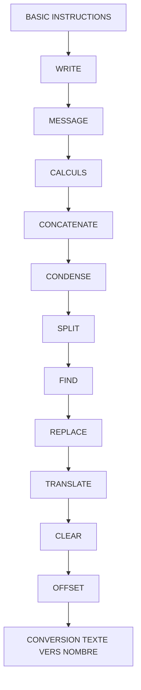

# 🌸 SOMMAIRE — BASIC INSTRUCTIONS

## 🌺 OBJECTIFS DU COURS

- [ ] Comprendre la progression générale du cours.
- [ ] Identifier l’ordre conseillé des chapitres.
- [ ] Retrouver rapidement une notion précise.

## 🌺 PARCOURS

> [!IMPORTANT]
> Suivre les chapitres dans l’ordre numérique, sauf révision ciblée d’une notion déjà étudiée.

## 🌺 CHAPITRES

- [WRITE](<./01 - 🍧 WRITE.md>)
- [MESSAGE](<./02 - 🍧 MESSAGE.md>)
- [CALCULS](<./03 - 🍧 CALCULS.md>)
- [CONCATENATE](<./04 - 🍧 CONCATENATE.md>)
- [CONDENSE](<./05 - 🍧 CONDENSE.md>)
- [SPLIT](<./06 - 🍧 SPLIT.md>)
- [FIND](<./07 - 🍧 FIND.md>)
- [REPLACE](<./08 - 🍧 REPLACE.md>)
- [TRANSLATE](<./09 - 🍧 TRANSLATE.md>)
- [CLEAR](<./10 - 🍧 CLEAR.md>)
- [OFFSET](<./11 - 🍧 OFFSET.md>)
- [CONVERSION TEXTE VERS NOMBRE](<./14 - 🍧 CONVERSION TEXTE VERS NOMBRE.md>)

Afficher la méthode de travail

1. Lire les objectifs du chapitre.
2. Étudier le schéma Mermaid.
3. Reproduire les exemples.
4. Réaliser l’exercice sans consulter la correction.
5. Valider l’auto-évaluation.

## 🌺 RÉSUMÉ

> - Ce sommaire représente le parcours du cours **BASIC INSTRUCTIONS**.
> - Les liens pointent vers les chapitres conservés dans leur emplacement d’origine.
