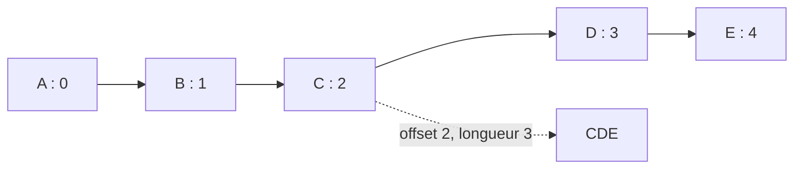

# 🌸 ACCÈS PAR OFFSET ET LONGUEUR

## 🌺 OBJECTIFS

- [ ] Extraire une sous-partie d’un champ caractère avec un offset et une longueur.
- [ ] Comprendre que l’offset commence à zéro.
- [ ] Utiliser une longueur statique ou dynamique.
- [ ] Éviter un accès au-delà des limites du champ.

## 🌺 VUE D’ENSEMBLE


## 🌺 DÉFINITION

ABAP permet d’adresser une partie d’un objet caractère avec la forme suivante :

```abap
<objet>+<offset>(<longueur>)
```

- `offset` indique la position de départ ; la première position vaut `0` ;
- `longueur` indique le nombre de caractères à traiter ;
- l’expression obtenue peut être lue ou utilisée comme cible d’une affectation lorsque le contexte le permet.

> [!IMPORTANT]
> Les crochets utilisés dans certaines documentations, comme `f[+off][(len)]`, indiquent des parties optionnelles de la syntaxe. Ils ne doivent pas être saisis dans le programme.

## 🌺 EXTRAIRE UNE SOUS-CHAÎNE

```abap
DATA lv_text   TYPE c LENGTH 10 VALUE 'ABCDEFGHIJ'.
DATA lv_part   TYPE c LENGTH 3.

lv_part = lv_text+2(3). "CDE
```



## 🌺 RÉORGANISER UNE DATE TECHNIQUE

```abap
DATA lv_date_internal TYPE d VALUE '20260730'.
DATA lv_date_display  TYPE c LENGTH 10.

lv_date_display = |{ lv_date_internal+6(2) }/{ lv_date_internal+4(2) }/{ lv_date_internal(4) }|.

WRITE lv_date_display. "30/07/2026
```

Dans `lv_date_internal(4)`, l’absence d’offset signifie que la lecture commence à la position zéro.

> [!TIP]
> Pour formater une date à destination de l’utilisateur, les options de formatage ABAP et les API de conversion sont souvent préférables. L’offset reste utile pour comprendre et manipuler un format technique connu et stable.

## 🌺 OFFSET OU LONGUEUR DYNAMIQUE

```abap
DATA lv_text   TYPE string VALUE `ABCDEFGHIJ`.
DATA lv_offset TYPE i VALUE 2.
DATA lv_length TYPE i VALUE 4.
DATA lv_part   TYPE string.

lv_part = lv_text+lv_offset(lv_length). "CDEF
```

> [!WARNING]
> La compatibilité exacte dépend du type de l’objet et de la position syntaxique. Les accès par sous-champ concernent principalement les objets caractère ou octet et certaines structures plates.

## 🌺 RISQUE DE DÉPASSEMENT

```abap
DATA lv_code TYPE c LENGTH 4 VALUE 'ABCD'.

"Accès invalide : 3 + 2 dépasse la longueur 4
"DATA(lv_invalid) = lv_code+3(2).
```

Un offset ou une longueur hors limites peut provoquer une erreur de syntaxe ou une exception à l’exécution selon que les valeurs sont statiques ou dynamiques.

> [!CAUTION]
> Contrôler la longueur avant un accès dynamique. Ne jamais supposer qu’une donnée externe possède toujours le format attendu.

```abap
IF strlen( lv_text ) >= lv_offset + lv_length.
  lv_part = lv_text+lv_offset(lv_length).
ENDIF.
```

## 🌺 EXERCICE

À partir de la valeur `FR-75001-PARIS`, extraire :

1. le code pays ;
2. le code postal ;
3. la ville.

<details>
<summary>💮 Afficher la correction</summary>

```abap
DATA lv_value       TYPE c LENGTH 14 VALUE 'FR-75001-PARIS'.
DATA lv_country     TYPE c LENGTH 2.
DATA lv_postal_code TYPE c LENGTH 5.
DATA lv_city        TYPE c LENGTH 5.

lv_country     = lv_value(2).
lv_postal_code = lv_value+3(5).
lv_city        = lv_value+9(5).
```

Cette solution repose sur un format fixe. Pour une chaîne dont les segments ont une longueur variable, utiliser plutôt `SPLIT`.

</details>

## 🌺 RÉSUMÉ

> - La syntaxe réelle est `<objet>+<offset>(<longueur>)`.
> - La première position possède l’offset `0`.
> - Un accès hors limites peut provoquer une erreur.
> - `SPLIT`, les templates de chaîne ou les API de conversion sont souvent plus adaptés aux formats variables.

## 🌺 SOURCES

- [SAP Help Portal — Processing Subfields](https://help.sap.com/saphelp_gbt10/helpdata/en/fc/eb341a358411d1829f0000e829fbfe/content.htm)
- [SAP Help Portal — Basic Forms of the ASSIGN Statement](https://help.sap.com/docs/SAP_NETWEAVER_700/10a002cd6c531014b5e1cb16d2455072/fceb38d5358411d1829f0000e829fbfe.html)
