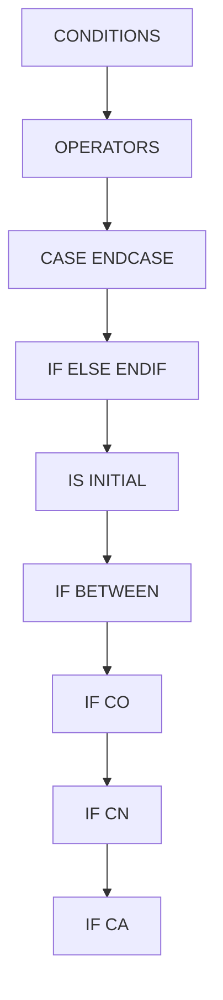

# 🌸 SOMMAIRE — CONDITIONS

## 🌺 OBJECTIFS DU COURS

- [ ] Comprendre la progression générale du cours.
- [ ] Identifier l’ordre conseillé des chapitres.
- [ ] Retrouver rapidement une notion précise.

## 🌺 PARCOURS

> [!IMPORTANT]
> Suivre les chapitres dans l’ordre numérique, sauf révision ciblée d’une notion déjà étudiée.

## 🌺 CHAPITRES

- [OPERATORS](<./01 - 🍧 OPERATORS.md>)
- [CASE ENDCASE](<./02 - 🍧 CASE ENDCASE.md>)
- [IF ELSE ENDIF](<./03 - 🍧 IF ELSE ENDIF.md>)
- [IS INITIAL](<./04 - 🍧 IS INITIAL.md>)
- [IF BETWEEN](<./05 - 🍧 IF BETWEEN.md>)
- [IF CO](<./06 - 🍧 IF CO.md>)
- [IF CN](<./07 - 🍧 IF CN.md>)
- [IF CA](<./08 - 🍧 IF CA.md>)
- [IF CS](<./09 - 🍧 IF CS.md>)
- [IF NS](<./10 - 🍧 IF NS.md>)
- [IF CP](<./11 - 🍧 IF CP.md>)
- [IF NP](<./12 - 🍧 IF NP.md>)

Afficher la méthode de travail

1. Lire les objectifs du chapitre.
2. Étudier le schéma Mermaid.
3. Reproduire les exemples.
4. Réaliser l’exercice sans consulter la correction.
5. Valider l’auto-évaluation.

## 🌺 RÉSUMÉ

> - Ce sommaire représente le parcours du cours **CONDITIONS**.
> - Les liens pointent vers les chapitres conservés dans leur emplacement d’origine.
