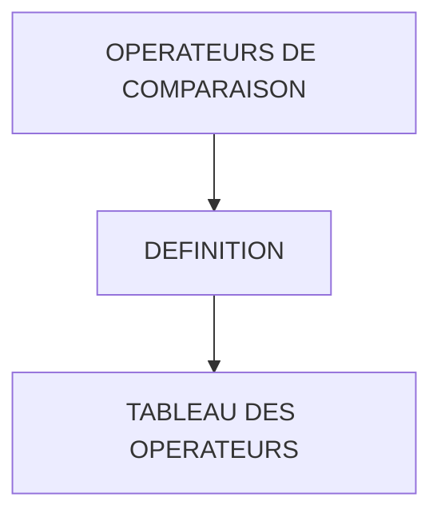

# 🌸 OPERATEURS DE COMPARAISON

## 🌺 OBJECTIFS

- [ ] Comprendre le rôle des opérateurs de comparaison en ABAP
- [ ] Savoir appliquer les opérateurs pour tester l’égalité, la différence et les relations d’ordre
- [ ] Savoir utiliser les mots-clés (`EQ`, `GT`, `LE`, etc.) dans les instructions ABAP

## 🌺 VUE D'ENSEMBLE

## 🌺 DÉFINITION

> Les opérateurs de comparaison permettent de tester des conditions entre deux valeurs. Ils peuvent être utilisés pour tous les types de données : numériques, alphanumériques ou texte.

> [!TIP]
> Ces opérateurs servent principalement dans les instructions `IF`, `WHILE` ou toute condition logique. Ils renvoient vrai ou faux selon le résultat de la comparaison.

## 🌺 TABLEAU DES OPERATEURS

| 🍧 OPERATION            | 🍧 SIGNE | 🍧 KEYWORD | 🍧 SIGNIFICATION |
| ----------------------- | -------- | ---------- | ---------------- |
| Egal                    | `=`      | `EQ`       | EQual            |
| Strictement supérieur à | `>`      | `GT`       | Greater Than     |
| Supérieur ou égal à     | `>=`     | `GE`       | Greater or Equal |
| Strictement inférieur à | `<`      | `LT`       | Lower Than       |
| Inférieur ou égal à     | `<=`     | `LE`       | Lower or Equal   |
| Différent               | `<>`     | `NE`       | Not Equal        |

> [!TIP]
> - `=` ou `EQ` vérifie l’égalité stricte
> - `>` ou `GT` et `<` ou `LT` comparent les valeurs numériques ou alphabétiques
> - `>=` ou `GE` et `<=` ou `LE` incluent l’égalité dans la comparaison
> - `<>` ou `NE` vérifie que deux valeurs sont différentes

> [!TIP]
> Comme mesurer et comparer deux objets pour savoir lequel est plus grand, plus petit, identique ou différent.

> [!IMPORTANT]
> Préférer les mots-clés (`EQ`, `NE`, `GT`, etc.) dans les instructions ABAP pour une meilleure lisibilité et clarté du code, surtout lors de la lecture par d’autres développeurs.

## 🌺 RÉSUMÉ

> - Savoir utiliser **définition** dans le contexte présenté.
> - Savoir utiliser **tableau des operateurs** dans le contexte présenté.

🍧 Afficher l’auto-évaluation

- [ ] Je peux définir **OPERATEURS DE COMPARAISON** avec mes propres mots.
- [ ] Je peux expliquer **definition** sans relire le chapitre.
- [ ] Je peux appliquer ou illustrer **tableau des operateurs** dans un exemple simple.
- [ ] Je peux identifier au moins une erreur fréquente ou une limite liée à cette notion.

