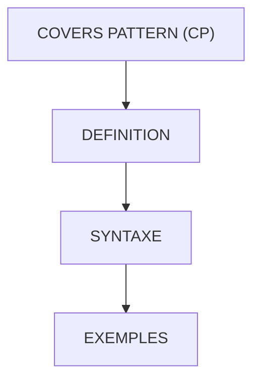

# 🌸 COVERS PATTERN (CP)

## 🌺 OBJECTIFS

- [ ] Comprendre l'opérateur `CP` (Covers Pattern) et son usage
- [ ] Vérifier si une chaîne correspond à un `PATTERN` avec caracteres generiques (\* et +)
- [ ] Utiliser `IF` ... `CP` ... `ENDIF` pour des comparaisons flexibles
- [ ] Identifier les situations pratiques : noms de fichiers, extensions, formats textuels
- [ ] Comprendre le comportement par défaut sur la casse et le rôle du caractère d'échappement `#`

## 🌺 VUE D'ENSEMBLE

## 🌺 DÉFINITION

> L'opérateur `CP` (Covers Pattern) permet de tester si une chaîne (oper1) correspond à un PATTERN (oper2) qui peut contenir des caracteres generiques (\* et +).

> [!TIP]
> Comme un filtre de recherche dans un explorateur de fichiers : "\*.png" renvoie tous les fichiers terminant par ".png".

> [!CAUTION]
> `CP` n'est pas sensible à la casse par défaut. Le caractère `#` échappe le caractère suivant et permet notamment d'imposer sa casse ou de traiter littéralement `*`, `+` ou `#`.

## 🌺 SYNTAXE

    IF oper1 CP oper2.
      [statement_block]
    ENDIF.

- oper1 → CHAINE à tester
- oper2 → MODELE contenant éventuellement :
- `*` → remplace une suite de caractères, éventuellement vide
- `+` → remplace exactement un caractère

> [!TIP]
> Utiliser `CP` pour valider des formats de fichiers, codes produits ou motifs textuels particuliers.

## 🌺 EXEMPLES

    WRITE:/ '     - IF COVERS PATTERN...'.

    CONSTANTS: lc_oper1 TYPE CHAR9 VALUE 'image.png',
               lc_oper2 TYPE CHAR5 VALUE '*.png'.

    IF lc_oper1 CP lc_oper2.
      WRITE:/ 'Le fichier lu est au format PNG'.
    ELSE.
      WRITE:/ 'Le fichier lu n''est pas au format PNG'.
    ENDIF.

Explication :

- lc_oper1 = "image.png"
- lc_oper2 = "\*.png"
- Le "\*" signifie "peu importe ce qu'il y a avant .png".
- Résultat : "Le fichier lu est au format PNG"

### 🍧 AUTRES EXEMPLES

- 'abc123' CP 'abc\*' → VRAI (commence par "abc")
- 'abc123' CP '\*123' → VRAI (finit par "123")
- 'abc123' CP 'a+\*' → VRAI (premier caractere "a", suivi d'au moins un autre)
- 'hello' CP '\*o' → VRAI (se termine par "o")
- 'hello' CP '\*x' → FAUX (ne finit pas par "x")

> [!NOTE]
> `CP` compare des opérandes de type caractère. Les conversions implicites peuvent masquer une erreur de typage ; utiliser des données explicitement caractère pour un exemple pédagogique.

## 🌺 RÉSUMÉ

> - `CP` = `COVERS PATTERN` → teste la correspondance d'une `CHAINE` avec un `PATTERN`.
> - Caractères génériques : `*` pour une suite de caractères, `+` pour un caractère
> - Comparaison insensible à la casse par défaut ; `#` sert de caractère d'échappement
> - Très utile pour filtrer fichiers, extensions ou formats textuels
>   [!TIP]
>   Comme un filtre de recherche avancé : on peut dire "montre-moi tous les fichiers commençant par 'abc' et finissant par '.txt'".

🍧 Afficher l’auto-évaluation

- [ ] Je peux définir **COVERS PATTERN (CP)** avec mes propres mots.
- [ ] Je peux expliquer **definition** sans relire le chapitre.
- [ ] Je peux appliquer ou illustrer **syntaxe** dans un exemple simple.
- [ ] Je peux identifier au moins une erreur fréquente ou une limite liée à cette notion.

