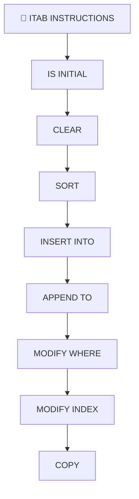

# 🌸 SOMMAIRE — 🧩 ITAB INSTRUCTIONS

## 🌺 OBJECTIFS DU COURS

- [ ] Comprendre la progression générale du cours.
- [ ] Identifier l’ordre conseillé des chapitres.
- [ ] Retrouver rapidement une notion précise.

## 🌺 PARCOURS

> [!IMPORTANT]
> Suivre les chapitres dans l’ordre numérique, sauf révision ciblée d’une notion déjà étudiée.

## 🌺 CHAPITRES

- [IS INITIAL](<./01 - 🍧 IS INITIAL.md>)
- [CLEAR](<./02 - 🍧 CLEAR.md>)
- [SORT](<./03 - 🍧 SORT.md>)
- [INSERT INTO](<./04 - 🍧 INSERT INTO.md>)
- [APPEND TO](<./05 - 🍧 APPEND TO.md>)
- [MODIFY WHERE](<./06 - 🍧 MODIFY WHERE.md>)
- [MODIFY INDEX](<./07 - 🍧 MODIFY INDEX.md>)
- [COPY](<./08 - 🍧 COPY.md>)
- [MOVE-CORRESPONDING](<./09 - 🍧 MOVE-CORRESPONDING.md>)
- [DELETE](<./10 - 🍧 DELETE.md>)
- [DELETE ADJACENT DUPLICATES](<./11 - 🍧 DELETE ADJACENT DUPLICATES.md>)
- [READ](<./12 - 🍧 READ.md>)
- [BINARY SEARCH](<./13 - 🍧 BINARY SEARCH.md>)
- [LOOP](<./14 - 🍧 LOOP.md>)
- [LOOP AT GROUP BY](<./15 - 🍧 LOOP AT GROUP BY.md>)

Afficher la méthode de travail

1. Lire les objectifs du chapitre.
2. Étudier le schéma Mermaid.
3. Reproduire les exemples.
4. Réaliser l’exercice sans consulter la correction.
5. Valider l’auto-évaluation.

## 🌺 RÉSUMÉ

> - Ce sommaire représente le parcours du cours **🧩 ITAB INSTRUCTIONS**.
> - Les liens pointent vers les chapitres conservés dans leur emplacement d’origine.
