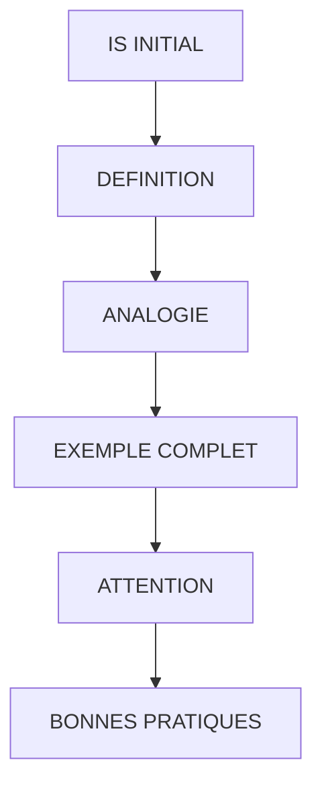

# 🌸 IS INITIAL

## 🌺 OBJECTIFS

- [ ] Vérifier si une table interne est vide ou non
- [ ] Comprendre l’usage des crochets `[]`
- [ ] Utiliser `IS INITIAL` ou `IS NOT INITIAL` pour tester le contenu d’une table interne
- [ ] Savoir que `IS INITIAL` fonctionne aussi avec des variables simples

## 🌺 VUE D'ENSEMBLE

## 🌺 DÉFINITION

    IF itab[] IS INITIAL.
      " La table est vide
    ENDIF.

    IF [NOT] itab[] IS [NOT] INITIAL.
      " La table contient au moins une ligne
    ENDIF.

> L’expression `IS INITIAL` vérifie si une donnée est vide ou non initialisée.
> Pour les tables internes, les crochets `[]` signifient qu’on évalue le contenu complet de la table.

> [!IMPORTANT]
>
> - `itab[] IS INITIAL` → la table ne contient aucune ligne
> - `itab[] IS NOT INITIAL` → la table contient au moins une ligne

## 🌺 ANALOGIE

Imagine une boîte :

- Si la boîte ne contient aucun objet, elle est _initiale_ (vide).
- Si elle contient au moins un objet, elle _n’est pas initiale_.

De la même façon :Z

- `itab[] IS INITIAL` → la boîte est vide.
- `NOT itab[] IS INITIAL` → la boîte contient quelque chose.

## 🌺 EXEMPLE COMPLET

    TYPES: BEGIN OF ty_citizen,
             country TYPE char3,
             name    TYPE char20,
             age     TYPE numc2,
           END OF ty_citizen.

    DATA: lt_citizen TYPE STANDARD TABLE OF ty_citizen,
          ls_citizen TYPE ty_citizen.

    " --- Vérification avant ajout ---
    IF lt_citizen[] IS INITIAL.
      WRITE: / 'La table est vide au départ.'.
    ENDIF.

    " --- Ajout d’un enregistrement ---
    ls_citizen-country = 'FR'.
    ls_citizen-name    = 'Thierry'.
    ls_citizen-age     = '24'.
    APPEND ls_citizen TO lt_citizen.

    " --- Vérification après ajout ---
    IF NOT lt_citizen[] IS INITIAL.
      WRITE: / 'La table contient au moins un enregistrement.'.
    ENDIF.

> [!IMPORTANT]
>
> - Avant le `APPEND`, la table est vide → `IS INITIAL` renvoie VRAI.
> - Après le `APPEND`, elle contient une ligne → `IS NOT INITIAL` renvoie VRAI.

## 🌺 ATTENTION

- Si vous oubliez les crochets `[]`, vous testez la référence de la table, pas son contenu.
- Une table peut être "non initiale" même si elle n’a plus de lignes si elle a été initialisée ailleurs.
→ Utiliser `itab IS INITIAL`. La forme historique `itab[] IS INITIAL` désigne également le corps de table, mais les crochets ne sont pas obligatoires dans ce test.

## 🌺 BONNES PRATIQUES

| 🍧 Bonne pratique                           | 🍧 Explication                                      |
| ------------------------------------------- | --------------------------------------------------- |
| Tester avant un traitement qui exige au moins une ligne | Un `LOOP AT` sur une table vide est valide et n'exécute aucune itération |
| Utiliser `IS INITIAL` avec `[]`             | Spécifie clairement que le test concerne le contenu |
| Utiliser `... IS NOT INITIAL`               | Vérifie qu’il y a au moins une ligne dans la table  |
| Appliquer aussi à des variables             | Permet de contrôler l’initialisation d’une donnée   |
| Préférer `IS INITIAL` à `LINES( itab ) = 0` | Plus lisible et plus rapide                         |

## 🌺 EXEMPLES RÉSUMÉ

### 🍧 1 — TABLE VIDE

    DATA lt_data TYPE TABLE OF string.

    IF lt_data[] IS INITIAL.
      WRITE: / 'La table est vide.'.
    ENDIF.

### 🍧 2 — TABLE NON VIDE

    APPEND 'Hello' TO lt_data.

    IF NOT lt_data[] IS INITIAL.
      WRITE: / 'La table contient au moins une valeur.'.
    ENDIF.

## 🌺 RÉSUMÉ

> `IS INITIAL` permet de vérifier si une table interne ou une variable est vide.
>
> - `itab[] IS INITIAL` → table vide
> - `itab[] IS NOT INITIAL` → table non vide
> - Fonctionne aussi pour variables et structures simples
>   Tester la table lorsque la logique dépend de son absence ou de sa présence. Il est inutile d'ajouter systématiquement ce test avant un simple `LOOP AT`.

> [!TIP]
> Tester si une boîte contient quelque chose avant d’essayer de prendre un objet à l’intérieur.

🍧 Afficher l’auto-évaluation

- [ ] Je peux définir **IS INITIAL** avec mes propres mots.
- [ ] Je peux expliquer **definition** sans relire le chapitre.
- [ ] Je peux appliquer ou illustrer **analogie** dans un exemple simple.
- [ ] Je peux identifier au moins une erreur fréquente ou une limite liée à cette notion.

