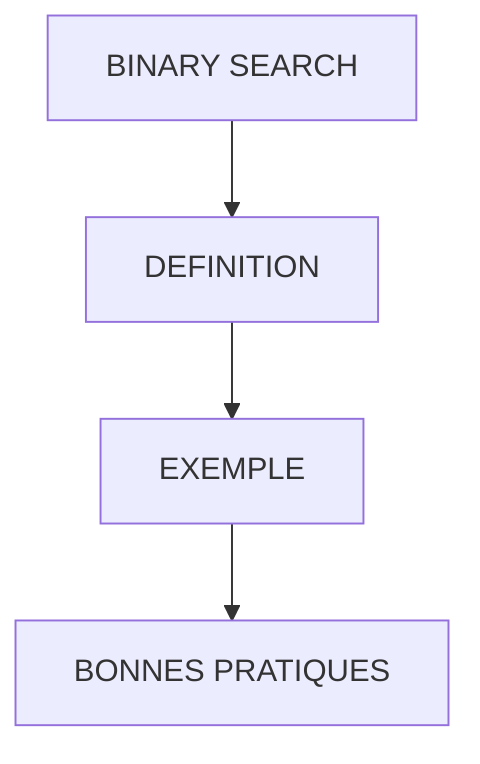

# 🌸 BINARY SEARCH

## 🌺 OBJECTIFS

- [ ] Comprendre l’option `BINARY SEARCH` avec `READ TABLE`
- [ ] Savoir l’utiliser pour optimiser les recherches dans une table interne
- [ ] Connaître la condition nécessaire pour que la recherche binaire fonctionne
- [ ] Identifier les avantages par rapport à une recherche linéaire

## 🌺 VUE D'ENSEMBLE

## 🌺 DÉFINITION

> L’option `BINARY SEARCH` utilisée avec `READ TABLE` permet de réaliser une recherche binaire dans une table interne, optimisant ainsi les performances du programme.
> Principe de la recherche binaire
>
> - Comparer la valeur recherchée à la valeur du milieu de la plage
> - Si égal → retour de l’index, fin de recherche
> - Si la valeur recherchée est supérieure à celle du milieu → recherche dans la moitié supérieure
> - Si la valeur recherchée est inférieure à celle du milieu → recherche dans la moitié inférieure
> - Répéter jusqu’à trouver la valeur ou épuiser la plage

> [!CAUTION]
> Pour une `STANDARD TABLE`, la table doit être triée par ordre croissant selon les composants utilisés par la recherche, dans le même ordre. Ces composants doivent former le début de la clé de tri. Une `SORTED TABLE` exploite déjà sa clé triée ; une table `HASHED` doit être lue par sa clé, sans `BINARY SEARCH`.

> [!TIP]
> Chercher un nom dans un annuaire trié par ordre alphabétique en ouvrant toujours à la page du milieu pour diviser les recherches.

## 🌺 EXEMPLE

    TYPES: BEGIN OF ty_citizen,
             country TYPE char3,
             name    TYPE char20,
             age     TYPE numc2,
           END OF ty_citizen.

    DATA: lt_citizen TYPE STANDARD TABLE OF ty_citizen,
          ls_citizen TYPE ty_citizen.

    FIELD-SYMBOLS: <lfs_citizen> TYPE ty_citizen.

    " Remplissage de la table
    ls_citizen-country = 'FR'. ls_citizen-name = 'Thierry'. ls_citizen-age = '24'. APPEND ls_citizen TO lt_citizen.
    ls_citizen-country = 'ES'. ls_citizen-name = 'Luis'.    ls_citizen-age = '32'. APPEND ls_citizen TO lt_citizen.
    ls_citizen-country = 'BR'. ls_citizen-name = 'Renata'.  ls_citizen-age = '27'. APPEND ls_citizen TO lt_citizen.
    ls_citizen-country = 'FR'. ls_citizen-name = 'Floriane'.ls_citizen-age = '32'. APPEND ls_citizen TO lt_citizen.

    " Tri obligatoire pour BINARY SEARCH
    SORT lt_citizen BY country name.

    " Recherche binaire
    READ TABLE lt_citizen WITH KEY country = 'FR' name = 'Floriane' BINARY SEARCH ASSIGNING <lfs_citizen>.
    IF sy-subrc = 0.
      WRITE:/ 'Enregistrement trouvé à la ligne :', sy-tabix, 'Pays:', <lfs_citizen>-country, 'Nom:', <lfs_citizen>-name.
    ENDIF.

## 🌺 BONNES PRATIQUES

| 🍧 Bonne pratique                            | 🍧 Explication                                             |
| -------------------------------------------- | ---------------------------------------------------------- |
| Trier sur les champs recherchés, dans le même ordre | Condition de correction pour une `STANDARD TABLE` |
| Utiliser ASSIGNING <fs> pour performance     | Évite la copie de la ligne, modifie directement la mémoire |
| Vérifier SY-SUBRC                            | S’assurer que l’enregistrement a été trouvé                |
| Comparer BINARY SEARCH vs recherche linéaire | Réduction significative du nombre de comparaisons          |
| Faire correspondre le début de la clé de tri | La recherche peut utiliser tout ou partie initiale de cette clé |

## 🌺 EXERCICES

### 🍧 1 – RECHERCHE BINAIRE SIMPLE + DECLARATION DYNAMIQUE EN FIELD-SYMBOL

> [!IMPORTANT]
> Trier `lt_citizen` par `country` puis `name` et lire l’enregistrement dont `country = 'ES'` et `name = 'Luis'` en utilisant `BINARY SEARCH`. Afficher `age`.

  
SOLUTION

    SORT lt_citizen BY country name.

    READ TABLE lt_citizen WITH KEY country = 'ES' name = 'Luis' BINARY SEARCH ASSIGNING FIELD-SYMBOL(<lfs_citizen>).
    IF sy-subrc = 0.
      WRITE:/ 'Âge du citoyen Luis en ES :', <lfs_citizen>-age.
    ENDIF.

---

### 🍧 2 – VERIFIER L’EXISTENCE SANS COPIER

> [!IMPORTANT]
> Vérifier si un enregistrement `country = 'BR'` et `name = 'Renata'` existe dans `lt_citizen` avec `BINARY SEARCH`, sans copier la ligne (`TRANSPORTING NO FIELDS`). Afficher un message.

  
SOLUTION

    READ TABLE lt_citizen WITH KEY country = 'BR' name = 'Renata' BINARY SEARCH TRANSPORTING NO FIELDS.
    IF sy-subrc = 0.
      WRITE:/ 'Enregistrement BR-Renata trouvé !'.
    ELSE.
      WRITE:/ 'Enregistrement BR-Renata non trouvé.'.
    ENDIF.

---

## 🌺 RÉSUMÉ

> `BINARY SEARCH` permet une recherche rapide dans une table interne triée.
>
> - Condition : ordre croissant compatible entre tri et composants de recherche
> - Réduit le nombre de comparaisons par rapport à une recherche linéaire
> - Retourne l’`INDEX` via `SY-TABIX` et le code retour via `SY-SUBRC`
>   [!TIP]
>   feuilleter un annuaire trié en ouvrant toujours au milieu pour diviser les recherches et trouver la personne plus rapidement.
