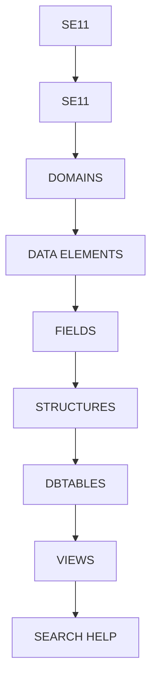

# 🌸 SOMMAIRE — SE11

## 🌺 OBJECTIFS DU COURS

- [ ] Comprendre la progression générale du cours.
- [ ] Identifier l’ordre conseillé des chapitres.
- [ ] Retrouver rapidement une notion précise.

## 🌺 PARCOURS

> [!IMPORTANT]
> Suivre les chapitres dans l’ordre numérique, sauf révision ciblée d’une notion déjà étudiée.

## 🌺 CHAPITRES

- [SE11](<./01 - 🍧 SE11.md>)
- [DOMAINS](<./02 - 🍧 DOMAINS.md>)
- [DATA ELEMENTS](<./03 - 🍧 DATA ELEMENTS.md>)
- [FIELDS](<./04 - 🍧 FIELDS.md>)
- [STRUCTURES](<./05 - 🍧 STRUCTURES.md>)
- [DBTABLES](<./06 - 🍧 DBTABLES.md>)
- [VIEWS](<./07 - 🍧 VIEWS.md>)
- [SEARCH HELP](<./08 - 🍧 SEARCH HELP.md>)

Afficher la méthode de travail

1. Lire les objectifs du chapitre.
2. Étudier le schéma Mermaid.
3. Reproduire les exemples.
4. Réaliser l’exercice sans consulter la correction.
5. Valider l’auto-évaluation.

## 🌺 RÉSUMÉ

> - Ce sommaire représente le parcours du cours **SE11**.
> - Les liens pointent vers les chapitres conservés dans leur emplacement d’origine.
