# 🌸 DOMAINS

## 🌺 OBJECTIFS

- [ ] Comprendre le rôle d’un `DOMAIN` dans le dictionnaire SAP
- [ ] Identifier les différents types de données disponibles
- [ ] Définir les propriétés techniques et éditoriales d’un `DOMAIN`
- [ ] Créer un `DOMAIN` dans la transaction `SE11` avec ses plages de valeurs et routines de conversion

## 🌺 DEFINITION

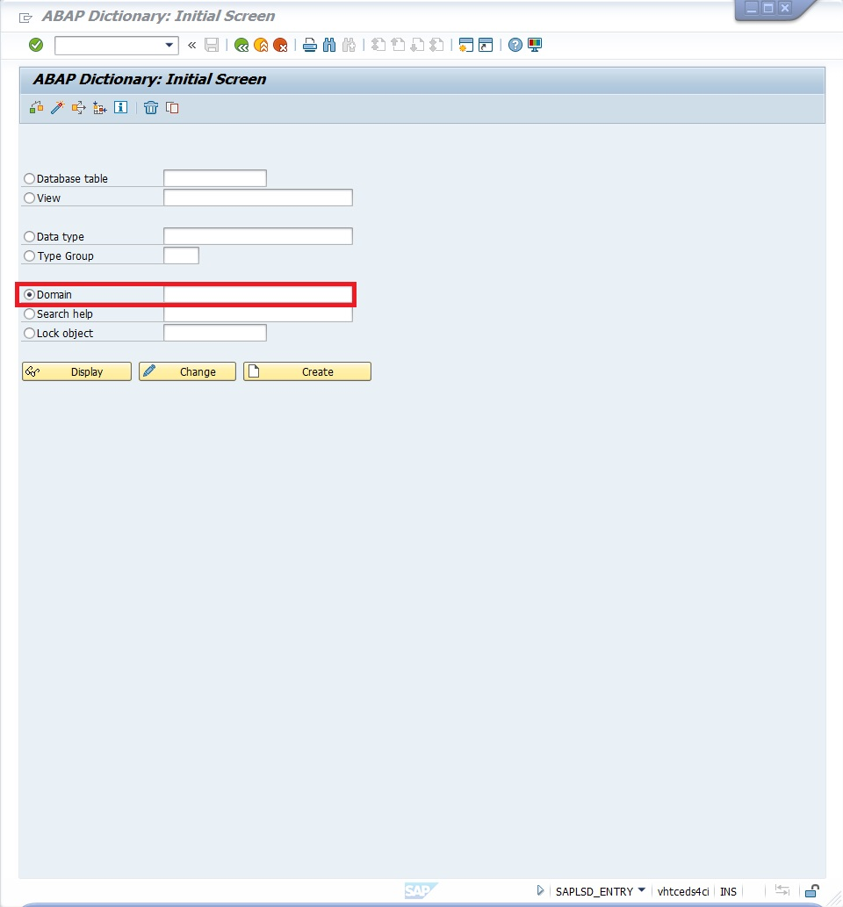

> [!TIP]
> On peut le voir comme le moule dans lequel une donnée doit entrer.

> La définition d’un `DOMAIN` constitue le niveau le plus bas de description d’une donnée dans SAP.  
> Il permet de définir les caractéristiques techniques d’un champ contenu dans une TABLE.

## 🌺 SE11

> [!NOTE]
> afin de faciliter la compréhension, nous allons prendre l'exemple du domaine `MATNR`, accessible depuis la Transaction `SE11` en entrant dans l'input "Domaine" le nom du domaine rechercher. Cliquer ensuite sur [ Afficher ] (or "Display")

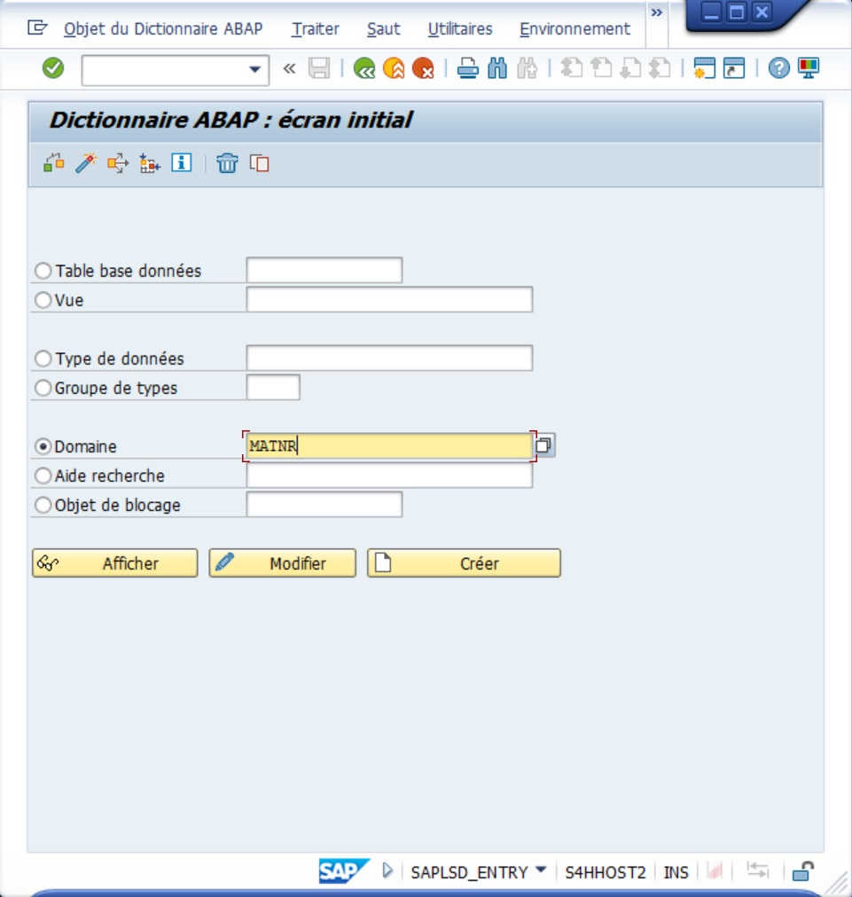

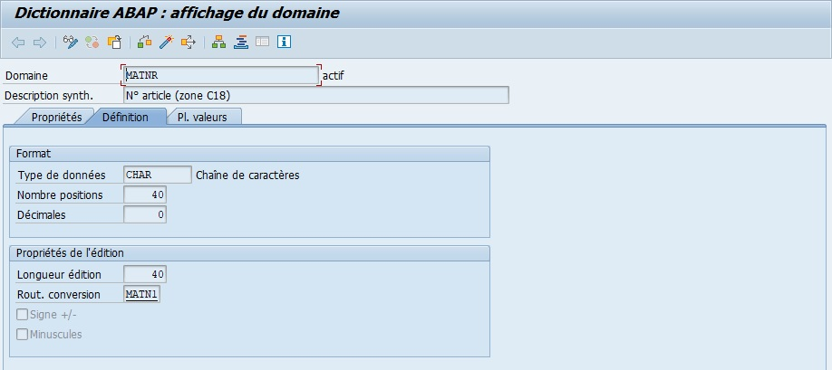

### MENU

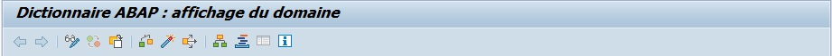

- `Deux flèches` : (Objet précédent et Objet suivant) pour naviguer entre les écrans.

- `Afficher <-Modifier` : pour passer à la modification en cas d’affichage et inversement [Ctrl][F1]

- `Actif <-> Inactif` permet de naviguer entre la version active et la version inactive (utile pour voir les modifications en cours avant activation finale) .

  Domaine - Actif <-Inactif

- `Autre Objet` :

  pour sélectionner un autre domaine sans repasser par l’écran initial de la SE11. [Shift][F5]

- `Contrôler` [ Ctrl ] + [ F2 ]

- `Activation `[ Ctrl ] + [ F3 ]

- `Cas d’Emploi` [ Ctrl ] + [ Shift ] + [ F3 ]

- `Afficher Liste d’objets` :

  Affichage de tous les objets ayant une même caractéristique, comme par exemple, tous les objets utilisant la même classe de développement (cf. chapitre Premiers pas sur SAP - Premier programme ABAP - ’Hello World’) [ Ctrl ] + [ Shift ] + [ F5 ]

- `Afficher fenêtre de navigation` ouvre un volet situé en bas de l’écran avec tous les objets modifiés facilitant le passage de l’un à l’autre [ Ctrl ] + [ Shift ] + [ F4 ]

- `Activer/Désactiver plein écran` va afficher ou masquer les deux options citées précédemment, si elles ont déjà été activées .

- `Manuel en ligne` est l’aide SAP disponible [ Ctrl ] + [ F8 ]

### DESCRIPTION

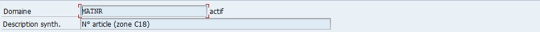

### ONGLET PROPRIETES

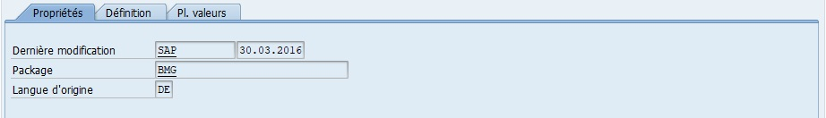

- `Derniere modification` du domaine

- `Package` du domaine

- `Langue d'origine` du domaine (lors de sa création)

### ONGLET DEFINITION

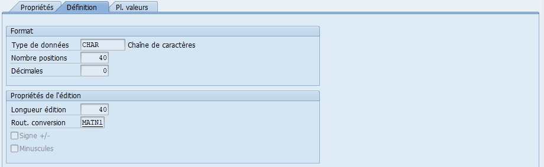

- `Type de données` caractérisant le format du domaine

- `Nombre positions` Il s'agit du nombre de caractères d'un type de données du Dictionnaire ABAP qui se rapporte à un type de données élémentaire sans caractères de mise en forme (par ex. virgules ou points).

- `Décimales`

- `Longueur édition` Il s'agit de la longueur d'édition comme partie des proprietés d'édition de domaines.

- `Rout. Conversion` Il s'agit de la routine de conversion comme partie des proprietés d'édition de domaines.

- `Signe +/-` paramètre du domaine

- `Minuscules` paramètre du domaine

### ONGLET PLAGE DE VALEURS

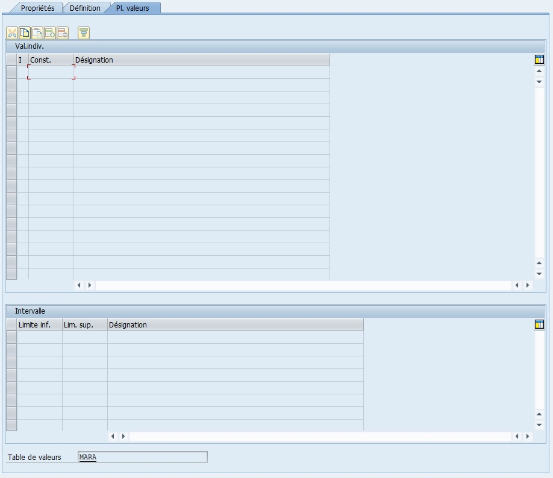

Une plage de valeur pour un domaine fait référence à une gamme ou à un ensemble de valeurs autorisées pour ce champ.

Si elle est renseignée lors de la création du `domaine`, lorsqu’un utilisateur emploiera une variable définie par ce `domaine`, SAP ira vérifier si la valeur renseignée existe bien en consultant cette `plage de valeur`. Si elle n’existe pas il renverra un message d’erreur.

### TYPES DE DONNEES DISPONIBLES

- CHAR : chaîne de caractères alphanumériques
- CURR : devise (EUR, USD…)
- DATS : format date
- DEC : nombre décimal avec signe et séparateur de milliers
- FLTP : nombre flottant (jusqu’à 16 positions)
- INT1, INT2, INT4 : nombres entiers
- NUMC : texte numérique (utile pour concaténer chiffres et texte)
- STRING : chaîne de caractères longue
- XSTRING : chaîne hexadécimale

> [!TIP]
> Imaginez un moule à biscuits.  
> Le `DOMAIN` définit la forme et la taille du biscuit. Peu importe la garniture (la valeur), elle doit toujours rentrer dans ce moule.

> [!IMPORTANT]
> Le `DOMAIN` fixe les règles techniques universelles d’un champ (type, longueur, format).  
> Ainsi, tous les champs basés sur ce `DOMAIN` partageront les mêmes contraintes et comportements.

> [!NOTE]
> Un `DOMAIN` peut être réutilisé dans plusieurs tables. Si vous le modifiez, tous les champs qui l’utilisent seront impactés.

## 🌺 PROPRIETES PRINCIPALES

- Type de données : format de base (CHAR, NUMC, DEC, etc.)
- Nombre de positions : nombre de caractères autorisés
- Décimales : uniquement pour les types numériques
- Longueur édition : longueur visible dans les interfaces
- Routine de conversion : conversion ou formatage automatique (ex. ALPHA)
- Signe +/- : autorise les nombres négatifs
- Minuscules : autorise les lettres minuscules

> [!NOTE]
> Si un `DOMAIN` définit un identifiant de 5 caractères, et que vous saisissez `123456`, SAP refusera la valeur.  
> Si vous saisissez `123`, la routine de conversion ALPHA peut compléter avec des zéros pour obtenir `00123`.

> [!CAUTION]
> Une longueur trop courte ou une mauvaise définition du type peut provoquer des erreurs de troncature ou d’incompatibilité avec d’autres objets.

> [!IMPORTANT]  
> Toujours définir le type et la longueur avec cohérence fonctionnelle (ex : `ZID_CLIENT` → CHAR10 pour permettre un format alphanumérique mixte).

## 🌺 PLAGE DE VALEUR

Une plage de valeurs définit un ensemble de valeurs autorisées pour le champ.

> [!TIP]
> C’est comme un menu dans un restaurant. Si le plat que vous demandez n’est pas dans le menu, le serveur (SAP) vous indique que ce n’est pas autorisé.

> [!IMPORTANT]
> Lorsqu’une plage est définie, SAP vérifie automatiquement que la valeur saisie appartient à cette liste et rejette toute donnée non conforme.

> [!TIP]
> Les plages de valeurs sont utiles pour restreindre des champs tels que le type de contrat, le code pays, ou le statut.

> [!IMPORTANT]  
> Définir des plages de valeurs dès que les données sont codifiées ou limitées à une liste fermée (par ex. O/N, A/B/C…).

## 🌺 ROUTINE DE CONVERSION

Les routines de conversion permettent de formater automatiquement les données lors de la saisie ou de l’affichage.

> [!IMPORTANT]
> Un champ de type `MATNR` (numéro de matériel) doit toujours comporter 10 caractères.  
> Si vous saisissez `12345`, la routine ALPHA le convertira automatiquement en `0000012345`.

> [!IMPORTANT]
> SAP utilise ces routines pour assurer une uniformité d’affichage entre les écrans, les bases et les rapports.  
> Ainsi, les valeurs sont toujours stockées sous le même format technique, mais affichées sous une forme lisible.

> [!CAUTION]
> Si une routine de conversion n’est pas adaptée, des erreurs d’affichage ou de comparaison peuvent survenir entre systèmes (ex : entre ECC et S/4HANA).

> [!IMPORTANT]  
> Employer les routines standard SAP (ex : ALPHA, CUNIT, CURRENCY) plutôt que d’en créer de nouvelles.

## 🌺 CREATION D’UN DOMAIN

1. Transaction SE11

   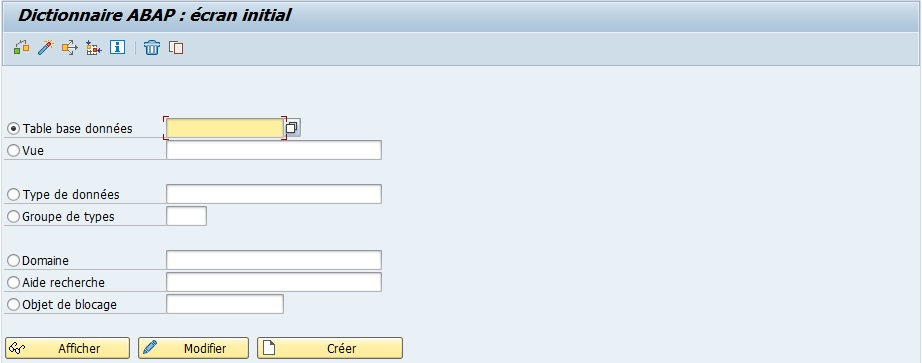

2. `Cocher` l’option `Domaine`.

   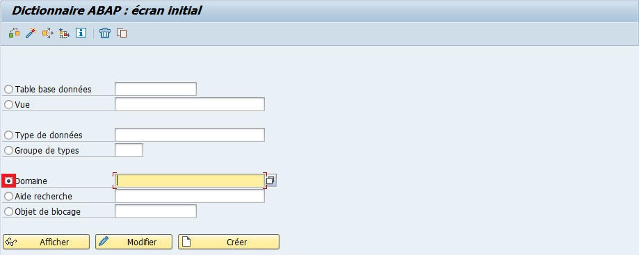

3. `Nommer` le domaine (exemple `ZCONSULTANT_ID`).

   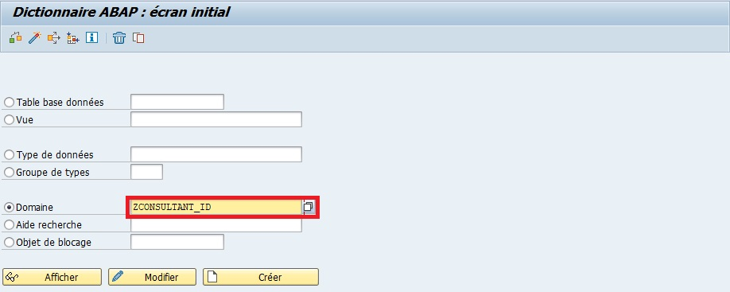

4. `Créer` ou [ F5 ].

   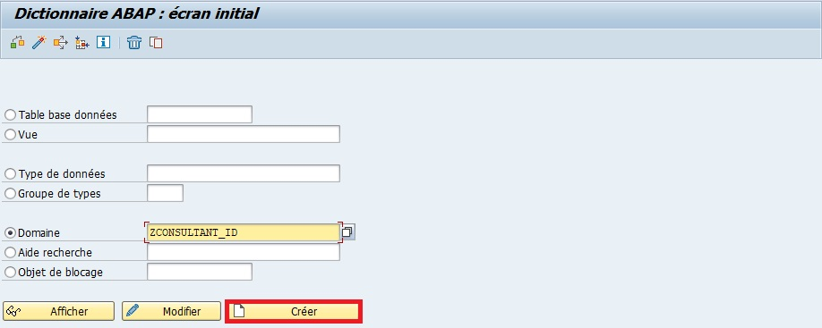

5. `Entrer` une `description` (obligatoire) (exemple `Identifiant Consultant SAP AELION`).

   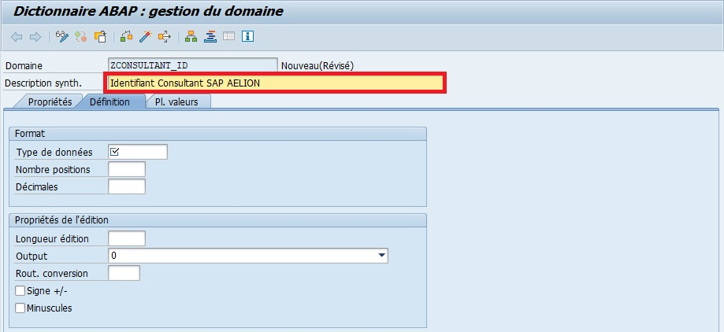

6. Insérer les informations suivantes :

   - `Type de données` : CHAR.

   - `Nombre positions` : 30.

   - `Longueur édition` : 30.

   - `Rout. conversion` : ALPHA.

     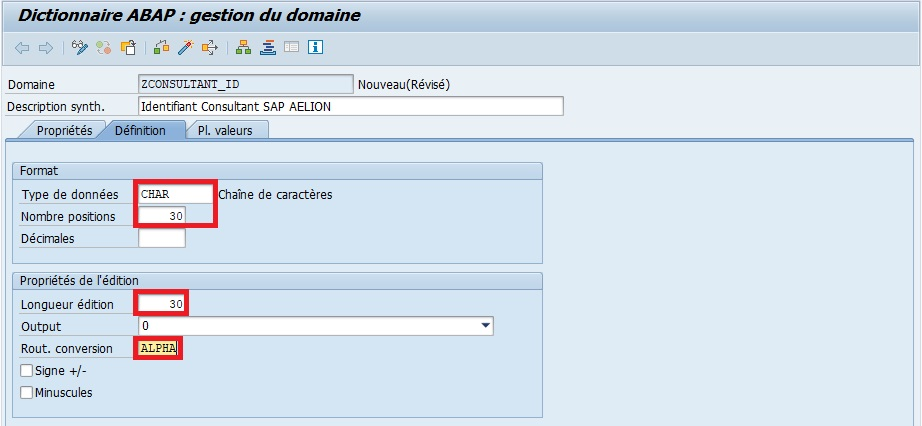

7. `Sauvegarder`.

   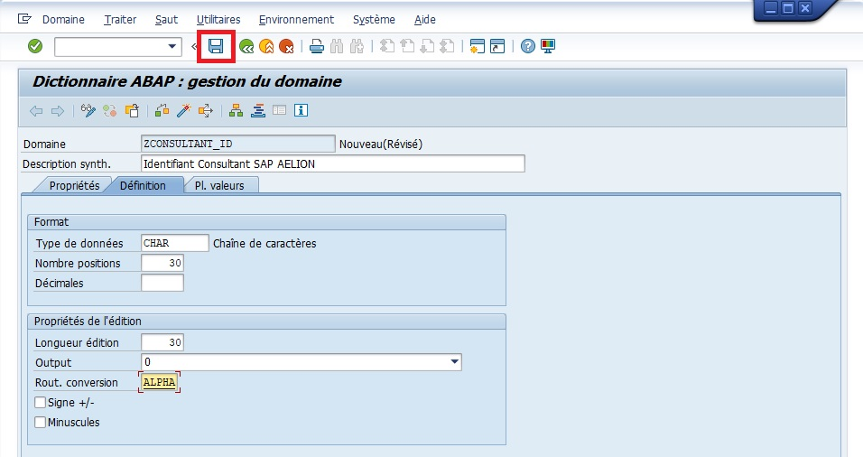

   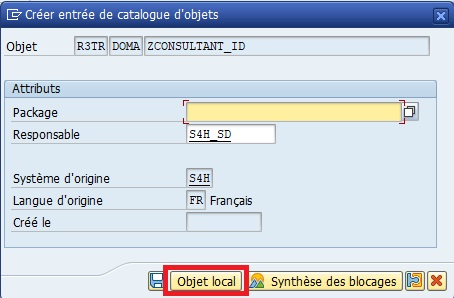

8. `Contrôler`.

   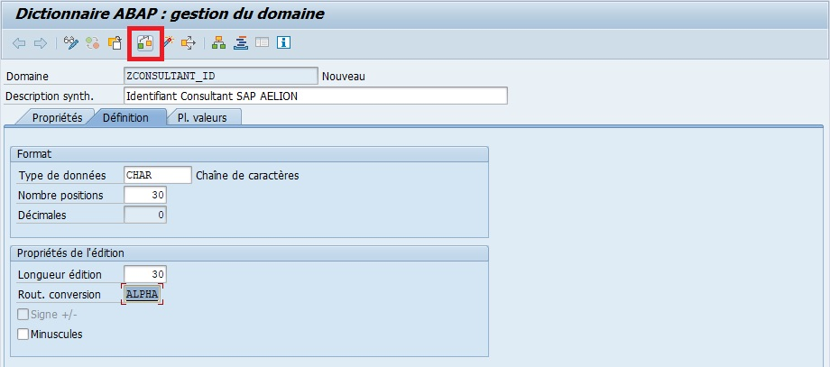

   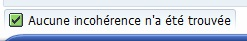

9. `Activer`

   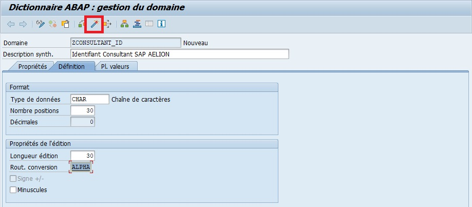

   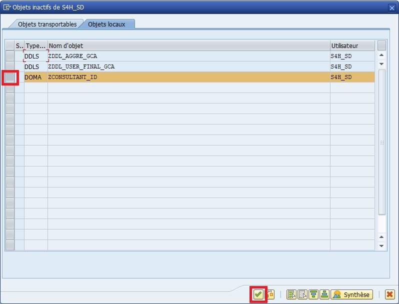

   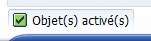

> [!TIP]
> Créer un `DOMAIN`, c’est comme définir un gabarit officiel pour un formulaire :  
> chaque champ doit respecter ce gabarit pour garantir l’uniformité des données dans tout le système.

> [!TIP]
> L’activation du `DOMAIN` vérifie automatiquement les incohérences éventuelles.  
> En cas d’erreur, SAP indique précisément le champ ou la propriété à corriger.

## 🌺 RESUME

> Un `DOMAIN` définit la structure technique d’un champ SAP : type, longueur, décimales, conversion et plage de valeurs.  
> Il garantit la cohérence et la qualité des données dans tout le système.
>
> - Chaque champ d’une table SAP est basé sur un `DOMAIN`.
> - Le `DOMAIN` assure l’homogénéité et la validation des données.
> - Les routines de conversion et les plages de valeurs renforcent l’intégrité du modèle de données.

> [!IMPORTANT]  
> Toujours créer un `DOMAIN` réutilisable plutôt que de définir des types directement dans les champs de table.  
> Cela simplifie la maintenance et la normalisation des données à long terme.
