# 🌸 ELEMENTS DE DONNEES

## 🌺 OBJECTIFS

- [ ] Comprendre le rôle d’un `ELEMENT DE DONNEES`
- [ ] Identifier la relation entre `ELEMENT DE DONNEES` et `DOMAINE`
- [ ] Définir la description et la présentation des données
- [ ] Créer un `ELEMENT DE DONNEES` dans la transaction SE11

## 🌺 DEFINITION

> [!TIP]
> Si le `DOMAINE` est le moule qui définit la forme et la taille du biscuit,  
> l’`ELEMENT DE DONNEES` est l’étiquette collée sur le biscuit.  
> Tous les biscuits du même moule peuvent avoir des étiquettes différentes selon leur usage (ex : "biscuit client", "biscuit fournisseur").

> Un `ELEMENT DE DONNEES` est lié à un seul `DOMAINE`, mais un `DOMAINE` peut être utilisé par plusieurs éléments de données.
>
> Un `ELEMENT DE DONNEES` est la zone de référence d’une donnée dans SAP.  
> Il définit comment une donnée est présentée et utilisée dans le système, et il est toujours associé à un `DOMAINE`.

> [!IMPORTANT]  
> Le `DOMAINE` fixe les caractéristiques techniques (type, longueur, format),  
> tandis que l’`ELEMENT DE DONNEES` fixe la signification fonctionnelle et l’étiquette d’affichage du champ.  
> C’est lui qui détermine le texte visible dans les écrans SAP ou les rapports (ex : "Code client", "Nom fournisseur").

> [!NOTE]  
> Le `DOMAINE` `ZCONSULTANT_ID` définit un identifiant technique de 30 caractères.  
> L’`ELEMENT DE DONNEES` `ZCONSULTANT_ID` définit comment ce champ apparaîtra à l’écran :  
> par exemple "Identifiant Consultant SAP".

> [!NOTE]  
> L’`ELEMENT DE DONNEES` est une abstraction de présentation :  
> il rend les données techniques compréhensibles pour les utilisateurs métier.  
> C’est une couche entre la technique (`DOMAINE`) et la sémantique (écran, formulaire, rapport).

## 🌺 RELATION ENTRE DOMAINE ET ELEMENT DE DONNEES

| 🍧 Élément           | 🍧 Rôle principal                                      | 🍧 Exemple                   |
| -------------------- | ------------------------------------------------------ | ---------------------------- |
| `DOMAINE`            | Définition technique (type, longueur, conversion)      | CHAR30                       |
| `ELEMENT DE DONNEES` | Définition fonctionnelle (texte, libellé, aide, docu.) | "Identifiant Consultant SAP" |

> [!TIP]
> Le `DOMAINE` dit comment la donnée doit être stockée,  
> l’`ELEMENT DE DONNEES` dit comment elle doit être comprise et affichée.

> [!CAUTION]
> Ne jamais confondre `DOMAINE` et `ELEMENT DE DONNEES`.  
> Modifier un `DOMAINE` affecte tous les éléments qui l’utilisent.  
> Modifier un `ELEMENT DE DONNEES` affecte uniquement la présentation du champ (pas sa structure).

## 🌺 CREATION D’UN ELEMENT DE DONNEES

### PRÉREQUIS

Avoir créé un `DOMAINE` (ex : `ZCONSULTANT_ID`).

### ETAPES

1. Transaction SE11

   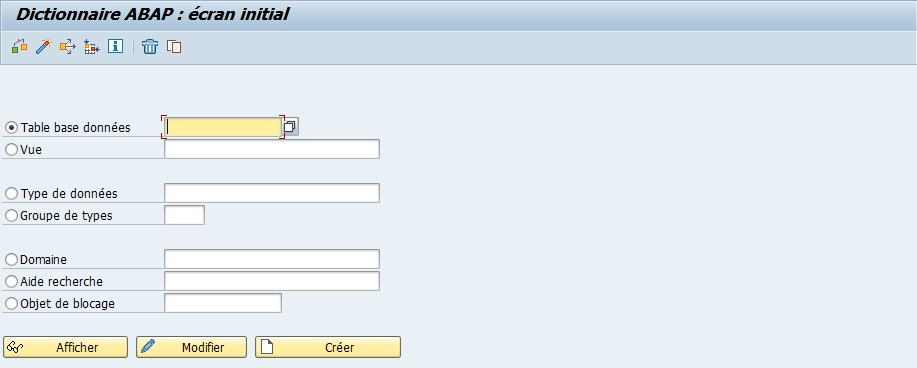

2. `Cocher` l’option `Type de données`.

   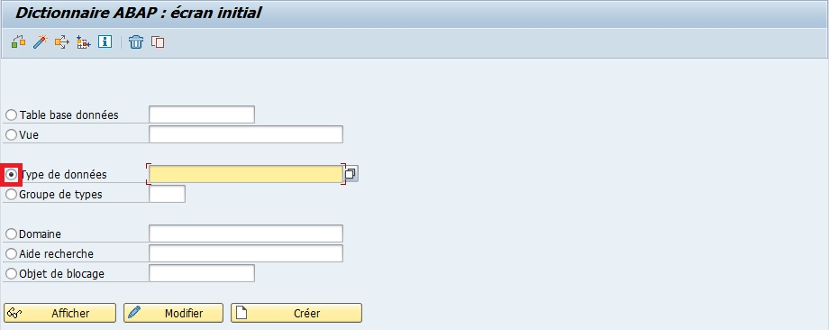

3. `Nommer` l'élément (exemple `ZCONSULTANT_ID`).

   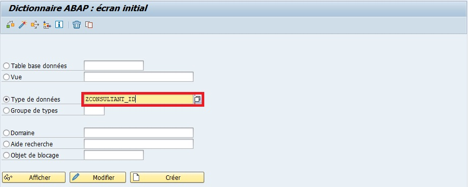

4. `Créer` ou [ F5 ].

   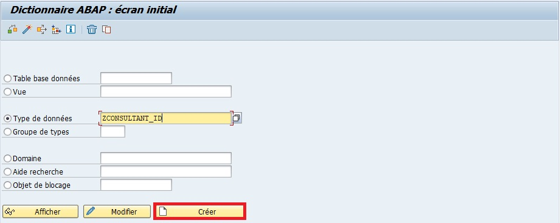

5. `Sélectionner` `Elément de données`.

   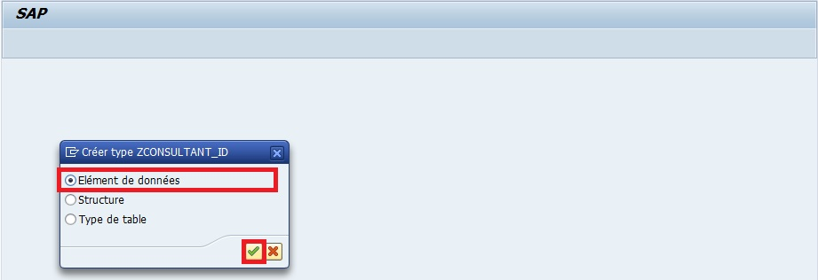

6. `Entrer` une `description` (obligatoire) (exemple `N° d’identification du consultant`).

   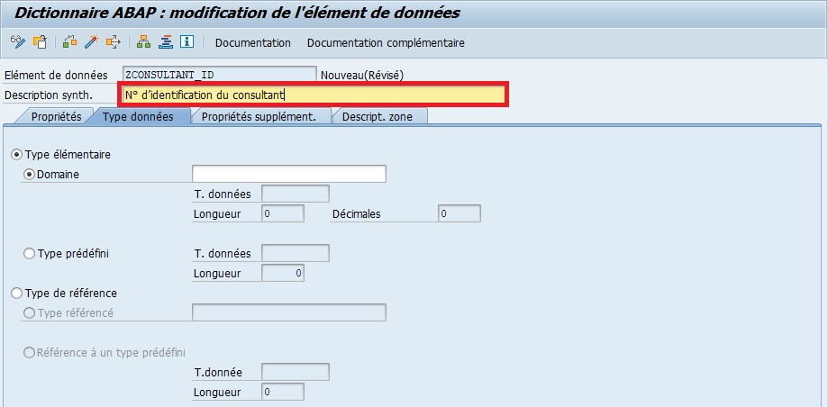

7. `Renseigner` le [DOMAINE](./04_DOMAINES.md) (exemple `ZCONSULTANT_ID`).

   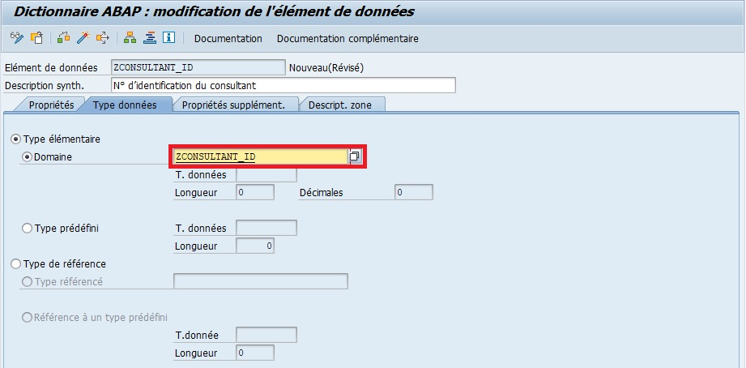

8. `Appuyer` sur [ Entrée ].

   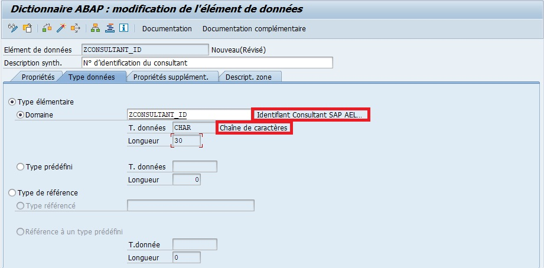

9. `Renseigner` les descriptions de zone dans l'onglet `Descript. zone`

   | LONGUEUR   | NBR CARACTERES | NOM                          |
   | ---------- | -------------- | ---------------------------- |
   | `Court`    | 10             | Consultant                   |
   | `Moyen`    | 20             | Ident.Consult.               |
   | `Long`     | 40             | Identification Consultant    |
   | `Intitulé` | 55             | Identification du Consultant |

   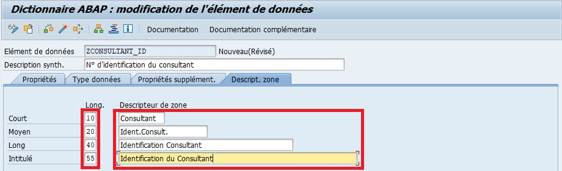

10. `Sauvegarder`

    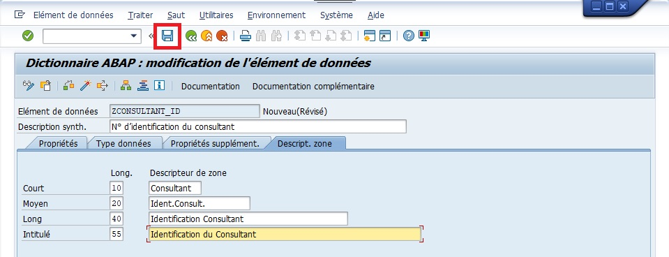

    > [!CAUTION]
    > Dans cet exemple, la création de l'ELEMENT DE DONNEE se fera en local mais il est soumis, comme tout objet, à la possibilité d'être affilié à un OT.

    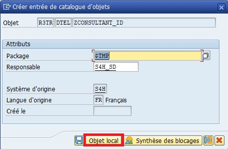

    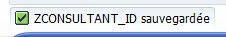

11. `Contrôler`.

    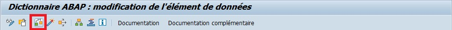

    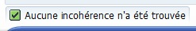

12. `Activer`.

    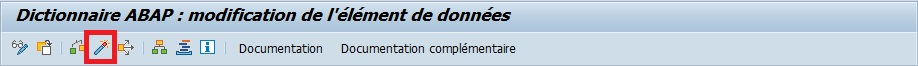

    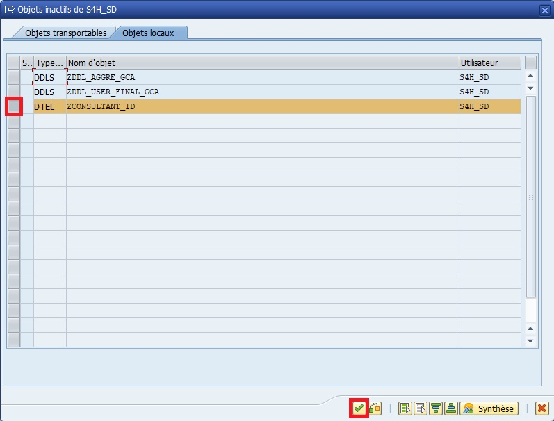

    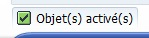

> [!IMPORTANT]  
> Ces libellés seront utilisés automatiquement dans les écrans, rapports, ALV et formulaires.  
> Cela permet d’uniformiser la présentation des champs dans tout le système.

> [!TIP]
> Si le `DOMAINE` est le moule du biscuit,  
> l’`ELEMENT DE DONNEES` ajoute l’étiquette et le style d’écriture sur le biscuit.  
> Tous les biscuits issus de ce moule seront identiques techniquement,  
> mais l’étiquette (`ELEMENT DE DONNEES`) permet de savoir à quoi ils correspondent.

> [!TIP]
> Les textes courts, moyens et longs sont utilisés selon le contexte d’affichage
>
> - Court : listes, ALV, tableaux
> - Moyen : écrans SAP classiques
> - Long / Intitulé : info-bulles, aide à la saisie, formulaires

> [!CAUTION]
> L’`ELEMENT DE DONNEES` ne doit pas être confondu avec un champ de table.  
> Le champ d’une table réutilise un `ELEMENT DE DONNEES`, il ne le définit pas.

## 🌺 UTILISATION CONSEILLÉE

> Utilisation conseillée
>
> - Créez un `ELEMENT DE DONNEES` par champ fonctionnel distinct, même si le `DOMAINE` est le même.
> - Utilisez des noms explicites (`ZCLIENT_ID`, `ZSUPPLIER_ID`) pour faciliter la maintenance.
> - Toujours documenter la signification du champ dans l’onglet "Document." de SE11.
> - Cela facilite la compréhension et la réutilisation dans d’autres projets SAP.

## 🌺 RESUME

> L’`ELEMENT DE DONNEES` est la définition sémantique d’un champ SAP.  
> Il repose sur un `DOMAINE` pour ses caractéristiques techniques,  
> mais ajoute la signification, les libellés et l’aide utilisateur.
>
> - Un `ELEMENT DE DONNEES` = un libellé fonctionnel basé sur un `DOMAINE` technique.
> - Un `DOMAINE` peut être partagé, mais un `ELEMENT DE DONNEES` ne référence qu’un seul `DOMAINE`.
> - Il garantit une présentation homogène et une compréhension claire des données dans tout SAP.

> [!TIP]
> Dans un projet SAP bien structuré, le couple _`DOMAINE` + `ELEMENT DE DONNEES`_  
> constitue la base de tout modèle de données propre, cohérent et compréhensible.
