# 🌸 STRUCTURES DE TABLE

## 🌺 OBJECTIFS

- [ ] Comprendre ce qu’est une structure de table dans SAP
- [ ] Différencier une structure d’une table
- [ ] Savoir créer une structure et y ajouter des champs
- [ ] Maîtriser les notions d’INCLUDE et APPEND

## 🌺 DEFINITION

> Une structure de table est un ensemble de champs définis à partir d’éléments de données, sans stockage physique dans la base.  
> Elle sert à organiser, transmettre et manipuler des informations, comme un modèle ou un patron pour créer des tables ou travailler sur des données temporaires.

> [!TIP]
> Imaginez une maquette ou un squelette : vous voyez la forme et les composants (champs), mais il n’y a pas encore de données réelles.  
> La structure sert de modèle pour construire des tables ou manipuler des informations temporairement.

> - Une structure de table ne stocke pas de données, elle définit uniquement la forme et le type des champs.
> - Chaque champ d’une structure est lié à un élément de données, lui-même lié à un domaine.
> - Les structures sont souvent utilisées pour - Passer des paramètres à des programmes ou fonctions
>   - Construire des tables temporaires
>   - Définir des modèles pour créer des tables standard ou transparentes

> [!IMPORTANT]  
> La structure est une définition technique, comme un plan de formulaire ou un modèle de tableau.  
> On sait quelles colonnes il y aura et quel type de données elles contiendront, même si aucune donnée n’existe encore.

## 🌺 INCLUDE & APPEND

### INCLUDE

> [!TIP]
> Copier un bloc Lego déjà assemblé dans une nouvelle construction. Si le bloc Lego change, toutes les constructions qui l’utilisent sont mises à jour automatiquement.

> - Intègre tous les champs d’une structure existante dans une autre structure ou table.
> - Si la structure source change, les modifications se répercutent automatiquement dans toutes les structures ou tables qui l’incluent.
> - Les champs issus d’un include apparaissent en bleu dans SE11, signifiant qu’ils ne sont pas natifs de la table principale.

> [!IMPORTANT]  
> Pour réutiliser des ensembles de champs standard, éviter de les recréer manuellement.

### APPEND

> [!TIP]
> Ajouter une extension à une maison : la maison originale reste intacte, mais vous pouvez ajouter une pièce pour vos besoins spécifiques.

> - Ajoute des champs supplémentaires à une table ou structure sans modifier l’original.
> - Utile pour les tables standard SAP où la modification directe est interdite.
> - Les champs append sont spécifiques à votre développement.

> [!CAUTION]
> Les champs append ne doivent pas créer de conflits avec les champs existants. Toujours vérifier la cohérence avec la table originale.

## 🌺 CREATION D’UNE STRUCTURE DE TABLE (SE11)

1. Transaction SE11

   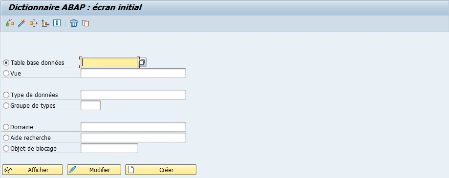

2. `Cocher` l’option `Type de données`.

   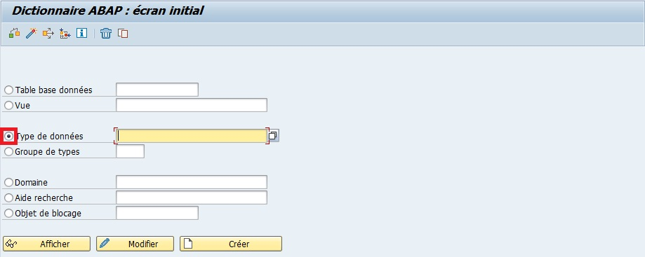

3. `Nommer` l'élément (exemple `ZST_CONSULTANT`).

   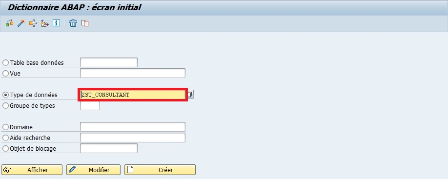

4. `Créer` ou [ F5 ].

   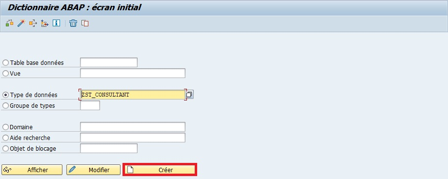

5. `Sélectionner` `Structure`.

   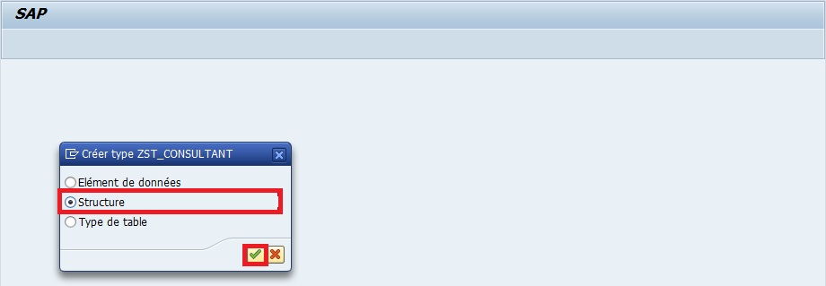

6. `Entrer` une `description` (obligatoire) (exemple `Structure de Table ZT_CONSULTANT`).

   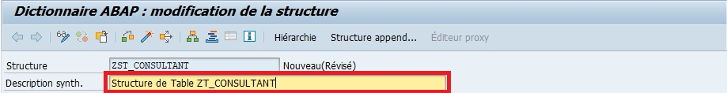

7. `Insérer` les signes suivantes

   | 🍧 COMPOSANTE | 🍧 CATEGORIE TYPE | 🍧 TYPE COMPOSANTE |
   | ------------- | ----------------- | ------------------ |
   | CONSULTANT_ID | TYPES             | ZCONSULTANT_ID     |
   | VILLE         | TYPES             | CITY               |
   | PAYS          | TYPES             | LAND_X             |

   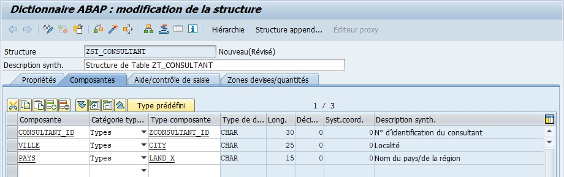

8. `Sauvegarder`

   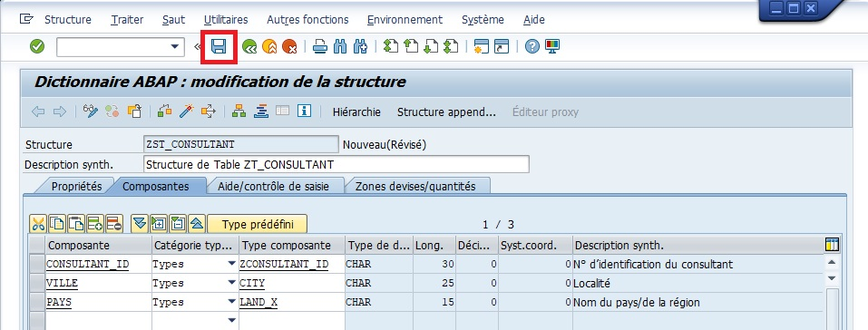

   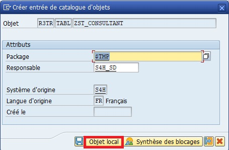

   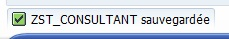

9. `Contrôler`.

   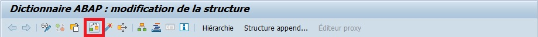

   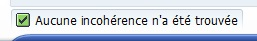

10. `Activer`.

    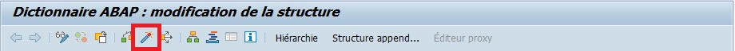

    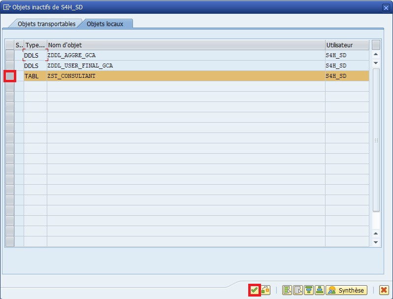

    

> [!TIP]
> Créer une structure revient à préparer une fiche Excel avec les colonnes définies, prête à recevoir des données. Vous définissez la forme des informations avant de remplir les cases.

> [!TIP]
>
> - Vérifiez toujours que les éléments de données associés existent et sont corrects.
> - Les noms de champs doivent suivre la nomenclature Z/AELION pour éviter les collisions avec SAP standard.

> [!NOTE]
> Une structure ne contient pas de données. Pour stocker des données, il faudra utiliser une table basée sur cette structure ou une table interne dans un programme.

## 🌺 BONNES PRATIQUES

| 🍧 Bonnes pratiques                | 🍧 Explication                                                 |
| ---------------------------------- | -------------------------------------------------------------- |
| Toujours contrôler et activer      | Vérifie que la structure est valide et utilisable              |
| Utiliser INCLUDE pour réutiliser   | Évite de recréer des champs déjà existants                     |
| Utiliser APPEND pour personnaliser | Ajoute des champs spécifiques sans toucher au standard         |
| Documenter la structure            | Facilite la maintenance et la compréhension pour d’autres devs |

> Utilisation conseillée
>
> - Réutilisez INCLUDE pour harmoniser les champs communs dans plusieurs tables/structures
> - Utilisez APPEND uniquement pour vos développements spécifiques ou extensions

## 🌺 RESUME

> - Une structure de table est un modèle de champs sans stockage physique
> - Include : reprend les champs d’une structure existante, mis à jour automatiquement si la source change
> - Append : ajoute des champs spécifiques à une table/structure, sans toucher à l’original
> - Les structures servent à organiser les données, faciliter leur passage entre programmes ou créer des tables basées sur un modèle

> [!TIP]
> La structure est comme une maquette ou un gabarit.  
> Vous savez quelles colonnes existent et comment elles sont définies, mais les données elles-mêmes ne sont pas encore présentes.
