# 🌸 TABLES

## 🌺 OBJECTIFS

- [ ] Comprendre ce qu’est une table dans SAP
- [ ] Différencier une table transparente, table pool et table cluster
- [ ] Savoir créer une table et y ajouter des champs
- [ ] Maîtriser les notions de clé primaire, index et plage de valeurs
- [ ] Comprendre INCLUDE et APPEND
- [ ] Créer une table avec INCLUDE ou APPEND

## 🌺 DEFINITION

> [!TIP]
> Imaginez une fiche Excel complète : chaque colonne est un champ, chaque ligne est un enregistrement. Contrairement à une structure, les données sont réellement stockées dans la base.

> Une table est un objet de stockage physique dans SAP, composée de champs (ou colonnes) définis par des éléments de données.  
> Elle permet de stocker, organiser et gérer les données de manière structurée.

## 🌺 TYPES DE TABLES

| 🍧 Type de table | 🍧 Description                                                                  |
| ---------------- | ------------------------------------------------------------------------------- |
| Transparente     | Correspond à une table réelle dans la base, une seule ligne = un enregistrement |
| Table pool       | Regroupe plusieurs petites tables transparentes dans une table physique unique  |
| Table cluster    | Regroupe des tables liées dans une table physique pour optimiser le stockage    |

> [!TIP]
>
> - Table transparente : une fiche individuelle pour chaque enregistrement.
> - Table pool : plusieurs mini-fiches stockées dans un classeur unique.
> - Table cluster : plusieurs fiches liées combinées dans une enveloppe.

## 🌺 CLES PRIMAIRES

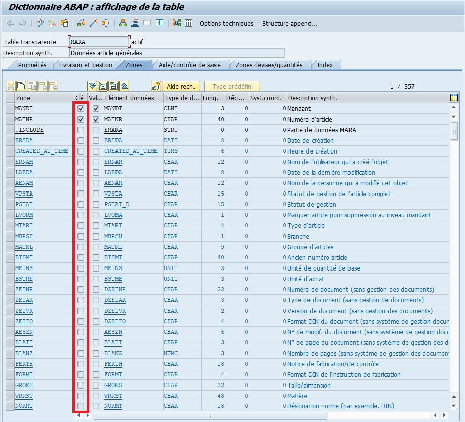

Les `clés primaires`, souvent abrégées en "PK" pour "Primary Key" en anglais, sont un concept fondamental en gestion de base de données. Une `clé primaire` est un ou plusieurs fields dans une `table de base de données` qui identifient de manière unique chaque enregistrement dans cette table. Voici quelques points importants à retenir sur les `clés primaires` :

- `Unicité des enregistrements` : La `clé primaire` garantit que chaque enregistrement dans la `table de base de données` est unique. Cela signifie qu'aucun deux enregistrements ne peut avoir la même valeur de `clé primaire`.

- `Contrainte d'intégrité` : Les `clés primaires` sont souvent définies comme une `contrainte d'intégrité` dans la `base de données`, ce qui signifie que le système de gestion de `base de données` (`SGBD`) garantit que la `clé primaire` est respectée à tout moment. Ainsi, les tentatives d'insertion ou de mise à jour d'enregistrements qui violeraient cette `contrainte` sont automatiquement rejetées.

- `Indexation automatique` : Les `clés primaires` sont souvent indexées automatiquement par le `SGBD` pour améliorer les performances des opérations de recherche et de `jointure` sur la table. Cela permet d'accélérer l'accès aux données lors de l'exécution de requêtes.

- `Définition lors de la conception de la base de données` : Les `clés primaires` sont définies lors de la conception initiale de la `base de données`. Les concepteurs de `bases de données` choisissent les fields qui doivent former la `clé primaire` en fonction des exigences spécifiques de l'application et des relations entre les données.

- `Types de clés primaires` : Une `clé primaire` peut être composée d'un seul fields (`clé primaire simple`) ou de plusieurs fields combinés (`clé primaire composite`). Dans le cas d'une `clé primaire composite`, l'ensemble des valeurs de tous les fields formant la clé doit être unique.

## 🌺 CREATION D’UNE TABLE

> [!TIP]
> Créer une table revient à préparer un classeur Excel avec colonnes et lignes, où chaque cellule est prête à recevoir des données.

1.  Transaction SE11

    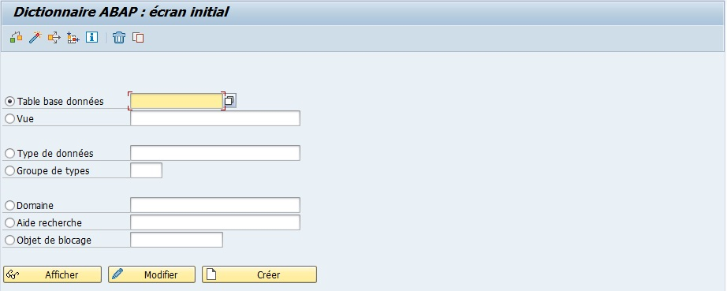

2.  `Sélectionner` l’option `Table base données`

    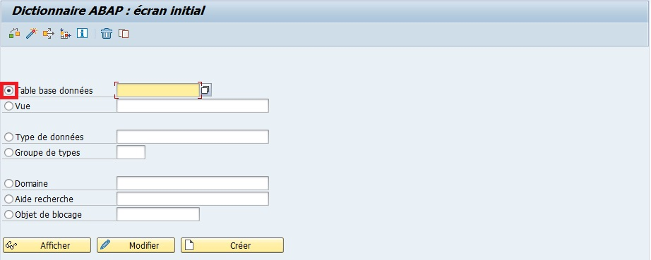

3.  `Entrer` le nom de la table (exemple ZDRIVER_CAR_FGI).

    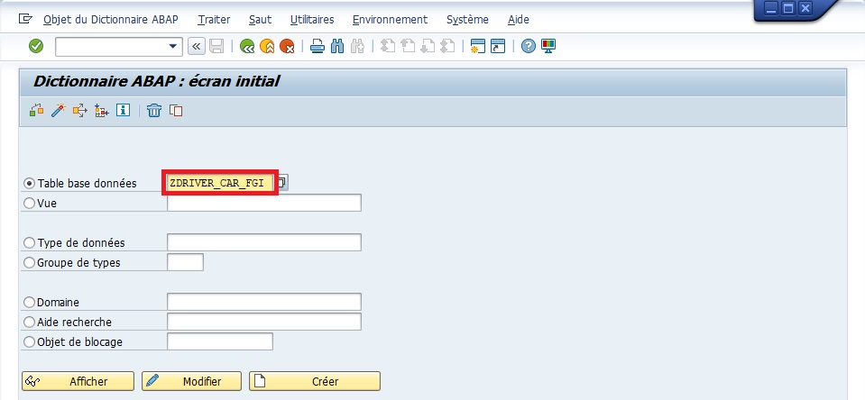

4.  `Créer` ou [ F5 ]

    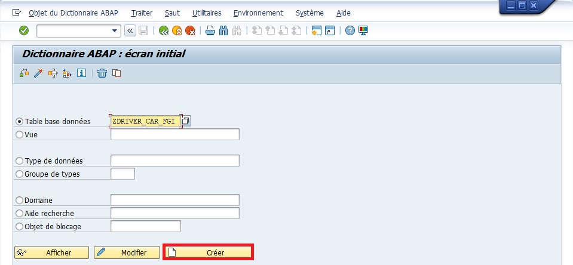

5.  `Entrer` une `description` (obligatoire) (exemple `Table des Consultants SAP`).

    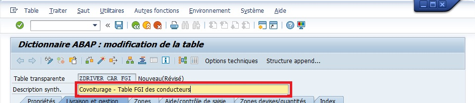

6.  Onglet `Livraison et gestion` :

    - `Class de livraison` : `classe A`

      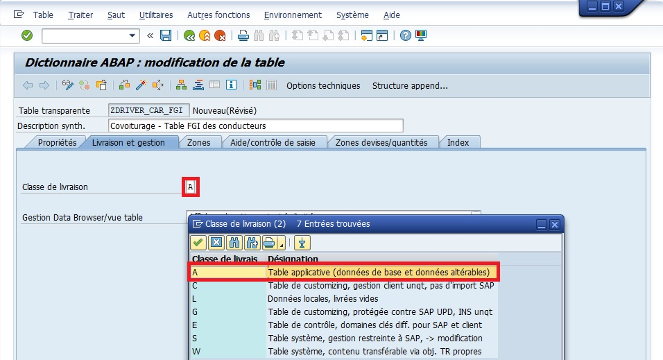

    - `Gestion Dara Browser/vue table` : `Affichage/gestion autorisés`

      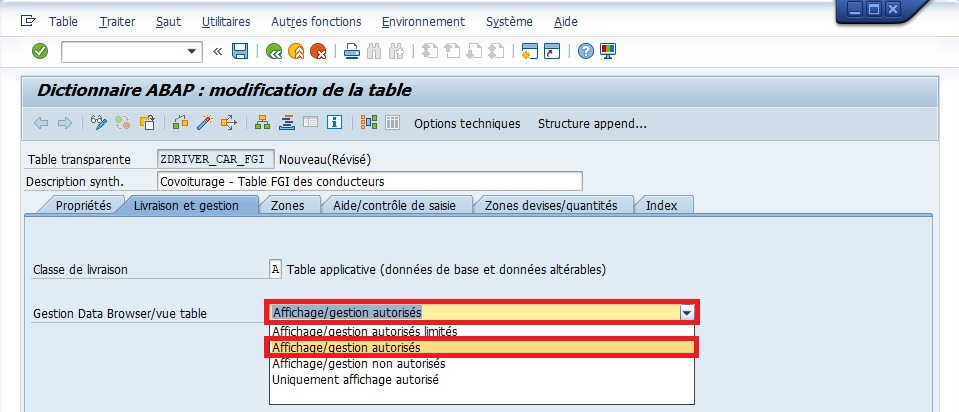

7.  `Onglet Zones`

    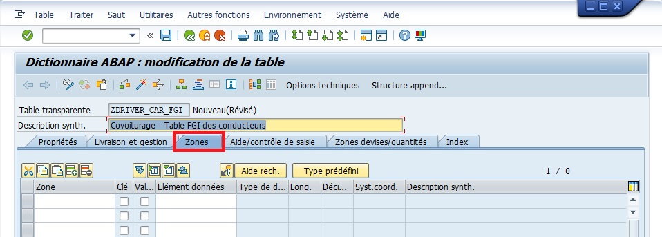

8.  `Renseigner` les champs avec leurs ZONES, KEYS et ELEMENT DE DONNEES

    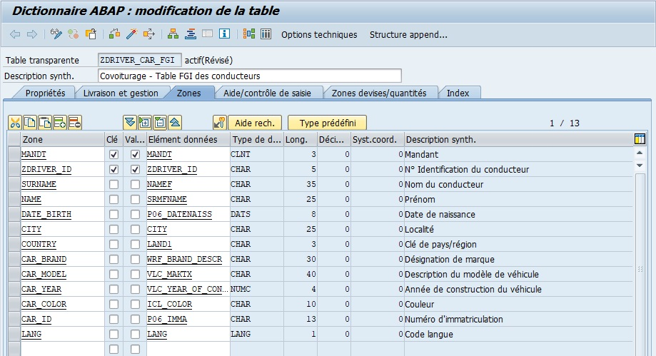

> [!CAUTION]
> L'élément de donnée cropé est le suivant : VLC_YEAR_OF_CONSTRUCTION

9.  `Clé externe`

    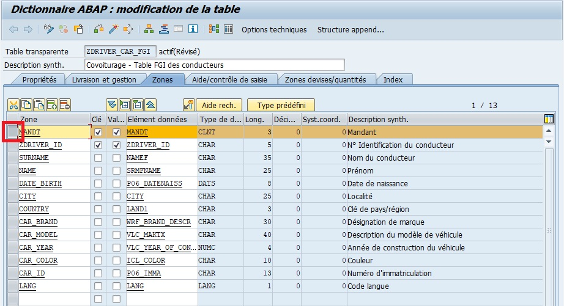

    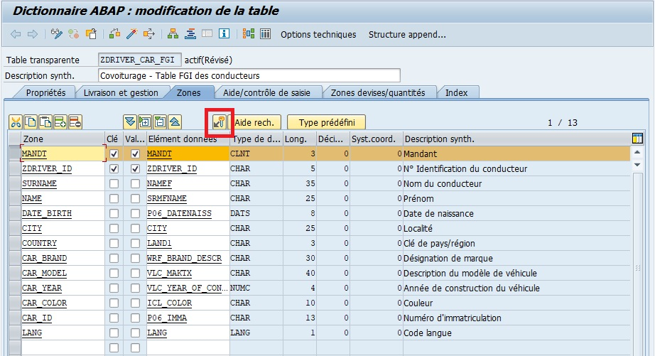

    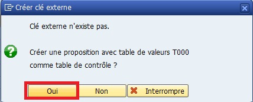

    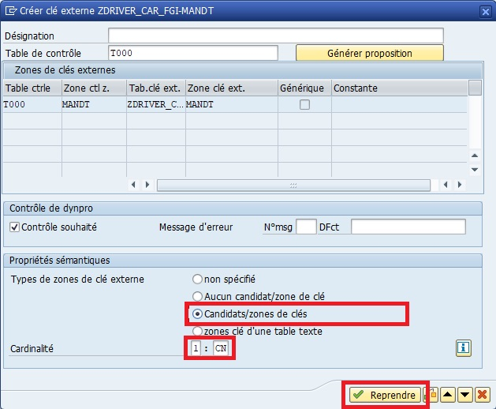

> [!NOTE]
> répéter les mêmes étapes pour le champ COUNTRY.

> [!NOTE]
> Aucune information à renseigner dans l’onglet Zones devises/quantités étant donné qu’il n’y a aucune unité de mesure nécessaire.

10. `Sauvegarder` et `Activer`

    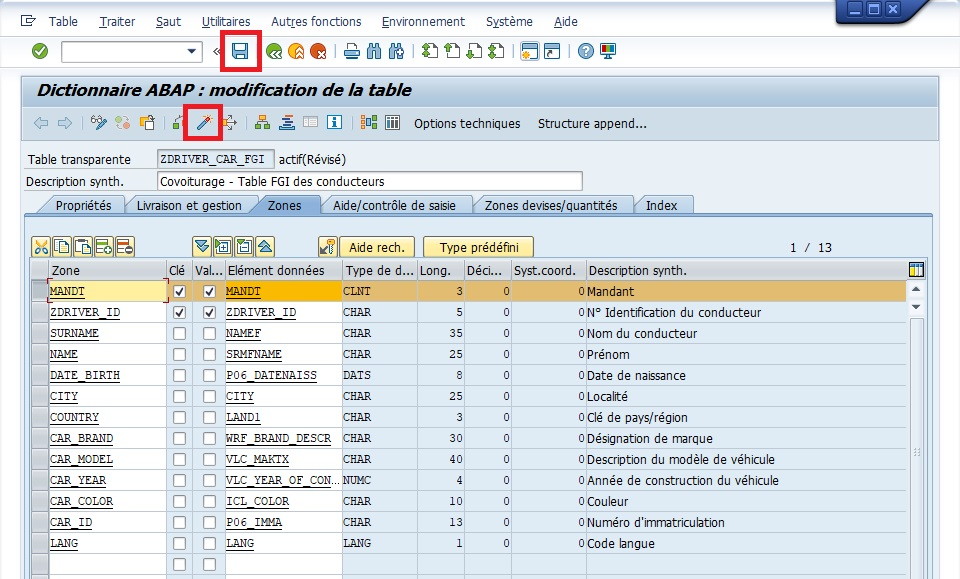

11. `Catégorie d'extension`

    > [!IMPORTANT]
    > La catégorie d’extension n’est pas obligatoire mais recommandée car elle définit le type de champs qui composeront la table (extension de la table doit être compris par ajout de champs dans la table directement ou grâce à un append dans le cas de tables standards).

    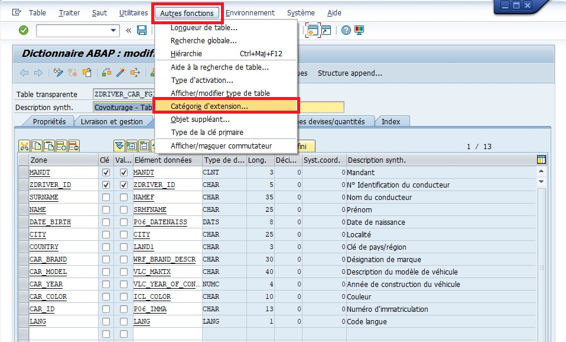

    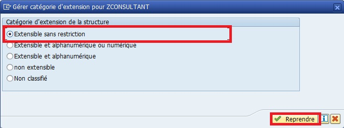

> [!NOTE]
> Pour information
>
> - Extensible sans restriction : pas de règle pour l’extension de la table ou de la structure.
>
> - Extensible et alphanumérique ou numérique : tous les champs devront être soit alphanumériques, soit numériques. La différence avec Extensible sans restriction est qu’il ne sera pas possible d’ajouter des champs de type date ou heure (par exemple) dans un append ou un include.
>
> - Extensible et alphanumérique : la table ou la structure ne sera composée que de champs alphanumériques et une erreur sera retournée si un champ est défini comme numérique (il sera alors possible de modifier le type d’extension).
>
> - Non extensible : il sera possible d’ajouter un champ directement à la table ou la structure initiale, mais impossible via un append. Ainsi, comme l’append est l’unique moyen d’ajouter un champ à une table standard, il n’y aura aucune possibilité pour accomplir cette tâche.
>
> - Non classifié (par défaut), aucune extension n’a été définie pour la table ou la structure.
>
> Dans le cas de notre table, il n’y aura pas besoin de restriction, l’option Extensible sans restriction sera donc choisie.

12. Onglet `Aide/contrôle de saisie`

    Ici, il n'y a rien à ajouter car nous n'avons pas de quantité et donc pas d'unité de mesure. Lorsque vous aurez à crééer une table avec un champ ayant une quantité telle qu'un nombre de pièce, une taille, le montant d'une devise, ... il faudra (juste en dessous de la ligne en question) ajouter une ligne avec le champ correspondant à son unité de mesure. Par exemple :

    - Quantité de pièce : 13
    - Type de pièce : palette

    ou encore

    - Montant : 12807
    - Devise : Euros

    En général, ces informations vous seront transmises dans la spécification fonctionnelle.

13. `Sauvegarder` puis cliquer sur `Options techniques`

14. Onglet `Propriétés générales`, renseigner les éléments suivant comme suit :

    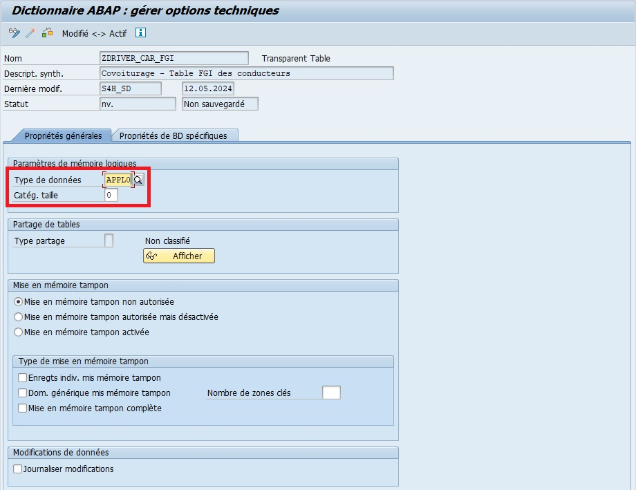

    - `Type de données` : APPL0
    - `Catég. taille` : 0

15. `Sauvegarder` puis [ Flèche verte ] pour revenir à l'écran précédent.

16. `Activer`

## 🌺 BONNES PRATIQUES

| 🍧 Bonnes pratiques                                    | 🍧 Explication                                 |
| ------------------------------------------------------ | ---------------------------------------------- |
| Toujours définir la clé primaire                       | Garantit l’unicité des enregistrements         |
| Utiliser les domaines et éléments de données existants | Assure la cohérence et facilite la maintenance |
| Ajouter des index pour les recherches fréquentes       | Optimise la performance des requêtes           |
| Documenter les tables                                  | Facilite la compréhension et la maintenance    |

> [!IMPORTANT]
>
> - Définir toujours la clé primaire avant de remplir la table
> - Réutiliser les éléments de données et domaines pour assurer l’homogénéité

## 🌺 INCLUDE ET APPEND

### INCLUDE

> - Permet de réutiliser des champs existants d’une structure ou d’une table dans une nouvelle table ou structure
> - Évite de recréer les mêmes champs à plusieurs endroits
> - Les champs apparaissent en bleu dans SE11
> - Toute modification de la structure incluse se répercute automatiquement

> [!TIP]
> Copier un patron prêt à l’emploi dans une nouvelle fiche, au lieu de réécrire toutes les colonnes.

> [!IMPORTANT]
>
> - Réutiliser pour harmoniser des champs communs dans plusieurs tables
> - Assure la cohérence des données

### APPEND

> - Permet d’ajouter des champs supplémentaires à une table ou structure sans modifier l’original
> - Très utile pour adapter une table standard SAP aux besoins spécifiques
> - Les champs ajoutés sont propres à votre développement

> [!TIP]
> Ajouter une extension à une fiche standard, sans toucher à la fiche originale.  
> Ex : ajouter un champ “Numéro d’employé interne” à une table client standard.

> [!CAUTION]
> Les champs append ne doivent pas entrer en conflit avec les champs existants. Toujours vérifier la cohérence.

## 🌺 CREATION D’UNE TABLE AVEC INCLUDE OU APPEND

### CREATION AVEC INCLUDE

1. Créer une structure réutilisable (ex : `ZST_ADRESSE` avec VILLE, PAYS, CODE_POSTAL)
2. Ouvrir SE11 pour créer la table
3. Dans l’onglet Zones, ajouter un INCLUDE de la structure existante
4. Les champs de l’INCLUDE apparaissent automatiquement et peuvent être utilisés comme si vous les aviez créés directement
5. Sauvegarder, Contrôler, Activer

> [!TIP]
> Copier un patron prêt à l’emploi dans une nouvelle fiche au lieu de réécrire toutes les colonnes.

### CREATION AVEC APPEND

1. Ouvrir la table existante (standard ou spécifique) dans SE11
2. Cliquer sur Créer Append Structure
3. Nommer la structure APPEND (ex : `ZAPPEND_CONSULTANT`)
4. Ajouter les champs supplémentaires dans cette structure
5. Associer la structure APPEND à la table via l’onglet Append
6. Sauvegarder, Contrôler, Activer

> [!TIP]
> Ajouter une fiche supplémentaire à un classeur existant, sans toucher aux fiches originales.

## 🌺 RESUME

> - Une table est un objet de stockage physique dans SAP
> - Chaque table est composée de champs définis par des éléments de données
> - La clé primaire identifie de manière unique chaque enregistrement
> - Les tables peuvent être transparente, pool ou cluster
> - INCLUDE = réutilisation de champs existants
> - APPEND = ajout de nouveaux champs sans toucher à la table originale
> - Créer une table avec INCLUDE ou APPEND permet de gagner du temps, personnaliser les tables SAP et maintenir la cohérence
