# 🌸 VIEWS SAP

## 🌺 OBJECTIFS

- [ ] Comprendre ce qu’est une `VIEW` dans SAP
- [ ] Différencier les types de `VIEWS` : Database View, Projection View, Help View
- [ ] Savoir créer une `VIEW` en utilisant des tables existantes
- [ ] Maîtriser les notions de jointures et sélections de champs

## 🌺 DEFINITION

> Une `VIEW` est une représentation logique de données provenant d’une ou plusieurs tables.  
> Elle ne stocke pas physiquement les données mais permet d’accéder à une sélection structurée et filtrée.

> [!TIP]
> Imaginez un filtre Excel qui n’affiche que certaines colonnes et lignes d’un classeur. La `VIEW` montre les données filtrées, mais ne les copie pas réellement.

## 🌺 TYPES DE VIEWS

> [!TIP]
>
> - Database View : une `VIEW` pivot qui combine plusieurs tableaux Excel.
> - Projection View : un tableau résumé ne montrant que certaines colonnes.
> - Help View : un menu déroulant intelligent pour choisir une valeur.

| 🍧 Type de `VIEW` | 🍧 Description                                                                                    |
| ----------------- | ------------------------------------------------------------------------------------------------- |
| Database View     | Combine des champs de plusieurs tables liées par des clés primaires et étrangères.                |
| Projection View   | Sélection de certains champs d’une seule table, souvent pour des rapports ou modules spécifiques. |
| Help View         | Spéciale pour les aides à la recherche, affiche une liste filtrée de valeurs pour un champ.       |

> [!NOTE]  
> Les `VIEWS` n’écrivent pas dans la base, elles ne servent qu’à consulter ou filtrer les données.

## 🌺 CREATION D’UNE VIEW

1. Transaction SE11

   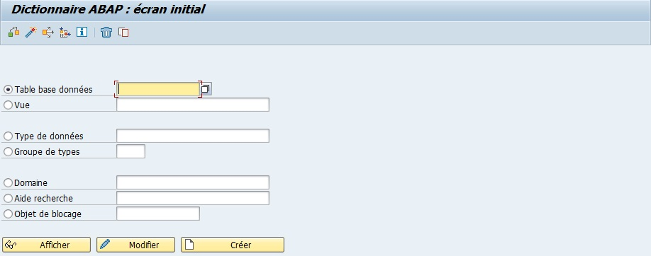

2. `Sélectionner` `Vue`

   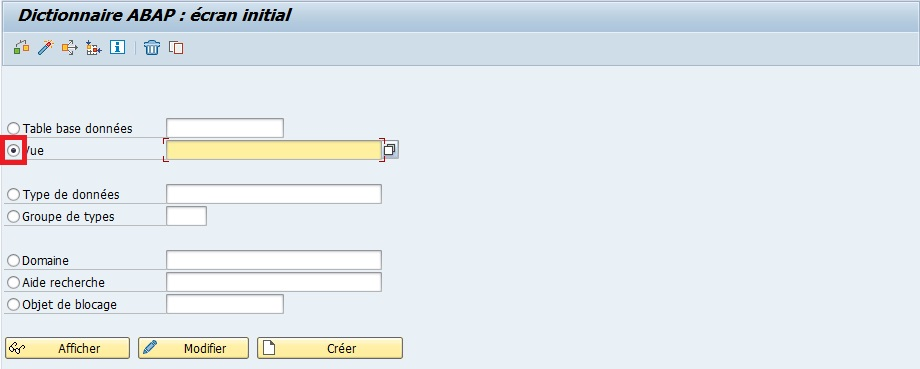

3. `Renseigner` un nom de vue (par exemple ZV_EKKO_EKPO)

   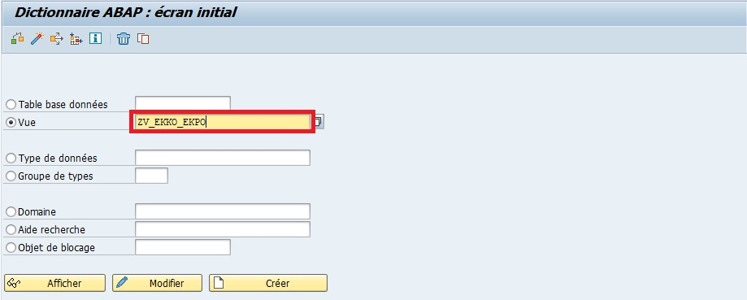

4. `Créer` ou [ F5 ]

   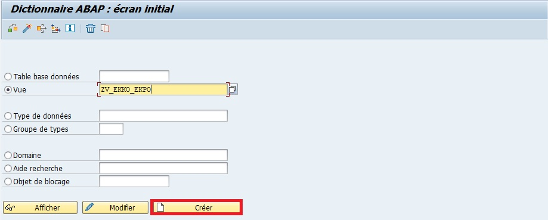

5. `Sélectionner` `Vue de BD` pour une vue de données présentes dans la Base de données

   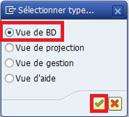

6. `Renseigner` une description (par exemple : Vue pour les tables EKKO et EKPO)

   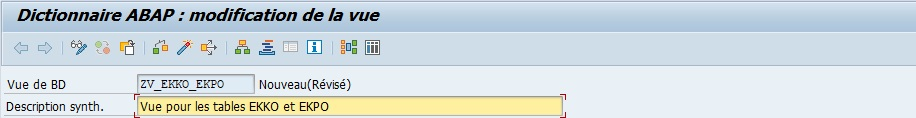

7. Onglet `Tables/Conditions de jointure`

   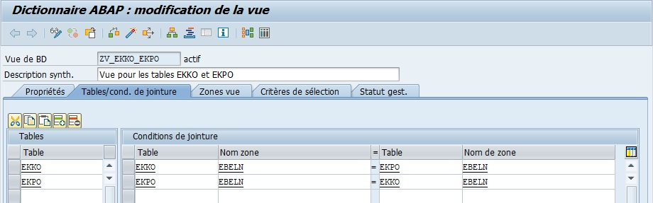

8. Onglet `Zones vue`

   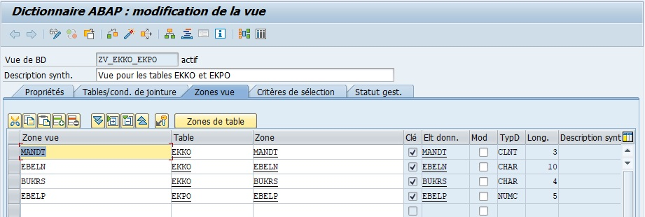

9. `Sauvegarder` et `Activer`

   Un message apparaîtra avec l'information suivante :

   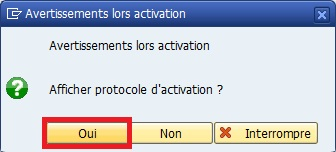

   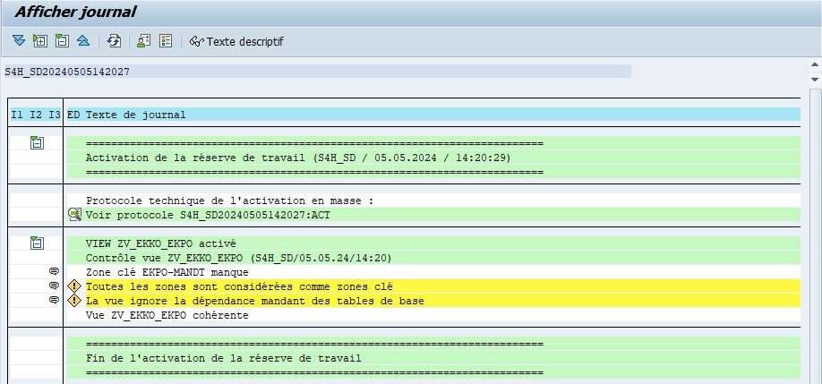

   Le journal rapporte des avertissements concernant les "zones clé" et la dépendance mandant. C'est normal étant donné que la clé unique de la table EKKO (EBELN) se répetera éventuellement autant de fois qu'elle a de poste dans la table EKPO.

10. Transaction SE16N
    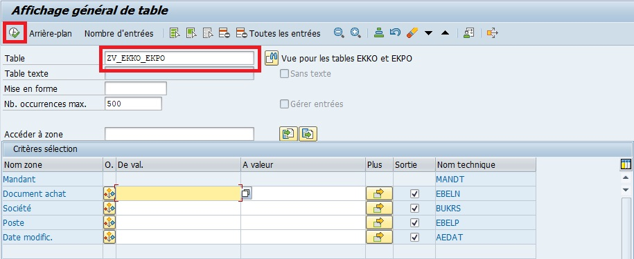

    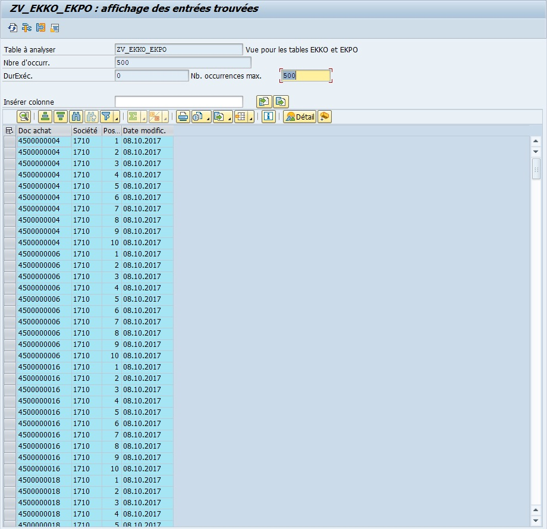

> [!NOTE]  
> Une Database View `ZV_CONSULTANT_INFO` pourrait combiner la table `ZT_CONSULTANT` avec la table `ZT_PROJETS` pour afficher le consultant, sa ville et ses projets en une seule `VIEW`.

> [!IMPORTANT]  
> La `VIEW` agit comme un résumé logique des tables : on peut interroger, filtrer et afficher les données sans toucher aux tables originales.

## 🌺 BONNES PRATIQUES

| 🍧 Bonnes pratiques                       | 🍧 sExplication                                                |
| ----------------------------------------- | -------------------------------------------------------------- |
| Limiter les champs et tables              | Optimise les performances de lecture                           |
| Toujours définir les jointures            | Assure que les relations entre les tables sont correctes       |
| Nommer les `VIEWS` clairement             | Facilite la compréhension et l’utilisation dans les programmes |
| Utiliser les `VIEWS` pour l’accès logique | Évite de manipuler directement les tables physiques            |

> [!TIP]
> Pour les rapports et modules SAP, privilégiez toujours les `VIEWS` plutôt que les tables pour accéder aux données, afin de préserver l’intégrité et la cohérence.

> [!CAUTION]
> Ne pas confondre Database View et table physique : une modification des données via la `VIEW` impacte toujours la table source, mais certaines `VIEWS` (projection/help) peuvent être lecture seule.

## 🌺 RESUME

> - Une `VIEW` est une représentation logique des données SAP
> - Types de `VIEWS` : Database, Projection, Help
> - Permet d’accéder à des données sélectionnées ou combinées sans stockage physique
> - Idéal pour rapports, analyses et aides à la recherche

> [!TIP]
> Une `VIEW` SAP est comme un filtre ou un tableau de bord Excel : elle montre ce dont vous avez besoin sans toucher aux données originales.
