# 🌸 AIDE A LA RECHERCHE (F4 HELP)

## 🌺 OBJECTIFS

- [ ] Comprendre ce qu’est une aide à la recherche dans SAP
- [ ] Savoir créer une aide à la recherche pour un champ
- [ ] Connaître les différents types de dialogues disponibles

## 🌺 DEFINITION

> Une aide à la recherche permet à l’utilisateur de voir une liste de valeurs possibles directement depuis un champ SAP.  
> Elle facilite la saisie et réduit les erreurs.

> [!TIP]
> Imaginez un formulaire Excel avec un champ "Ville". Une liste déroulante apparaît pour proposer toutes les villes possibles. L’aide à la recherche fonctionne de la même manière dans SAP.

## 🌺 TYPES DE DIALOGUES

| 🍧 Type de dialogue                  | 🍧 Description                                                                                           |
| ------------------------------------ | -------------------------------------------------------------------------------------------------------- |
| Affichage de valeurs immédiat        | La liste s’affiche directement après l’appel de l’aide. Utile si peu de valeurs.                         |
| Dialogue complexe avec délimitation  | Une boîte de dialogue permet de filtrer et choisir les valeurs à afficher.                               |
| Dialogue dépendant du jeu de valeurs | Le système choisit automatiquement : si <100 occurrences, affichage immédiat ; sinon, boîte de dialogue. |

> [!TIP]
>
> - Affichage immédiat : liste déroulante courte
> - Dialogue complexe : filtre avancé
> - Dialogue dépendant : le système décide le meilleur affichage selon le nombre de valeurs

> [!IMPORTANT]  
> Le type de dialogue choisi influence la performance et l’ergonomie de l’aide à la saisie. Pour beaucoup de valeurs, préférez le dialogue complexe.

## 🌺 CREATION D’UNE AIDE A LA RECHERCHE

1. Transaction SE11

   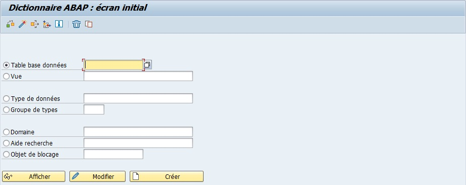

2. `Cocher` l’option `Aide recherche`.

   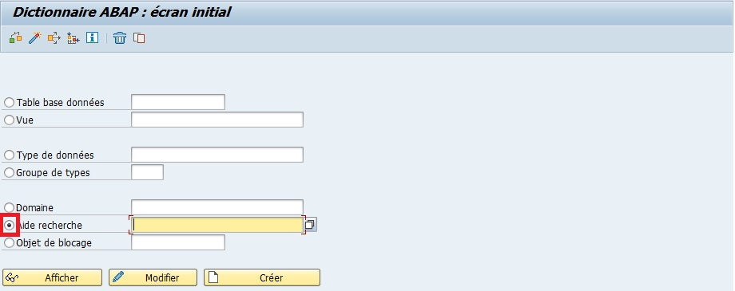

3. `Entrer` le nom `ZAR_MARA` ("AR" pour Aide à la Recherche).

   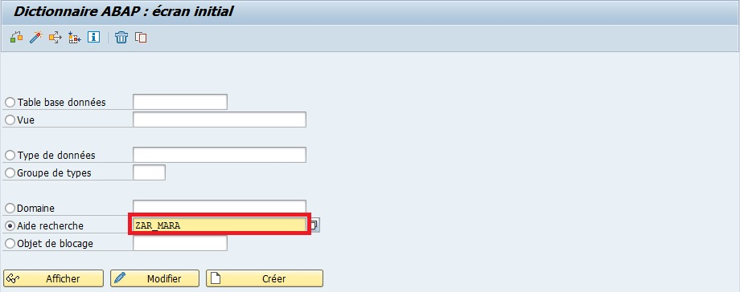

4. `Sélectionner` l'option `Aide recherche élémentaire`.

   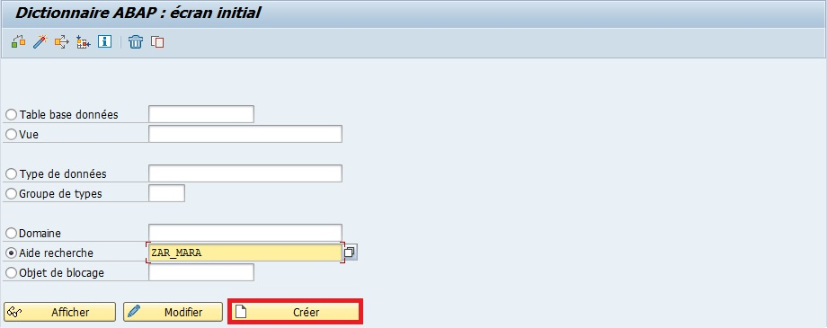

5. `Entrer` une `description` (obligatoire) (exemple `Aide MARA`).

   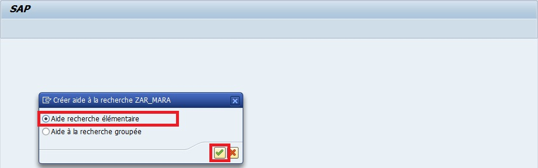

6. `Renseigner` la description, la `Méthode sélection` et `Table des textes`.

   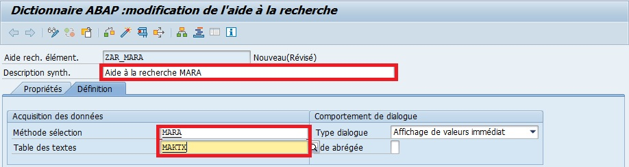

   - Description : Aide à la recherche MARA

   - Méthode sélection : MARA

   - Table des textes : MAKT

7. `Sélectionner` l'option `Affichage de valeurs immédiat` (Type de dialogue).

   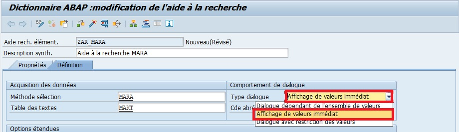

   Cette aide à la recherche affichera les champs :

   - `MATNR` (n° d’article) qui sera à la fois un champ d’`import` et d’`export`
   - `MAKTX` (désignation de l’article)
   - `MTART` (type d’article)
   - `MATKL` (groupe marchandise)

   Les paramètres ressembleront à ceci :

   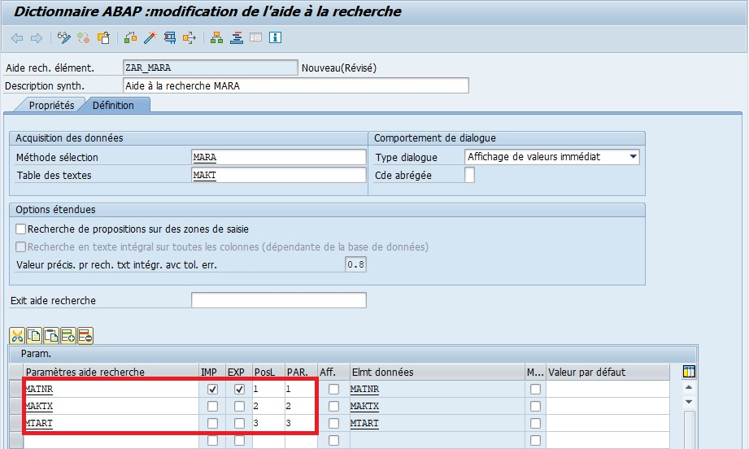

   | CHAMP   | IMP | EXP | PosL | PAR. | Elmt données |
   | ------- | --- | --- | ---- | ---- | ------------ |
   | `MATNR` | X   | X   | 1    | 1    | MATNR        |
   | `MAKTX` |     |     | 2    | 2    | MAKTX        |
   | `MTART` |     |     | 3    | 3    | MTART        |
   | `MATKL` |     |     | 4    | 4    | MATKL        |

8. `Sauvegarder`.

   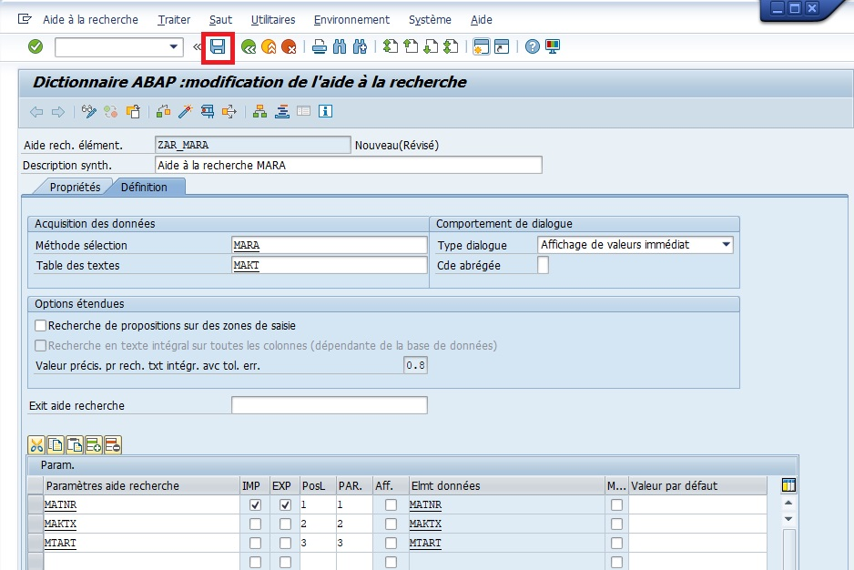

   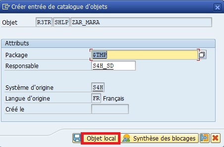

9. `Contrôler`.

   

   

10. `Activer`.

    

    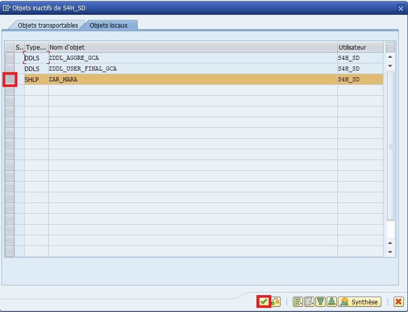

    

    Il est également possible de la tester avec le bouton Tester... de la barre d’outils, via le raccourci-clavier [F8] ou par le menu déroulant.

> [!TIP]
> Tester immédiatement l’aide pour vérifier qu’elle fonctionne correctement et propose les valeurs attendues.

## 🌺 BONNES PRATIQUES

| 🍧 Bonnes pratiques                      | 🍧 Explication                                         |
| ---------------------------------------- | ------------------------------------------------------ |
| Tester l’aide après création             | Vérifie que les valeurs sont correctes et accessibles  |
| Utiliser les champs clés et descriptions | Facilite l’identification des valeurs                  |
| Choisir le type de dialogue adapté       | Évite les listes trop longues ou inutiles              |
| Documenter l’aide à la recherche         | Permet aux autres utilisateurs de comprendre son usage |

> [!IMPORTANT]
> Les aides à la recherche sont particulièrement utiles pour les champs avec des valeurs fixes ou standardisées (ex : matériel, client, code postal).

> [!CAUTION]
> Si le nombre de valeurs est très important, privilégiez un dialogue complexe ou vue filtrée, sinon l’aide sera lente ou inutilisable.

## 🌺 RESUME

> - Une aide à la recherche permet de proposer des valeurs possibles pour un champ SAP
> - Elle peut être élémentaire ou collective et se base sur une table ou une vue
> - Trois types de dialogues permettent d’adapter l’affichage selon la quantité de données
> - Toujours sauvegarder, contrôler et activer une aide après sa création

> [!TIP]
> L’aide à la recherche est comme un menu déroulant intelligent dans Excel : elle guide l’utilisateur pour éviter les erreurs et accélérer la saisie.
