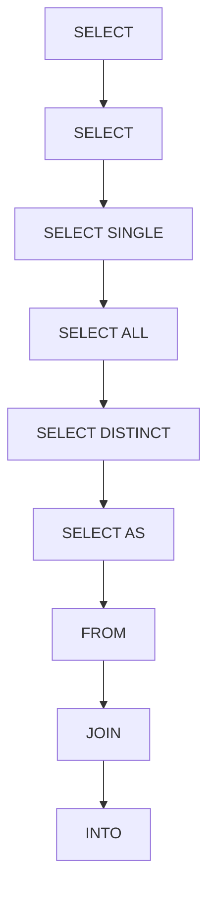

# 🌸 SOMMAIRE — SELECT

## 🌺 OBJECTIFS DU COURS

- [ ] Comprendre la progression générale du cours.
- [ ] Identifier l’ordre conseillé des chapitres.
- [ ] Retrouver rapidement une notion précise.

## 🌺 PARCOURS

> [!IMPORTANT]
> Suivre les chapitres dans l’ordre numérique, sauf révision ciblée d’une notion déjà étudiée.

## 🌺 CHAPITRES

- [SELECT](<./01 - 🍧 SELECT.md>)
- [SELECT SINGLE](<./02 - 🍧 SELECT SINGLE.md>)
- [SELECT ALL](<./03 - 🍧 SELECT ALL.md>)
- [SELECT DISTINCT](<./04 - 🍧 SELECT DISTINCT.md>)
- [SELECT AS](<./05 - 🍧 SELECT AS.md>)
- [FROM](<./06 - 🍧 FROM.md>)
- [JOIN](<./07 - 🍧 JOIN.md>)
- [INTO](<./08 - 🍧 INTO.md>)
- [WHERE](<./09 - 🍧 WHERE.md>)
- [FOR ALL ENTRIES](<./10 - 🍧 FOR ALL ENTRIES.md>)
- [ORDER BY](<./11 - 🍧 ORDER BY.md>)

Afficher la méthode de travail

1. Lire les objectifs du chapitre.
2. Étudier le schéma Mermaid.
3. Reproduire les exemples.
4. Réaliser l’exercice sans consulter la correction.
5. Valider l’auto-évaluation.

## 🌺 RÉSUMÉ

> - Ce sommaire représente le parcours du cours **SELECT**.
> - Les liens pointent vers les chapitres conservés dans leur emplacement d’origine.
