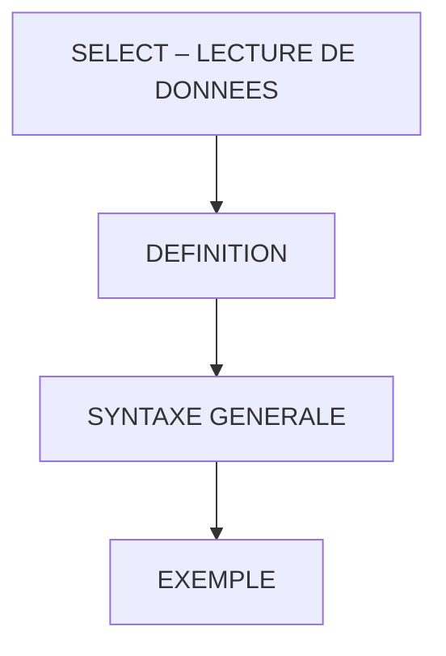

# 🌸 SELECT – LECTURE DE DONNEES

## 🌺 OBJECTIFS

- [ ] Comprendre l’utilité de l’instruction `SELECT` en ABAP
- [ ] Savoir lire des données depuis une table SAP
- [ ] Identifier les colonnes à sélectionner et les conditions à appliquer

## 🌺 VUE D'ENSEMBLE

## 🌺 DÉFINITION

> L’instruction SELECT permet de lire des données depuis une table SAP et de les stocker dans des variables, structures ou tables internes.
> C’est l’équivalent d’une requête SQL classique adaptée au langage ABAP.

> [!TIP]
> Imaginez un classeur Excel : vous choisissez une feuille (table), des colonnes (champs) et éventuellement des lignes (conditions), puis vous copiez le résultat dans une fiche ou un tableau pour travailler dessus.

> [!NOTE]
> Depuis SAP EHP6/EHP7 et HANA, le SELECT a été optimisé pour de meilleures performances et de nouvelles fonctionnalités, notamment pour le filtrage et la manipulation directe de grandes tables.

## 🌺 SYNTAXE GENERALE

    SELECT result
           FROM source
           [FOR ALL ENTRIES IN itab]
           WHERE sql_cond
           [GROUP BY group]
           [HAVING group_cond]
           [ORDER BY sort_key]
           INTO|APPENDING target
           [UP TO n ROWS]
           [BYPASSING BUFFER]
           [CONNECTION con|(con_syntax)].

> [!IMPORTANT]
> - `result` : colonne(s) que l’on veut récupérer
> - `source` : table SAP ciblée
> - `itab` : table interne utilisée pour filtrer (optionnel)
> - `sql_cond` : conditions de filtrage
> - `target` : variable, structure ou table interne où stocker les résultats

> [!NOTE]
> Les instructions entre crochets sont optionnelles.

## 🌺 EXEMPLE

### 🍧 SELECT SIMPLE AVEC RÉSULTATS DANS DES VARIABLES DANS L'ORDRE

    SELECT matnr,
            ersda
        FROM mara
        INTO ( lv_matnr, lv_ersda )
        WHERE matnr = 'CHAISE ERGONOMIQUE'.
    IF sy-subrc <> 0.
        MESSAGE 'ERROR SELECT mara' TYPE 'E'.
    ENDIF.

### 🍧 SELECT SIMPLE AVEC RÉSULTATS DANS DES VARIABLES DECLAREES DYNAMIQUEMENT

    SELECT matnr,
            ersda
        FROM mara
        INTO ( @DATA(lv_matnr), @DATA(lv_ersda) )
        WHERE matnr = 'CHAISE ERGONOMIQUE'.
    IF sy-subrc <> 0.
        MESSAGE 'ERROR SELECT mara' TYPE 'E'.
    ENDIF.

### 🍧 SELECT SIMPLE AVEC RÉSULTATS DANS UNE TABLE (AYANT LES CHAMPS DANS L'ORDRE)

    SELECT matnr,
            ersda
        FROM mara
        INTO TABLE lt_mara
        WHERE matnr = 'CHAISE ERGONOMIQUE'.
    IF sy-subrc <> 0.
        MESSAGE 'ERROR SELECT mara' TYPE 'E'.
    ENDIF.

### 🍧 SELECT SIMPLE AVEC RÉSULTATS DANS UNE TABLE DECLAREE DYNAMIQUEMENT

    SELECT matnr,
            ersda
        FROM mara
        INTO TABLE @DATA(lt_mara)
        WHERE matnr = 'CHAISE ERGONOMIQUE'.
    IF sy-subrc <> 0.
        MESSAGE 'ERROR SELECT mara' TYPE 'E'.
    ENDIF.

> [!CAUTION]
> Utiliser SELECT simple sans WHERE sur une table volumineuse peut être très coûteux en performance et ramener beaucoup de données inutiles.

> [!IMPORTANT]
> - `SELECT` simple pour extraire des colonnes précises avec filtres connus

## 🌺 RÉSUMÉ

> - `SELECT` permet de lire et récupérer des données depuis une table SAP.
> - On choisit les colonnes, on applique des filtres et on stocke le résultat dans une variable, une structure ou une table interne.
> [!TIP]
> chercher des informations dans un classeur Excel, filtrer les lignes et copier les colonnes nécessaires dans un tableau de travail.

🍧 Afficher l’auto-évaluation

- [ ] Je peux définir **SELECT – LECTURE DE DONNEES** avec mes propres mots.
- [ ] Je peux expliquer **definition** sans relire le chapitre.
- [ ] Je peux appliquer ou illustrer **syntaxe generale** dans un exemple simple.
- [ ] Je peux identifier au moins une erreur fréquente ou une limite liée à cette notion.

