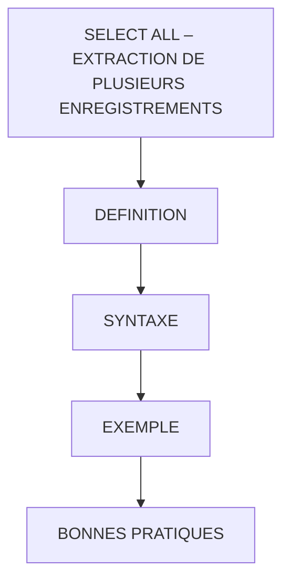

# 🌸 SELECT ALL – EXTRACTION DE PLUSIEURS ENREGISTREMENTS

## 🌺 OBJECTIFS

- [ ] Comprendre l’utilisation de SELECT ALL pour récupérer plusieurs enregistrements depuis une table SAP
- [ ] Savoir récupérer tous les champs ou seulement certains champs
- [ ] Identifier l’usage du caractère d’évasion `@` pour les variables externes
- [ ] Stocker les résultats dans une structure ou dans plusieurs variables

## 🌺 VUE D'ENSEMBLE

## 🌺 DÉFINITION

> SELECT ALL permet de lire plusieurs lignes d’une table SAP et de les stocker dans une structure ou des variables.
> Le symbole `*` signifie tous les champs.
> Le symbole `@` indique que la variable ou table interne utilisée dans le INTO fait partie du programme (externe à la base).

> [!TIP]
> Imaginez copier plusieurs lignes ou toutes les colonnes d’un classeur Excel
>
> - Vous pouvez sélectionner toutes les colonnes ou seulement certaines.
> - Vous pouvez mettre les résultats dans une fiche unique (structure) ou répartir dans plusieurs variables.

> [!IMPORTANT]
>
> - `SELECT` peut récupérer plusieurs enregistrements, mais il faut limiter le volume lu pour éviter une consommation excessive de mémoire.
> - Pour un seul enregistrement, préférez SELECT SINGLE.

> [!CAUTION]
> L’absence de clause WHERE dans SELECT ALL récupère toutes les lignes de la table, ce qui peut impacter les performances.

## 🌺 SYNTAXE

    SELECT *
      FROM table
      INTO [@]dest
      WHERE condition.

> [!NOTE]
>
> - `*` : ALL (toutes les colonnes)
> - `table` : table SAP ciblée
> - `dest` : variable, structure ou table interne
> - `condition` : filtre facultatif pour limiter la sélection

## 🌺 EXEMPLE

### 🍧 PERFORM SELECT_ALL_INTO_TAB

    DATA: lt_ekpo TYPE STANDARD TABLE OF ekpo.

    SELECT *
      FROM ekpo
      INTO TABLE lt_ekpo
      WHERE ebeln = '4500000106'.

    IF sy-subrc <> 0.
      MESSAGE 'Error select_all_into_tab' TYPE 'E'.
    ENDIF.

### 🍧 PERFORM SELECT_SINGLE_ALL_INTO_STRUCT

    DATA: ls_ekpo TYPE ekpo.

    SELECT SINGLE *
      FROM ekpo
      INTO ls_ekpo
      WHERE ebeln = '4500000106'.

    IF sy-subrc <> 0.
      MESSAGE 'Error select_all_into_tab' TYPE 'E'.
    ENDIF.

## 🌺 BONNES PRATIQUES

| 🍧 Bonnes pratiques                           | 🍧 Explications                                                            |
| --------------------------------------------- | -------------------------------------------------------------------------- |
| Utiliser `WHERE` lorsque le besoin ne porte pas sur toutes les lignes | Évite de transférer des données inutiles ; une lecture exhaustive reste valide si elle est réellement demandée |
| Utiliser INTO pour structures simples         | Stocke les données dans une seule structure                                |
| Utiliser INTO TABLE pour plusieurs lignes     | Stocke les résultats dans une table interne pour manipulations ultérieures |
| Préférer SELECT SINGLE pour un enregistrement | Évite de récupérer trop de lignes inutilement                              |
| Tester vos SELECT avec un petit échantillon   | Évite de surcharger le système                                             |

> [!IMPORTANT]
>
> - SELECT ALL pour récupérer plusieurs lignes ou toutes les colonnes

> [!TIP]
> Vous pouvez tester chaque SELECT dans un petit programme ABAP et afficher les résultats avec WRITE ou dans un ALV simple.

## 🌺 RÉSUMÉ

> - Savoir utiliser **définition** dans le contexte présenté.
> - Savoir utiliser **syntaxe** dans le contexte présenté.
> - **Exemple :** DATA: ltekpo TYPE STANDARD TABLE OF ekpo.

🍧 Afficher l’auto-évaluation

- [ ] Je peux définir **SELECT ALL – EXTRACTION DE PLUSIEURS ENREGISTREMENTS** avec mes propres mots.
- [ ] Je peux expliquer **definition** sans relire le chapitre.
- [ ] Je peux appliquer ou illustrer **syntaxe** dans un exemple simple.
- [ ] Je peux identifier au moins une erreur fréquente ou une limite liée à cette notion.

