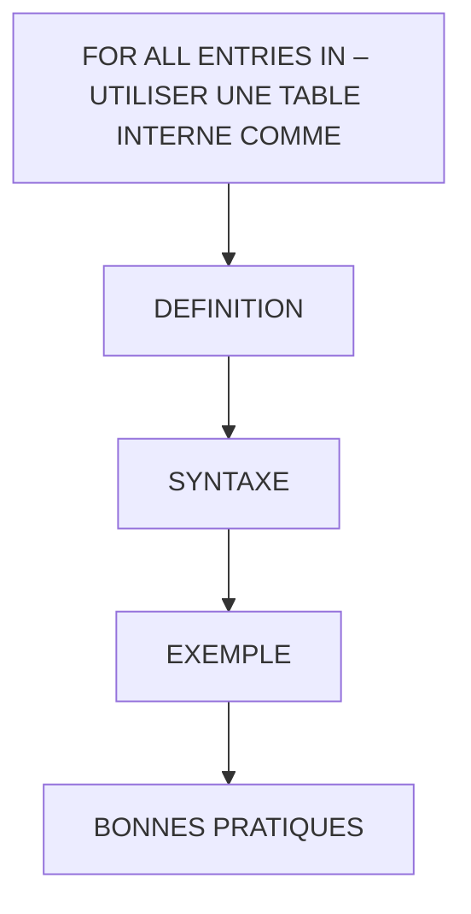

# 🌸 FOR ALL ENTRIES IN – UTILISER UNE TABLE INTERNE COMME FILTRE

## 🌺 OBJECTIFS

- [ ] Comprendre l’usage de `FOR ALL ENTRIES IN`
- [ ] Utiliser une table interne pour filtrer une sélection sur une table de base
- [ ] Vérifier que la table interne n’est pas vide avant la requête

## 🌺 VUE D'ENSEMBLE

## 🌺 DÉFINITION

> `FOR ALL ENTRIES IN itab`
> Permet d’effectuer une sélection dans une table de base en utilisant les valeurs contenues dans une table interne `itab` comme filtre.

> [!CAUTION]
> Si la table interne est vide, tous les enregistrements de la table de base seront sélectionnés, ce qui peut fortement impacter les performances.

> [!TIP]
> Imaginez que vous ayez un filtre Excel avec une liste de modèles de voitures.
> `FOR ALL ENTRIES` revient à ne sélectionner que les lignes correspondant aux valeurs présentes dans cette liste.

## 🌺 SYNTAXE

    SELECT champs
      FROM table_base
      INTO TABLE @DATA(table_resultat)
      FOR ALL ENTRIES IN @itab
      WHERE colonne1 = @itab-champ1
        AND colonne2 = @itab-champ2.

> [!NOTE]
> Les colonnes utilisées dans le WHERE doivent correspondre aux champs de la table interne.

## 🌺 EXEMPLE

    TYPES: BEGIN OF ty_ekko,
            ebeln TYPE ekko-ebeln,
            bukrs TYPE ekko-bukrs,
            lifnr TYPE ekko-lifnr,
            ernam TYPE ekko-ernam,
          END OF ty_ekko,

          BEGIN OF ty_ekpo,
            ebeln TYPE ekpo-ebeln,
            ebelp TYPE ekpo-ebelp,
            txz01 TYPE ekpo-txz01,
            matkl TYPE ekpo-matkl,
          END OF ty_ekpo.

    DATA: lt_ekko TYPE STANDARD TABLE OF ty_ekko,
          lt_ekpo TYPE STANDARD TABLE OF ty_ekpo.

    SELECT header~ebeln,
          header~bukrs,
          header~lifnr,
          header~ernam
      FROM ekko AS header
      INTO TABLE @lt_ekko
      WHERE header~bukrs = '1710'
        AND header~ernam = 'S4H_CO'.

    IF sy-subrc <> 0.
      MESSAGE 'Error select_for_all_entries_in' TYPE 'E'.
    ENDIF.

    SELECT post~ebeln,
          post~ebelp,
          post~txz01,
          post~matkl
      FROM ekpo AS post
      INTO TABLE @lt_ekpo
      FOR ALL ENTRIES IN @lt_ekko
      WHERE post~ebeln = @lt_ekko-ebeln
        AND ( post~matkl = 'ZFRAME' OR post~matkl = 'ZHANDLE' OR post~matkl = 'ZSEAT' ).

    IF sy-subrc <> 0.
      MESSAGE 'Error select_for_all_entries_in' TYPE 'E'.
    ENDIF.

## 🌺 BONNES PRATIQUES

- Toujours vérifier que la table interne n’est pas vide :

      IF NOT itab IS INITIAL.
         " FOR ALL ENTRIES IN ...
      ENDIF.

- Préférer un `INNER JOIN` si possible, surtout avec une base HANA, pour de meilleures performances.
- `FOR ALL ENTRIES IN` reste moins performant qu’un `JOIN`, surtout sur de grandes tables.

## 🌺 RÉSUMÉ

> - Savoir utiliser **définition** dans le contexte présenté.
> - **Syntaxe :** INTO TABLE @DATA(tableresultat)
> - **Exemple :** TYPES: BEGIN OF tyekko,

🍧 Afficher l’auto-évaluation

- [ ] Je peux définir **FOR ALL ENTRIES IN – UTILISER UNE TABLE INTERNE COMME FILTRE** avec mes propres mots.
- [ ] Je peux expliquer **definition** sans relire le chapitre.
- [ ] Je peux appliquer ou illustrer **syntaxe** dans un exemple simple.
- [ ] Je peux identifier au moins une erreur fréquente ou une limite liée à cette notion.

