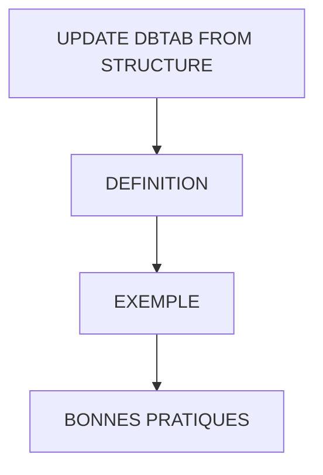

# 🌸 UPDATE DBTAB FROM STRUCTURE

## 🌺 OBJECTIFS

- [ ] Mettre à jour une ligne d'une table de base de données SAP à partir d'une structure ABAP
- [ ] Vérifier le succès de l'opération via `SY-SUBRC`
- [ ] Comprendre l’impact de la clé primaire sur la mise à jour
- [ ] Savoir préparer la structure avant l’`UPDATE`

## 🌺 VUE D'ENSEMBLE

## 🌺 DÉFINITION

> `UPDATE dbtab FROM struct`
> Met à jour la table `dbtab` avec les valeurs de la structure `struct`.
> Le système cherche un enregistrement ayant la même clé primaire que celle définie dans la structure.

> Variables système mises à jour :
>
> - `SY-SUBRC = 0` → mise à jour réussie
> - `SY-SUBRC = 4` → aucun enregistrement correspondant trouvé

> [!TIP]
> Imaginez un classeur Excel où la colonne "ID" est unique.
> Vous voulez modifier une ligne :
>
> - Si l’ID existe → les valeurs des autres colonnes sont mises à jour
> - Si l’ID n’existe pas → aucune modification n’est faite

> [!TIP]
> La structure doit contenir la clé primaire et toutes les valeurs à mettre à jour.

## 🌺 EXEMPLE

### 🍧 Mise à jour d’un enregistrement via structure

    CONSTANTS: lc_id_driver TYPE zdriver_id VALUE 'C0001'.

    " Récupération de l'enregistrement
    SELECT SINGLE *
      FROM ztravel
      INTO @DATA(ls_travel)
      WHERE id_driver = @lc_id_driver.

    IF sy-subrc = 0.

      " Modification des champs
      ls_travel-toll  = ls_travel-toll  + 5.
      ls_travel-gasol = ls_travel-gasol + 10.

      " Mise à jour dans la table
      UPDATE ztravel FROM ls_travel.

      IF sy-subrc = 0.
        WRITE 'Mise à jour réussie'.
      ELSE.
        WRITE 'Echec de la mise à jour'.
      ENDIF.

    ELSE.
      WRITE 'Enregistrement introuvable'.
    ENDIF.

### 🍧 ENREGISTREMENTS AVANT UPDATE

| 🍧 ID_DRIVER | 🍧 TOLL | 🍧 GAZOL |
| ------------ | ------- | -------- |
| C0001        | 16.00   | 40.21    |

### 🍧 ENREGISTREMENTS APRES UPDATE

| 🍧 ID_DRIVER | 🍧 TOLL | 🍧 GAZOL |
| ------------ | ------- | -------- |
| C0001        | 21.00   | 50.21    |

## 🌺 BONNES PRATIQUES

1. Toujours vérifier `SY-SUBRC` après le `SELECT SINGLE` pour s’assurer qu’un enregistrement existe.
2. Modifier uniquement les champs souhaités dans la structure avant le `UPDATE`.
3. Tester `SY-SUBRC` après le `UPDATE` pour confirmer la réussite.
4. Cette méthode fonctionne uniquement sur un enregistrement à la fois.
5. Préparer les valeurs correctement pour éviter d’écraser des données importantes.

## 🌺 RÉSUMÉ

> - Savoir utiliser **définition** dans le contexte présenté.
> - **Exemple :** CONSTANTS: lciddriver TYPE zdriverid VALUE 'C0001'.
> - **Bonnes pratiques :** 1.

🍧 Afficher l’auto-évaluation

- [ ] Je peux définir **UPDATE DBTAB FROM STRUCTURE** avec mes propres mots.
- [ ] Je peux expliquer **definition** sans relire le chapitre.
- [ ] Je peux appliquer ou illustrer **exemple** dans un exemple simple.
- [ ] Je peux identifier au moins une erreur fréquente ou une limite liée à cette notion.

