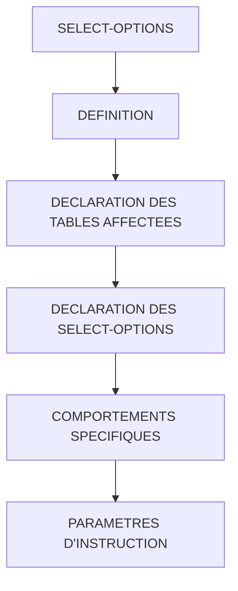

# 🌸 SELECT-OPTIONS

## 🌺 OBJECTIFS

- [ ] CREER UN CHAMP DE SAISIE PERMETTANT DE RECUPERER UNE PLAGE DE VALEURS
- [ ] RECUPERER ET UTILISER LES VALEURS SAISIES DANS LE PROGRAMME ABAP
- [ ] PERMETTRE A L’UTILISATEUR DE FILTRER SUR DES PLAGES DE DONNEES

## 🌺 VUE D'ENSEMBLE

## 🌺 DÉFINITION

> Les `SELECT-OPTIONS` créent des champs de saisie doubles pour l’utilisateur afin de récupérer une plage de valeurs.
> Contrairement aux `PARAMETERS`, un `SELECT-OPTIONS` peut contenir plusieurs lignes correspondant à une plage ou à plusieurs entrées distinctes.

> [!TIP]
> Imaginez une feuille Excel où l’on peut saisir plusieurs intervalles de valeurs ou une liste de numéros : `SELECT-OPTIONS` permet cette flexibilité alors qu’un `PARAMETERS` ne permet qu’une seule cellule.

> [!TIP]
> `SELECT-OPTIONS` reprend le type de l'objet indiqué après `FOR`. Une aide à la saisie est disponible seulement si cette référence ou la logique d'écran en fournit une.

## 🌺 DECLARATION DES TABLES AFFECTEES

_Exemple de déclaration_

    TABLES: vbak, vbap.

> [!CAUTION]
>
> - La déclaration préalable d'une table n'est nécessaire que si le type de référence est exprimé par `FOR <table>-<field>`. Un élément de données ou une variable correctement typée peut aussi servir de référence selon la syntaxe utilisée.
> - Généralement placé au début du programme avec les variables et constantes.
> - Permet de lier le type du champ et d’activer automatiquement le match-code.

## 🌺 DECLARATION DES SELECT-OPTIONS

_Exemple de déclaration_

    SELECT-OPTIONS: s_vbeln FOR vbak-vbeln,
                    s_posnr FOR vbap-posnr.

> [!IMPORTANT]
>
> - `SELECT-OPTIONS:` obligatoire pour déclarer un ou plusieurs champs.
> - `s_vbeln` : nom du champ, convention `s_` pour SELECT-OPTIONS, ici pour le numéro de document commercial.
> - `FOR` : indique la table et le champ pour définir le type et générer le match-code.
> - `s_posnr` : second champ pour saisir les numéros de poste.
> - Chaque `SELECT-OPTIONS` peut contenir plusieurs lignes, permettant de saisir des plages ou plusieurs valeurs séparées.

## 🌺 COMPORTEMENTS SPECIFIQUES

### 🍧 UNE SEULE ENTREE

- Si une seule valeur est saisie, le `SELECT-OPTIONS` se comporte comme un `PARAMETERS`.

### 🍧 ABSENCE D'ENTREE

- Si aucune ligne n'est saisie, la table de sélection est initiale. Dans une condition Open SQL `WHERE field IN s_field`, ce critère ne restreint alors pas le résultat. Ce comportement ne signifie pas que tous les traitements ABAP interprètent automatiquement une table vide comme « toutes les valeurs ».

> [!CAUTION]
> Ne pas oublier de vérifier la table affectée si vous utilisez `SELECT-OPTIONS` pour filtrer les données, sinon des valeurs inattendues peuvent être considérées comme valides.

## 🌺 PARAMÈTRES D'INSTRUCTION

### 🍧 CHAMP TYPE OBLIGATOIRE

> [!IMPORTANT]
> L'option `OBLIGATORY` de `SELECT-OPTIONS` impose une saisie sur la ligne de sélection. Elle ne garantit pas, à elle seule, la validité métier de l'intervalle ; cette validation reste à programmer.

    SELECT-OPTIONS: s_vbeln FOR vbak-vbeln OBLIGATORY,
                    s_posnr FOR vbap-posnr.

### 🍧 CHAMP AVEC VALEUR PAR DEFAUT

> [!IMPORTANT]
> Le paramètre `DEFAULT` suivie de la valeur applique une valeur par défaut sur le champ au niveau de la valeur Low.

    SELECT-OPTIONS: s_vbeln FOR vbak-vbeln OBLIGATORY,
                    s_posnr FOR vbap-posnr DEFAULT '00015'.

## 🌺 TEXTES D'INPUTS

- Les textes d’interface peuvent être personnalisés comme pour les `PARAMETERS`.
- Permet de rendre l’interface plus lisible et accessible

## 🌺 BONNES PRATIQUES

- Appliquer la convention de l'équipe ; `s_` est une convention courante pour les `SELECT-OPTIONS`.
- Référencer directement le champ DDIC ou une donnée typée ; ne pas ajouter `TABLES` sans nécessité.
- Prévoir des textes d’input clairs pour chaque champ.
- Tester les différentes saisies possibles : plage, valeur unique, aucune valeur.

## 🌺 RÉSUMÉ

> - `SELECT-OPTIONS` crée des champs de saisie pour des plages ou plusieurs valeurs.
> - Chaque entrée peut contenir une ou plusieurs lignes.
> - Une déclaration `TABLES` n'est pas obligatoire pour référencer un champ DDIC dans `FOR`.
> - Noms commencent par `s_` par convention.
> - Permet un filtrage flexible et puissant dans un programme ABAP.

🍧 Afficher l’auto-évaluation

- [ ] Je peux définir **SELECT-OPTIONS** avec mes propres mots.
- [ ] Je peux expliquer **definition** sans relire le chapitre.
- [ ] Je peux appliquer ou illustrer **declaration des tables affectees** dans un exemple simple.
- [ ] Je peux identifier au moins une erreur fréquente ou une limite liée à cette notion.

