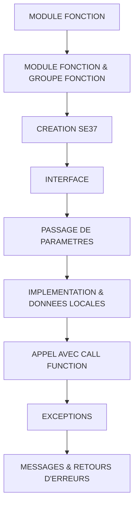

# 🌸 SOMMAIRE — MODULE FONCTION

## 🌺 OBJECTIFS DU COURS

- [ ] Comprendre la progression générale du cours.
- [ ] Identifier l’ordre conseillé des chapitres.
- [ ] Retrouver rapidement une notion précise.

## 🌺 PARCOURS

> [!IMPORTANT]
> Suivre les chapitres dans l’ordre numérique, sauf révision ciblée d’une notion déjà étudiée.

## 🌺 CHAPITRES

- [MODULE FONCTION & GROUPE FONCTION](<./01 - 🍧 MODULE FONCTION & GROUPE FONCTION.md>)
- [CREATION SE37](<./02 - 🍧 CREATION SE37.md>)
- [INTERFACE](<./03 - 🍧 INTERFACE.md>)
- [PASSAGE DE PARAMETRES](<./04 - 🍧 PASSAGE DE PARAMETRES.md>)
- [IMPLEMENTATION & DONNEES LOCALES](<./05 - 🍧 IMPLEMENTATION & DONNEES LOCALES.md>)
- [APPEL AVEC CALL FUNCTION](<./06 - 🍧 APPEL AVEC CALL FUNCTION.md>)
- [EXCEPTIONS](<./07 - 🍧 EXCEPTIONS.md>)
- [MESSAGES & RETOURS D'ERREURS](<./08 - 🍧 MESSAGES & RETOURS D'ERREURS.md>)
- [DONNEES GLOBALES DU GROUPE](<./09 - 🍧 DONNEES GLOBALES DU GROUPE.md>)
- [MODULES FONCTION RFC](<./10 - 🍧 MODULES FONCTION RFC.md>)
- [MODULE FONCTION DE MISE A JOUR](<./11 - 🍧 MODULE FONCTION DE MISE A JOUR.md>)
- [BAPI & GESTION DE TRANSACTION](<./12 - 🍧 BAPI & GESTION DE TRANSACTION.md>)
- [TEST & DEBOGAGE](<./13 - 🍧 TEST & DEBOGAGE.md>)
- [BONNES PRATIQUES & LIMITES](<./14 - 🍧 BONNES PRATIQUES & LIMITES.md>)
- [CONVERSION EXITS](<./15 - 🍧 CONVERSION EXITS.md>)
- [EXCEPTIONS DES CONVERSION EXITS](<./16 - 🍧 EXCEPTIONS DES CONVERSION EXITS.md>)
- [VALIDATION DATE PAR MODULE FONCTION](<./17 - 🍧 VALIDATION DATE PAR MODULE FONCTION.md>)

Afficher la méthode de travail

1. Lire les objectifs du chapitre.
2. Étudier le schéma Mermaid.
3. Reproduire les exemples.
4. Réaliser l’exercice sans consulter la correction.
5. Valider l’auto-évaluation.

## 🌺 RÉSUMÉ

> - Ce sommaire représente le parcours du cours **MODULE FONCTION**.
> - Les liens pointent vers les chapitres conservés dans leur emplacement d’origine.
