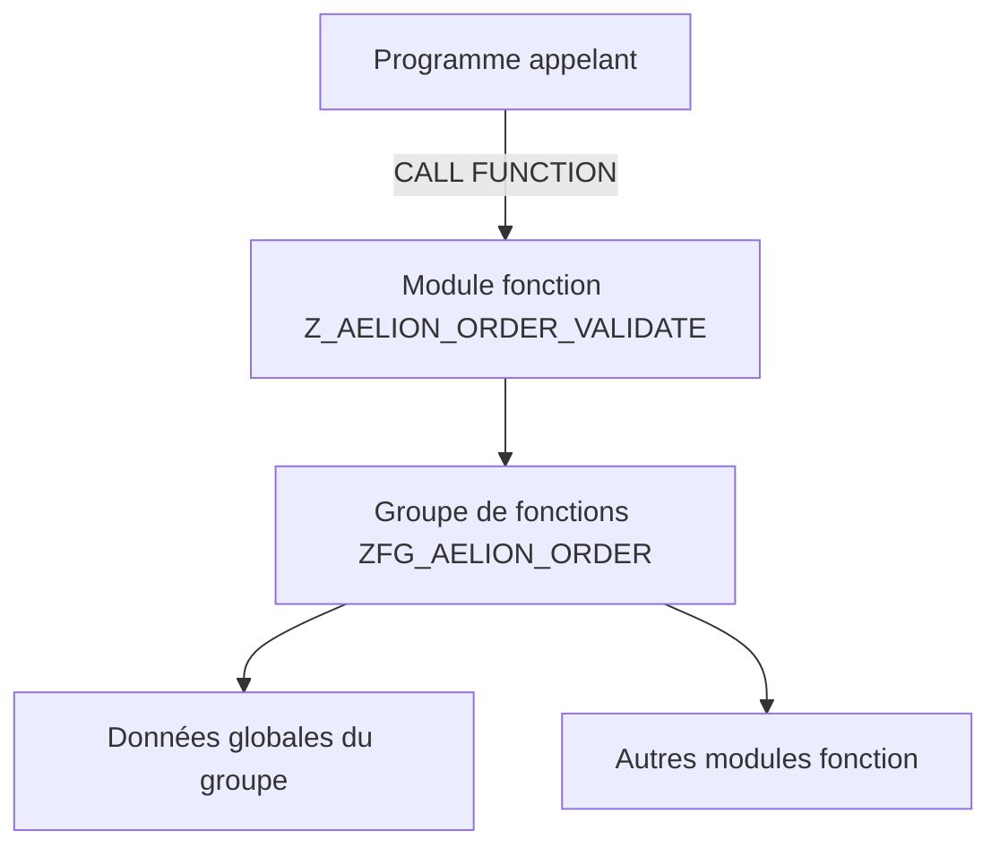

# 🌸 MODULES FONCTION ET GROUPES DE FONCTIONS

## 🌺 OBJECTIFS

- [ ] Définir un module fonction
- [ ] Définir un groupe de fonctions
- [ ] Comprendre le lien entre les deux objets
- [ ] Distinguer module fonction, sous-programme et méthode

## 🌺 DEFINITION DU MODULE FONCTION

> Un `MODULE FONCTION` est une procédure ABAP globale enregistrée dans la bibliothèque de fonctions SAP.
>
> Il possède un nom unique, une interface formelle et un bloc de code compris entre `FUNCTION` et `ENDFUNCTION`.

Un module fonction peut être appelé depuis différents programmes ABAP avec l’instruction :

    CALL FUNCTION 'Z_AELION_CALCULATE_TOTAL'.

> [!TIP]
> Un module fonction peut être comparé à un service technique central : plusieurs programmes lui transmettent des données, il exécute un traitement, puis il retourne un résultat.

## 🌺 DEFINITION DU GROUPE DE FONCTIONS

> Un `GROUPE DE FONCTIONS` est le programme conteneur qui regroupe un ou plusieurs modules fonction liés à un même domaine.

Exemple :

    Groupe de fonctions : ZFG_AELION_ORDER

    Modules fonction :
    - Z_AELION_ORDER_CALCULATE
    - Z_AELION_ORDER_VALIDATE
    - Z_AELION_ORDER_READ

Le groupe de fonctions est techniquement un programme de type `FUNCTION-POOL`.

    FUNCTION-POOL zfg_aelion_order.

## 🌺 RELATION ENTRE LES OBJETS

> [!IMPORTANT]
> Un module fonction ne peut pas exister sans groupe de fonctions.

## 🌺 COMPARAISON

| 🍧 Objet        | 🍧 Portée                      | 🍧 Interface                                       | 🍧 Appel        |
| --------------- | ------------------------------ | -------------------------------------------------- | --------------- |
| `FORM`          | Programme ou includes associés | `USING`, `CHANGING`, `TABLES`                      | `PERFORM`       |
| Module fonction | Globale dans le système        | Import, export, changing, tables, exceptions       | `CALL FUNCTION` |
| Méthode         | Classe ou interface            | Importing, exporting, changing, returning, raising | `->` ou `=>`    |

## 🌺 STRUCTURE TECHNIQUE

Un groupe de fonctions généré dans le Workbench contient notamment :

- un programme principal de type fonction pool ;
- un include global, souvent nommé `L<groupe>TOP` ;
- un include par module fonction, souvent nommé `L<groupe>Uxx` ;
- éventuellement des includes supplémentaires pour les formulaires, écrans ou modules dynpro.

> [!NOTE]
> Les noms exacts des includes sont générés par SAP. Ils ne doivent pas être renommés manuellement.

## 🌺 QUAND RENCONTRE-T-ON DES MODULES FONCTION ?

- APIs historiques SAP ;
- BAPI ;
- appels RFC ;
- modules de mise à jour ;
- exits et frameworks classiques ;
- traitements partagés dans des développements existants.

## 🌺 EXEMPLE CONCEPTUEL

Entrées :

    IV_QUANTITY   = 4
    IV_UNIT_PRICE = 12.50

Traitement :

    EV_TOTAL = IV_QUANTITY * IV_UNIT_PRICE

Sortie :

    EV_TOTAL = 50.00

## 🌺 BONNES PRATIQUES

- Regrouper dans un même groupe les fonctions d’un même domaine.
- Donner un nom explicite au groupe et aux modules.
- Éviter de mélanger lecture, validation, affichage et mise à jour dans un seul module.
- Documenter l’objectif, les paramètres et les erreurs possibles.
- Vérifier les programmes appelants avant de modifier une interface existante.

## 🌺 EXERCICES

1. Expliquer la différence entre un groupe de fonctions et un module fonction.
2. Donner un exemple de domaine fonctionnel pouvant contenir trois modules fonction.
3. Identifier l’instruction utilisée pour appeler un module fonction.
4. Expliquer pourquoi le nom du module fonction doit être unique.

## 🌺 RESUME

> - Le module fonction est une procédure globale.
> - Le groupe de fonctions est son programme conteneur.
> - L’appel utilise `CALL FUNCTION`.
> - Plusieurs modules fonction peuvent partager les données globales du même groupe.
> - Cette portée globale impose de contrôler les impacts avant toute modification.

## 🌺 SOURCES OFFICIELLES

- SAP Help Portal — Overview of Function Modules : https://help.sap.com/docs/SAP_NETWEAVER_702/ff59ad5d6c55101492f7f1c64dee0529/d1801ea7454211d189710000e8322d00.html
- SAP Help Portal — Modularization with Function Modules : https://help.sap.com/docs/SAP_NETWEAVER_AS_ABAP_FOR_SOH_740/c238d694b825421f940829321ffa326a/4ec1cbf46e391014adc9fffe4e204223.html
