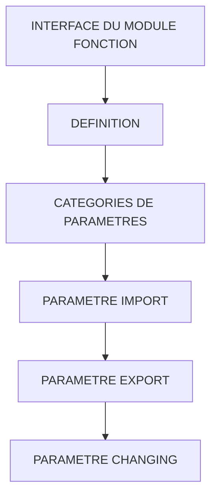

# 🌸 INTERFACE DU MODULE FONCTION

## 🌺 OBJECTIFS

- [ ] Utiliser les paramètres d’import
- [ ] Utiliser les paramètres d’export
- [ ] Utiliser les paramètres changing
- [ ] Comprendre les paramètres tables
- [ ] Choisir une direction cohérente pour chaque donnée

## 🌺 VUE D'ENSEMBLE

## 🌺 DÉFINITION

> L’interface définit le contrat entre le programme appelant et le module fonction.
> Elle précise les données reçues, retournées, modifiées et les erreurs déclarées.

## 🌺 CATEGORIES DE PARAMÈTRES

| 🍧 Interface SE37 | 🍧 Sens logique      | 🍧 Vue du module fonction |
| ----------------- | -------------------- | ------------------------- |
| Import            | Appelant vers module | Entrée                    |
| Export            | Module vers appelant | Sortie                    |
| Changing          | Dans les deux sens   | Entrée puis sortie        |
| Tables            | Dans les deux sens   | Table héritée             |
| Exceptions        | Module vers appelant | Erreur classique          |

## 🌺 PARAMETRE IMPORT

Déclaration générée :

    IMPORTING
      VALUE(iv_quantity) TYPE i

Utilisation dans le module :

    IF iv_quantity <= 0.
      RAISE invalid_quantity.
    ENDIF.

Le module reçoit la valeur. Il ne doit pas utiliser un paramètre d’import comme sortie fonctionnelle.

## 🌺 PARAMETRE EXPORT

Déclaration générée :

    EXPORTING
      VALUE(ev_total) TYPE decfloat34

Utilisation :

    ev_total = iv_quantity * iv_unit_price.

Le module affecte la donnée retournée au programme appelant.

## 🌺 PARAMETRE CHANGING

Déclaration générée :

    CHANGING
      VALUE(cv_text) TYPE string

Utilisation :

    CONDENSE cv_text.
    TRANSLATE cv_text TO UPPER CASE.

Le même paramètre contient une valeur avant l’appel et une valeur potentiellement différente après l’appel.

## 🌺 PARAMETRE TABLES

Syntaxe héritée :

    TABLES
      et_items STRUCTURE zsaelion_item

> [!WARNING]
> Les paramètres `TABLES` sont obsolètes dans la documentation ABAP actuelle. Ils restent fréquents dans les modules historiques, mais ne doivent pas être le choix par défaut pour un nouveau module.

Pour un nouveau développement, utiliser plutôt un paramètre typé comme table interne dans `IMPORT`, `EXPORT` ou `CHANGING`.

Exemple de type DDIC :

    ZTAELION_ITEM

Exemple d’interface moderne :

    EXPORTING
      VALUE(et_items) TYPE ztaelion_item

## 🌺 EXEMPLE D'INTERFACE COMPLETE

    FUNCTION z_aelion_calculate_total.
    *"----------------------------------------------------------------------
    *"* Interface locale :
    *"  IMPORTING
    *"     VALUE(IV_QUANTITY) TYPE I
    *"     VALUE(IV_UNIT_PRICE) TYPE DECFLOAT34
    *"  EXPORTING
    *"     VALUE(EV_TOTAL) TYPE DECFLOAT34
    *"  CHANGING
    *"     VALUE(CV_DESCRIPTION) TYPE STRING
    *"  EXCEPTIONS
    *"      INVALID_QUANTITY
    *"----------------------------------------------------------------------

      IF iv_quantity <= 0.
        RAISE invalid_quantity.
      ENDIF.

      ev_total = iv_quantity * iv_unit_price.

      CONDENSE cv_description.

    ENDFUNCTION.

## 🌺 NOMMAGE DES PARAMÈTRES

| 🍧 Préfixe | 🍧 Signification           | 🍧 Exemple   |
| ---------- | -------------------------- | ------------ |
| `IV_`      | Import, valeur élémentaire | `IV_MATNR`   |
| `IS_`      | Import, structure          | `IS_HEADER`  |
| `IT_`      | Import, table              | `IT_ITEMS`   |
| `EV_`      | Export, valeur élémentaire | `EV_TOTAL`   |
| `ES_`      | Export, structure          | `ES_RESULT`  |
| `ET_`      | Export, table              | `ET_ITEMS`   |
| `CV_`      | Changing, valeur           | `CV_COUNTER` |
| `CS_`      | Changing, structure        | `CS_HEADER`  |
| `CT_`      | Changing, table            | `CT_ITEMS`   |

> [!NOTE]
> Ces préfixes sont une convention de lisibilité. Ils ne modifient pas le comportement ABAP.

## 🌺 BONNES PRATIQUES

- Utiliser `IMPORT` pour une entrée et `EXPORT` pour une sortie.
- Réserver `CHANGING` aux données réellement modifiées.
- Éviter `TABLES` dans les nouveaux modules.
- Utiliser des types DDIC stables pour les interfaces réutilisées ou distantes.
- Choisir des noms qui expriment le contenu, pas uniquement le type technique.

## 🌺 EXERCICES

1. Définir l’interface d’un module qui reçoit deux nombres et retourne leur moyenne.
2. Définir l’interface d’un module qui normalise un texte reçu puis modifié.
3. Définir l’interface d’un module qui reçoit une table et retourne une autre table.
4. Expliquer pourquoi `TABLES` ne doit pas être privilégié dans un nouveau développement.

## 🌺 RÉSUMÉ

> - `IMPORT` fournit les entrées.
> - `EXPORT` fournit les sorties.
> - `CHANGING` reçoit puis modifie une donnée.
> - `TABLES` est une forme héritée et obsolète.
> - L’interface est un contrat global qui doit rester lisible et stable.

🍧 Afficher l’auto-évaluation

- [ ] Je peux définir **INTERFACE DU MODULE FONCTION** avec mes propres mots.
- [ ] Je peux expliquer **definition** sans relire le chapitre.
- [ ] Je peux appliquer ou illustrer **categories de parametres** dans un exemple simple.
- [ ] Je peux identifier au moins une erreur fréquente ou une limite liée à cette notion.

## 🌺 SOURCES OFFICIELLES

- SAP Help Portal — Interface Parameters of a Function Module : https://help.sap.com/docs/SAP_NETWEAVER_702/ff59ad5d6c55101492f7f1c64dee0529/d1801ece454211d189710000e8322d00.html
- SAP ABAP Keyword Documentation — Obsolete `TABLES` Parameters : https://help.sap.com/doc/abapdocu_latest_index_htm/latest/en-US/ABAPTABLES_PARAMETERS_OBSOLETE.html
