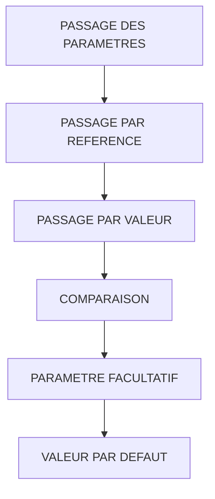

# 🌸 PASSAGE DES PARAMETRES

## 🌺 OBJECTIFS

- [ ] Distinguer passage par référence et passage par valeur
- [ ] Comprendre le mot-clé `VALUE`
- [ ] Déclarer un paramètre facultatif
- [ ] Déclarer une valeur par défaut
- [ ] Éviter les modifications involontaires

## 🌺 VUE D'ENSEMBLE

## 🌺 PASSAGE PAR REFERENCE

> Lors d’un passage par référence, le paramètre formel du module fonction référence la donnée réelle du programme appelant.

Conséquence :

- aucune copie complète n’est nécessaire au moment de l’appel ;
- une modification peut affecter directement la donnée de l’appelant selon la direction du paramètre ;
- le comportement dépend du type de paramètre et de son utilisation.

## 🌺 PASSAGE PAR VALEUR

> Lors d’un passage par valeur, le module fonction travaille avec une copie logique du contenu transmis.

Dans l’interface générée, le passage par valeur est représenté par `VALUE(...)`.

    IMPORTING
      VALUE(iv_text) TYPE string

> [!IMPORTANT]
> Le mot-clé `VALUE` placé autour du nom du paramètre indique le passage par valeur. Il ne sert pas à donner une valeur par défaut.

## 🌺 COMPARAISON

| 🍧 Critère                      | 🍧 Référence                     | 🍧 Valeur                      |
| ------------------------------- | -------------------------------- | ------------------------------ |
| Donnée manipulée                | Référence vers le paramètre réel | Copie logique                  |
| Risque de modification directe  | Plus élevé selon la direction    | Limité par la copie            |
| Coût potentiel sur gros volumes | Souvent plus faible              | Copie potentiellement coûteuse |
| Lisibilité du contrat           | Effet moins explicite            | Isolation plus explicite       |

> [!NOTE]
> Le choix ne doit pas être fait uniquement sur la performance. La sécurité du contrat et le volume des données doivent être considérés.

## 🌺 PARAMETRE FACULTATIF

Dans `SE37`, cocher la propriété **Optional** sur le paramètre.

Exemple de déclaration :

    IMPORTING
      VALUE(iv_separator) TYPE c OPTIONAL

Le programme appelant peut omettre le paramètre.

Dans le module :

    IF iv_separator IS INITIAL.
      DATA(lv_separator) = `-`.
    ELSE.
      lv_separator = iv_separator.
    ENDIF.

## 🌺 VALEUR PAR DEFAUT

Une valeur par défaut est utilisée lorsque l’appelant ne transmet pas le paramètre.

    IMPORTING
      VALUE(iv_multiplier) TYPE i DEFAULT 1

Appel sans le paramètre :

    CALL FUNCTION 'Z_AELION_MULTIPLY'
      EXPORTING
        iv_value = 10
      IMPORTING
        ev_result = DATA(lv_result).

Le multiplicateur vaut alors `1`.

## 🌺 EXEMPLE COMPLET

Interface :

    IMPORTING
      VALUE(iv_text)      TYPE string
      VALUE(iv_uppercase) TYPE abap_bool DEFAULT abap_false
      VALUE(iv_prefix)    TYPE string OPTIONAL
    EXPORTING
      VALUE(ev_text)      TYPE string

Traitement :

    ev_text = iv_text.

    IF iv_uppercase = abap_true.
      TRANSLATE ev_text TO UPPER CASE.
    ENDIF.

    IF iv_prefix IS NOT INITIAL.
      ev_text = |{ iv_prefix }{ ev_text }|.
    ENDIF.

## 🌺 ERREUR CLASSIQUE

Mauvaise conception :

    IMPORTING
      iv_text TYPE string

Puis utilisation de `iv_text` comme résultat du traitement.

Bonne conception :

    IMPORTING
      VALUE(iv_text) TYPE string
    EXPORTING
      VALUE(ev_text) TYPE string

Le sens de la donnée est explicite.

## 🌺 BONNES PRATIQUES

- Utiliser le passage par valeur pour isoler une entrée lorsque la copie reste raisonnable.
- Éviter les paramètres facultatifs lorsque la donnée est réellement obligatoire.
- Donner une valeur par défaut seulement lorsqu’elle est fonctionnellement non ambiguë.
- Documenter le comportement d’un paramètre omis.
- Ne pas utiliser une entrée comme sortie cachée.

## 🌺 EXERCICES

1. Créer un paramètre obligatoire `IV_TEXT`.
2. Créer un paramètre facultatif `IV_PREFIX`.
3. Créer un paramètre `IV_UPPERCASE` avec `ABAP_FALSE` comme valeur par défaut.
4. Retourner le texte transformé dans `EV_TEXT`.
5. Tester les trois combinaisons d’appel.

## 🌺 RÉSUMÉ

> - `VALUE(...)` indique le passage par valeur.
> - Sans passage par valeur, le paramètre peut être transmis par référence.
> - `OPTIONAL` autorise l’absence du paramètre.
> - `DEFAULT` fournit une valeur lorsque le paramètre est omis.
> - Le sens de l’interface doit rester explicite.

🍧 Afficher l’auto-évaluation

- [ ] Je peux définir **PASSAGE DES PARAMETRES** avec mes propres mots.
- [ ] Je peux expliquer **passage par reference** sans relire le chapitre.
- [ ] Je peux appliquer ou illustrer **passage par valeur** dans un exemple simple.
- [ ] Je peux identifier au moins une erreur fréquente ou une limite liée à cette notion.

## 🌺 SOURCES OFFICIELLES

- SAP ABAP Keyword Documentation — `CALL FUNCTION`, Parameter List : https://help.sap.com/doc/abapdocu_latest_index_htm/latest/en-US/ABAPCALL_FUNCTION_PARAMETER.html
- SAP Help Portal — Specifying Parameters and Exceptions : https://help.sap.com/docs/ABAP_PLATFORM_2021/bd833c8355f34e96a6e83096b38bf192/d1801f0f454211d189710000e8322d00.html
