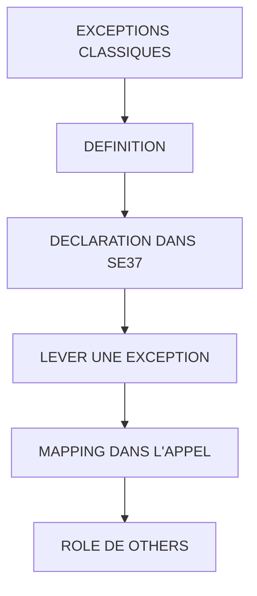

# 🌸 EXCEPTIONS CLASSIQUES

## 🌺 OBJECTIFS

- [ ] Déclarer une exception classique dans `SE37`
- [ ] Lever une exception avec `RAISE`
- [ ] Mapper les exceptions dans `CALL FUNCTION`
- [ ] Interpréter `SY-SUBRC`
- [ ] Comprendre la différence avec une exception de classe

## 🌺 VUE D'ENSEMBLE

## 🌺 DÉFINITION

> Une exception classique signale qu’un module fonction n’a pas pu produire son résultat normal.

Exemples :

- quantité invalide ;
- article inexistant ;
- division par zéro ;
- autorisation absente ;
- état fonctionnel incompatible.

## 🌺 DECLARATION DANS SE37

Onglet **Exceptions** :

    INVALID_QUANTITY
    MATERIAL_NOT_FOUND
    NOT_AUTHORIZED

L’ordre de déclaration n’impose pas la valeur de `SY-SUBRC`. La valeur est définie dans la section `EXCEPTIONS` du programme appelant.

## 🌺 LEVER UNE EXCEPTION

    IF iv_quantity <= 0.
      RAISE invalid_quantity.
    ENDIF.

Lors du `RAISE`, le traitement normal du module fonction est interrompu et revient à l’appelant.

## 🌺 MAPPING DANS L'APPEL

    CALL FUNCTION 'Z_AELION_CALCULATE_TOTAL'
      EXPORTING
        iv_quantity   = lv_quantity
        iv_unit_price = lv_unit_price
      IMPORTING
        ev_total      = lv_total
      EXCEPTIONS
        invalid_quantity = 1
        invalid_price    = 2
        OTHERS           = 3.

    CASE sy-subrc.
      WHEN 0.
        WRITE / lv_total.
      WHEN 1.
        MESSAGE 'Quantité invalide' TYPE 'E'.
      WHEN 2.
        MESSAGE 'Prix invalide' TYPE 'E'.
      WHEN OTHERS.
        MESSAGE 'Erreur inattendue' TYPE 'E'.
    ENDCASE.

## 🌺 RÔLE DE OTHERS

`OTHERS` récupère les exceptions classiques qui ne sont pas mappées individuellement.

    OTHERS = 4

> [!WARNING]
> `OTHERS` ne permet pas d’identifier précisément l’erreur. Les exceptions attendues doivent être nommées explicitement.

## 🌺 MESSAGE ... RAISING

Un module fonction peut associer un message à une exception classique :

    MESSAGE e001(zaelion) WITH iv_quantity
      RAISING invalid_quantity.

Le message n’est pas obligatoirement affiché directement par l’appelant. Le comportement dépend de la manière dont l’appel et les exceptions sont traités.

## 🌺 EXCEPTION CLASSIQUE ET EXCEPTION DE CLASSE

| 🍧 Critère               | 🍧 Exception classique     | 🍧 Exception de classe              |
| ------------------------ | -------------------------- | ----------------------------------- |
| Déclaration              | Onglet Exceptions          | Classe d’exception et `RAISING`     |
| Déclenchement            | `RAISE nom_exception`      | `RAISE EXCEPTION TYPE ...`          |
| Traitement               | `EXCEPTIONS` et `SY-SUBRC` | `TRY ... CATCH`                     |
| Informations structurées | Limitées                   | Attributs et texte d’exception      |
| Recommandation moderne   | Héritage fréquent          | Préférée dans le code orienté objet |

> [!IMPORTANT]
> Les modules fonction historiques utilisent largement les exceptions classiques. Il faut savoir les traiter correctement même lorsqu’un nouveau code privilégie les exceptions de classe.

## 🌺 ERREUR CLASSIQUE

Appel incorrect :

    CALL FUNCTION 'Z_AELION_CALCULATE_TOTAL'
      EXPORTING
        iv_quantity = 0.

Aucune section `EXCEPTIONS`, aucun contrôle de `SY-SUBRC`.

Conséquence : le programme ne gère pas explicitement l’échec déclaré par le module.

## 🌺 BONNES PRATIQUES

- Donner à l’exception un nom décrivant la cause.
- Déclarer uniquement les erreurs réellement détectées.
- Traiter chaque exception attendue.
- Réserver `OTHERS` aux erreurs non prévues.
- Ne pas continuer le traitement comme si `SY-SUBRC` valait zéro.
- Ne pas réutiliser une ancienne variable de sortie après un appel en erreur.

## 🌺 EXERCICES

1. Déclarer `DIVISION_BY_ZERO`.
2. Lever l’exception lorsque le diviseur vaut zéro.
3. Mapper l’exception sur `SY-SUBRC = 1`.
4. Ajouter `OTHERS = 2`.
5. Afficher un message différent pour chaque résultat.

## 🌺 RÉSUMÉ

> - Une exception classique est déclarée dans `SE37`.
> - Elle est levée avec `RAISE` ou `MESSAGE ... RAISING`.
> - L’appelant lui affecte une valeur dans `EXCEPTIONS`.
> - `SY-SUBRC = 0` indique le traitement normal de l’appel.
> - Les erreurs attendues doivent être traitées individuellement.

🍧 Afficher l’auto-évaluation

- [ ] Je peux définir **EXCEPTIONS CLASSIQUES** avec mes propres mots.
- [ ] Je peux expliquer **definition** sans relire le chapitre.
- [ ] Je peux appliquer ou illustrer **declaration dans se37** dans un exemple simple.
- [ ] Je peux identifier au moins une erreur fréquente ou une limite liée à cette notion.

## 🌺 SOURCES OFFICIELLES

- SAP ABAP Keyword Documentation — `CALL FUNCTION` : https://help.sap.com/doc/abapdocu_latest_index_htm/latest/en-US/abapcall_function.htm
- SAP ABAP Keyword Documentation — Classic and Class-Based Exceptions : https://help.sap.com/doc/abapdocu_latest_index_htm/latest/en-US/ABENCLASS_EXCEPTION_GUIDL.html
