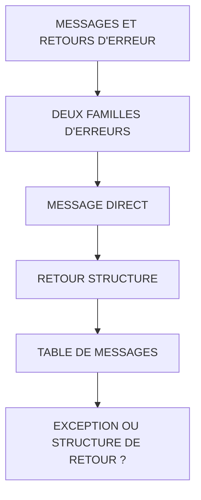

# 🌸 MESSAGES ET RETOURS D'ERREUR

## 🌺 OBJECTIFS

- [ ] Distinguer exception technique et message fonctionnel
- [ ] Retourner un message structuré
- [ ] Utiliser une structure de type `BAPIRET2`
- [ ] Éviter les sorties écran dans une API réutilisable
- [ ] Définir un contrat d’erreur cohérent

## 🌺 VUE D'ENSEMBLE

## 🌺 DEUX FAMILLES D'ERREURS

| 🍧 Famille    | 🍧 Exemple                                                  | 🍧 Traitement possible                |
| ------------- | ----------------------------------------------------------- | ------------------------------------- |
| Technique     | Erreur SQL, type incompatible, destination RFC indisponible | Exception, journal technique          |
| Fonctionnelle | Quantité supérieure au stock, article bloqué                | Structure de retour, exception métier |

## 🌺 MESSAGE DIRECT

Exemple :

    MESSAGE e001(zaelion) WITH iv_matnr.

> [!WARNING]
> Un message de type `E`, `A` ou `X` peut modifier fortement le flux d’exécution selon le contexte. Une API réutilisable ne doit pas produire un comportement d’interface utilisateur imprévisible.

## 🌺 RETOUR STRUCTURE

Une structure de retour peut contenir :

- type du message ;
- classe de messages ;
- numéro ;
- texte ;
- variables du message ;
- champ concerné.

Le type standard `BAPIRET2` est fréquemment utilisé dans les BAPI et APIs classiques.

Exemple d’interface :

    EXPORTING
      VALUE(es_return) TYPE bapiret2

Exemple de remplissage :

    CLEAR es_return.

    IF iv_quantity <= 0.
      es_return-type       = 'E'.
      es_return-id         = 'ZAELION'.
      es_return-number     = '001'.
      es_return-message_v1 = |{ iv_quantity }|.

      MESSAGE ID es_return-id
              TYPE es_return-type
              NUMBER es_return-number
              WITH es_return-message_v1
              INTO es_return-message.
      RETURN.
    ENDIF.

## 🌺 TABLE DE MESSAGES

Pour plusieurs contrôles :

    EXPORTING
      VALUE(et_return) TYPE bapiret2_t

Exemple :

    APPEND VALUE #(
      type    = 'E'
      id      = 'ZAELION'
      number  = '001'
      message = 'La quantité doit être positive' )
      TO et_return.

> [!NOTE]
> Selon la version et le système, le type table standard disponible peut varier. Vérifier dans `SE11` le type retenu par le projet.

## 🌺 EXCEPTION OU STRUCTURE DE RETOUR ?

Utiliser une exception lorsque :

- le traitement ne peut pas continuer ;
- l’appelant doit prendre une branche d’erreur ;
- l’erreur représente un état exceptionnel du contrat.

Utiliser une structure ou une table de retour lorsque :

- plusieurs validations doivent être retournées ;
- le consommateur doit afficher une liste de messages ;
- le contrat suit un modèle BAPI existant.

## 🌺 CONTRAT COHERENT

Mauvais contrat :

- une exception pour certaines erreurs ;
- un `MESSAGE E` pour d’autres ;
- une table de retour pour d’autres ;
- aucun ordre de priorité documenté.

Bon contrat :

- un mode principal de retour d’erreur ;
- des exceptions techniques clairement distinctes ;
- une documentation expliquant le résultat en cas d’erreur ;
- aucune sortie écran cachée.

## 🌺 BONNES PRATIQUES

- Ne pas afficher de popup dans un module destiné à plusieurs contextes.
- Retourner des messages compréhensibles sans noms de tables techniques inutiles.
- Renseigner le champ ou la donnée en erreur.
- Ne pas retourner un succès si une erreur bloquante est présente.
- Vider la structure ou la table de retour au début lorsque le contrat l’exige.
- Ne pas masquer une erreur technique derrière un texte fonctionnel générique.

## 🌺 EXERCICES

1. Ajouter un export `ES_RETURN TYPE BAPIRET2`.
2. Retourner une erreur lorsque le texte d’entrée est vide.
3. Retourner un succès lorsque le texte a été normalisé.
4. Tester l’appel sans produire de `MESSAGE E` direct.
5. Ajouter le nom du champ en erreur dans le message.

## 🌺 RÉSUMÉ

> - Une exception modifie le flux d’exécution.
> - Une structure de retour transporte une information d’erreur ou de succès.
> - `BAPIRET2` est un format standard fréquent.
> - Une API réutilisable doit éviter les sorties écran cachées.
> - Le contrat d’erreur doit être unique, explicite et documenté.

🍧 Afficher l’auto-évaluation

- [ ] Je peux définir **MESSAGES ET RETOURS D'ERREUR** avec mes propres mots.
- [ ] Je peux expliquer **deux familles d'erreurs** sans relire le chapitre.
- [ ] Je peux appliquer ou illustrer **message direct** dans un exemple simple.
- [ ] Je peux identifier au moins une erreur fréquente ou une limite liée à cette notion.

## 🌺 SOURCES OFFICIELLES

- SAP Help Portal — Implementing the Function Module for a BAPI : https://help.sap.com/docs/ABAP_PLATFORM_NEW/166400f6be7b46e8adc6b90fd20f3516/4d4f424ab3ee468de10000000a42189c.html
- SAP Help Portal — Calling Function Modules from Your Programs : https://help.sap.com/docs/ABAP_PLATFORM_NEW/bd833c8355f34e96a6e83096b38bf192/d1801edb454211d189710000e8322d00.html
