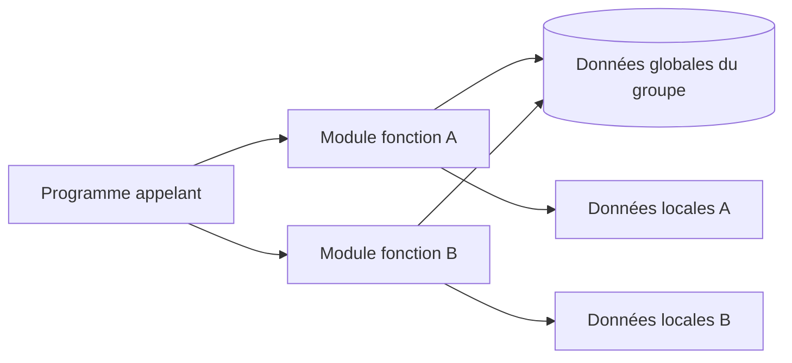

# 🌸 DONNEES GLOBALES DU GROUPE

## 🌺 OBJECTIFS

- [ ] Comprendre le programme fonction pool
- [ ] Identifier l’include global du groupe
- [ ] Comprendre le partage des données globales
- [ ] Identifier les risques d’état implicite
- [ ] Préférer les paramètres et données locales

## 🌺 FUNCTION POOL

Un groupe de fonctions est un programme ABAP spécial dont l’instruction principale est :

    FUNCTION-POOL zfg_aelion_order.

Le Workbench génère plusieurs includes autour de ce programme.

## 🌺 INCLUDE TOP

L’include global est généralement nommé selon le modèle :

    L<nom_du_groupe>TOP

Exemple :

    LZFG_AELION_ORDERTOP

Il peut contenir :

- types globaux internes au groupe ;
- constantes ;
- variables ;
- tables internes ;
- références d’objets ;
- déclarations communes.

## 🌺 DONNEE GLOBALE PARTAGEE

Dans l’include TOP :

    DATA gv_last_order_id TYPE char10.

Dans un premier module fonction :

    gv_last_order_id = iv_order_id.

Dans un autre module du même groupe :

    ev_order_id = gv_last_order_id.

> [!WARNING]
> Le second module dépend d’un appel antérieur non visible dans son interface. Cette dépendance implicite rend le comportement plus difficile à tester et à comprendre.

## 🌺 DUREE DE VIE

Les données globales du groupe existent dans le contexte interne du programme fonction pool chargé dans la session interne.

Elles ne doivent pas être interprétées comme :

- une base de données persistante ;
- un cache partagé entre tous les utilisateurs ;
- une garantie de conservation entre deux contextes techniques distincts ;
- un mécanisme de transport de données entre appels RFC indépendants.

## 🌺 SCHEMA

## 🌺 CAS ACCEPTABLE

Exemples contrôlés :

- constante technique commune ;
- type interne partagé par plusieurs modules ;
- référence vers un service créé de manière déterministe ;
- état requis par un framework classique et documenté.

## 🌺 CAS A EVITER

- mémoriser silencieusement le dernier utilisateur traité ;
- stocker un résultat métier entre deux appels ;
- dépendre de l’ordre d’appel de plusieurs modules ;
- modifier une table globale sans la vider ou l’initialiser ;
- utiliser le groupe comme stockage persistant.

## 🌺 ALTERNATIVE EXPLICITE

Mauvais :

    gv_werks = iv_werks.

Puis un autre module suppose que `GV_WERKS` a déjà été rempli.

Meilleur :

    IMPORTING
      VALUE(iv_werks) TYPE werks_d

Chaque appel reçoit explicitement le centre nécessaire.

## 🌺 BONNES PRATIQUES

- Utiliser les paramètres pour les données nécessaires au contrat.
- Utiliser les variables locales pour les calculs temporaires.
- Limiter l’include TOP aux déclarations réellement partagées.
- Initialiser explicitement toute donnée globale modifiable.
- Documenter les dépendances imposées par un framework historique.
- Vérifier la concurrence et la séparation des sessions avant tout mécanisme de cache.

## 🌺 EXERCICES

1. Identifier les données qui peuvent être locales dans un module existant.
2. Remplacer une variable globale métier par un paramètre d’import.
3. Décrire un défaut provoqué par une table globale non vidée.
4. Expliquer pourquoi une donnée globale de groupe n’est pas une persistance fiable.

## 🌺 RÉSUMÉ

> - Le groupe de fonctions est un programme de type fonction pool.
> - L’include TOP contient les déclarations globales du groupe.
> - Tous les modules du groupe peuvent accéder à ces données.
> - Cet état partagé crée des dépendances implicites.
> - Les paramètres et variables locales doivent être privilégiés.

🍧 Afficher l’auto-évaluation

- [ ] Je peux définir **DONNEES GLOBALES DU GROUPE** avec mes propres mots.
- [ ] Je peux expliquer **function pool** sans relire le chapitre.
- [ ] Je peux appliquer ou illustrer **include top** dans un exemple simple.
- [ ] Je peux identifier au moins une erreur fréquente ou une limite liée à cette notion.

## 🌺 SOURCES OFFICIELLES

- SAP Help Portal — Overview of Function Modules : https://help.sap.com/docs/SAP_NETWEAVER_702/ff59ad5d6c55101492f7f1c64dee0529/d1801ea7454211d189710000e8322d00.html
- SAP Help Portal — Understanding Function Module Code : https://help.sap.com/docs/ABAP_PLATFORM_NEW/bd833c8355f34e96a6e83096b38bf192/d1801f1c454211d189710000e8322d00.html
