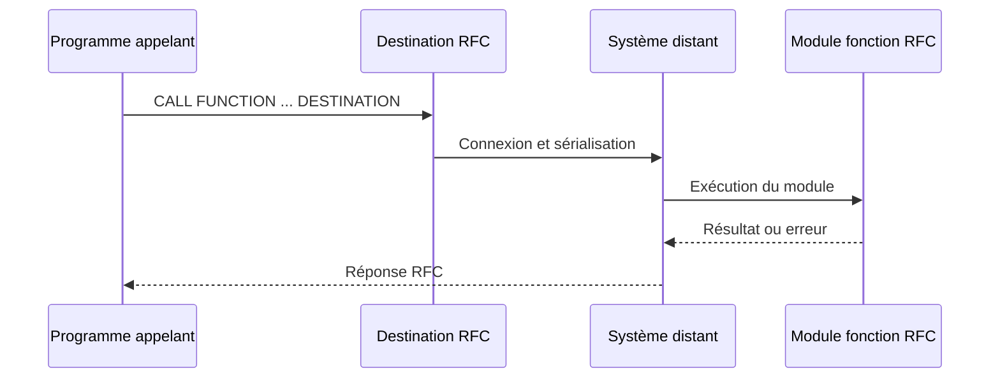

# 🌸 MODULES FONCTION RFC

## 🌺 OBJECTIFS

- [ ] Définir un module fonction RFC
- [ ] Comprendre un appel local et un appel distant
- [ ] Connaître les contraintes principales d’une interface RFC
- [ ] Utiliser `DESTINATION`
- [ ] Distinguer RFC synchrone et variantes asynchrones

## 🌺 DÉFINITION

> Un module fonction RFC est un module marqué comme compatible avec le mécanisme Remote Function Call.
> Il peut être appelé depuis un autre système ou un autre contexte technique autorisé.

Dans `SE37`, le type de traitement est :

    Remote-Enabled Module

## 🌺 APPEL LOCAL

Même si le module est RFC-enabled, il peut être appelé localement :

    CALL FUNCTION 'Z_AELION_RFC_ADD'
      EXPORTING
        iv_first  = 2
        iv_second = 3
      IMPORTING
        ev_result = DATA(lv_result).

## 🌺 APPEL DISTANT

    CALL FUNCTION 'Z_AELION_RFC_ADD'
      DESTINATION 'S4_DEV'
      EXPORTING
        iv_first  = 2
        iv_second = 3
      IMPORTING
        ev_result = DATA(lv_result)
      EXCEPTIONS
        system_failure        = 1
        communication_failure = 2
        OTHERS                = 3.

La destination RFC est généralement configurée dans `SM59` sur les systèmes ABAP classiques.

## 🌺 FLUX

## 🌺 CONTRAINTES D'INTERFACE

Une interface RFC doit utiliser des types transportables et compatibles avec la sérialisation RFC.

Contraintes et pratiques sûres :

- sélectionner le passage par valeur pour les paramètres `IMPORTING`, `EXPORTING` et `CHANGING` ;
- utiliser des types ABAP Dictionary compatibles RFC ;
- éviter les références d’objets et références de données ;
- éviter les dépendances à l’interface graphique ;
- ne pas supposer le partage de la mémoire de session ;
- documenter les autorisations et le contrat d’erreur.

> [!IMPORTANT]
> La documentation ABAP impose le passage par valeur pour les paramètres `IMPORTING`, `EXPORTING` et `CHANGING` d’un module remote-enabled. Le fait de cocher RFC ne transforme pas automatiquement un traitement local en API sûre. L’interface, la sécurité, les volumes, la transaction et les erreurs doivent être conçus pour un appel distant.

## 🌺 ERREURS RFC

Deux erreurs techniques fréquentes sont :

- `SYSTEM_FAILURE` ;
- `COMMUNICATION_FAILURE`.

Exemple avec récupération d’un texte :

    DATA lv_message TYPE c LENGTH 255.

    CALL FUNCTION 'Z_AELION_RFC_ADD'
      DESTINATION 'S4_DEV'
      EXPORTING
        iv_first  = 2
        iv_second = 3
      IMPORTING
        ev_result = DATA(lv_result)
      EXCEPTIONS
        system_failure        = 1 MESSAGE lv_message
        communication_failure = 2 MESSAGE lv_message
        OTHERS                = 3.

## 🌺 VARIANTES RFC

| 🍧 Variante   | 🍧 Principe                                             |
| ------------- | ------------------------------------------------------- |
| RFC synchrone | L’appelant attend la réponse                            |
| aRFC          | Exécution asynchrone avec tâche et éventuel callback    |
| tRFC          | Appel transactionnel enregistré pour exécution fiable   |
| qRFC          | tRFC avec gestion d’ordre par file                      |
| bgRFC         | Modèle plus récent d’unités d’exécution en arrière-plan |

> [!NOTE]
> Ces variantes nécessitent un cours spécifique. Elles ne doivent pas être réduites à l’ajout d’un mot-clé sans conception de reprise, d’ordre et de transaction.

## 🌺 SECURITE

Un module RFC exposé augmente la surface d’accès au traitement.

Contrôles nécessaires :

- autorisation d’exécuter le module ;
- autorisations métier dans le code lorsque requises ;
- limitation des données retournées ;
- validation stricte des entrées ;
- absence de données sensibles dans les messages techniques ;
- configuration et gouvernance RFC du système.

## 🌺 BONNES PRATIQUES

- N’activer RFC que lorsqu’un appel distant est requis.
- Utiliser des structures DDIC stables.
- Retourner des erreurs structurées.
- Éviter les interactions SAP GUI.
- Limiter les volumes transférés.
- Ne jamais mettre une destination ou un mot de passe en dur dans le code.

## 🌺 EXERCICES

1. Transformer un module d’addition en module RFC.
2. Remplacer les types locaux par des types DDIC si nécessaire.
3. Générer un appel avec `DESTINATION`.
4. Traiter `SYSTEM_FAILURE` et `COMMUNICATION_FAILURE`.
5. Expliquer pourquoi une popup est incompatible avec un appel distant fiable.

## 🌺 RÉSUMÉ

> - Un module RFC est explicitement marqué comme remote-enabled.
> - L’appel distant utilise notamment `DESTINATION` dans le modèle classique.
> - L’interface doit être sérialisable et stable.
> - Les erreurs de communication sont distinctes des erreurs métier.
> - Sécurité, volume et transaction font partie du contrat RFC.

🍧 Afficher l’auto-évaluation

- [ ] Je peux définir **MODULES FONCTION RFC** avec mes propres mots.
- [ ] Je peux expliquer **definition** sans relire le chapitre.
- [ ] Je peux appliquer ou illustrer **appel local** dans un exemple simple.
- [ ] Je peux identifier au moins une erreur fréquente ou une limite liée à cette notion.

## 🌺 SOURCES OFFICIELLES

- SAP Help Portal — Providing an RFC Service : https://help.sap.com/docs/abap-cloud/abap-integration-connectivity/provide-rfc-service
- SAP Help Portal — Calling RFC Function Modules in ABAP : https://help.sap.com/docs/ABAP_PLATFORM_NEW/753088fc00704d0a80e7fbd6803c8adb/48a0f18641bc062de10000000a42189d.html
- SAP ABAP Keyword Documentation — RFC Overview : https://help.sap.com/doc/abapdocu_latest_index_htm/latest/en-US/ABENRFC.html
