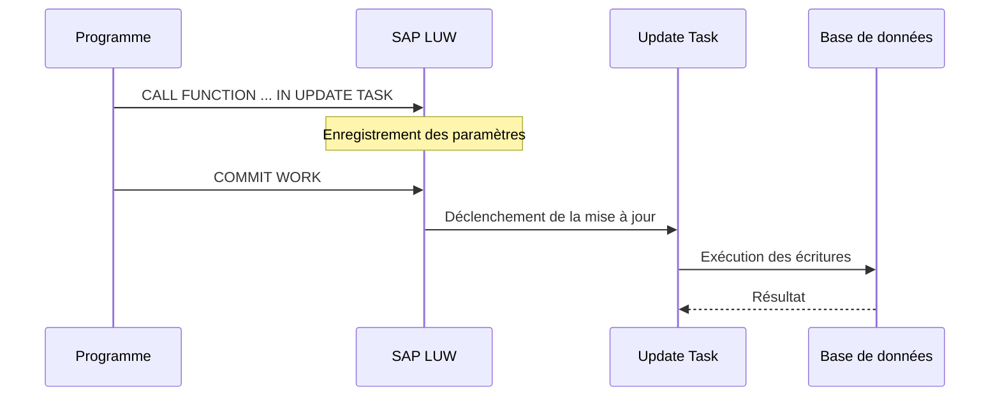

# 🌸 MODULES FONCTION DE MISE A JOUR

## 🌺 OBJECTIFS

- [ ] Définir un module fonction de mise à jour
- [ ] Comprendre `IN UPDATE TASK`
- [ ] Comprendre le rôle de `COMMIT WORK`
- [ ] Distinguer enregistrement et exécution
- [ ] Connaître les restrictions principales

## 🌺 DÉFINITION

> Un module fonction de mise à jour est enregistré par le programme appelant, puis exécuté par le système de mise à jour dans le cadre de la SAP LUW.

Dans `SE37`, il est marqué comme `Update Module`.

## 🌺 APPEL

    CALL FUNCTION 'Z_AELION_UPDATE_LOG'
      IN UPDATE TASK
      EXPORTING
        iv_object_id = lv_object_id
        iv_message   = lv_message.

    " SY-SUBRC n'est pas défini par cet enregistrement.

À ce stade, l’appel est enregistré pour la mise à jour. L’exécution effective dépend de la fin transactionnelle.

## 🌺 VALIDATION

    COMMIT WORK.

Avec attente de la fin de la mise à jour :

    COMMIT WORK AND WAIT.

Annulation de la SAP LUW en cours :

    ROLLBACK WORK.

> [!IMPORTANT]
> `CALL FUNCTION ... IN UPDATE TASK` ne signifie pas que le code du module est exécuté immédiatement à la ligne d’appel.

## 🌺 FLUX

## 🌺 INTERFACE RESTREINTE

Les modules de mise à jour possèdent une interface restreinte : les paramètres de résultat et les exceptions ne sont pas autorisés, car le module ne peut pas communiquer son résultat à l’appelant au moment de son exécution différée. L’interface utilise des paramètres d’entrée et, dans les interfaces historiques, éventuellement des paramètres `TABLES`, référencés par des objets du Dictionnaire ABAP.

Conséquences pratiques :

- utiliser des paramètres d’entrée sérialisables et typés avec des références DDIC ;
- ne pas déclarer de paramètre d’export ou de changing pour retourner un résultat ;
- ne pas déclarer d’exception classique comme contrat de retour ;
- ne pas dépendre d’une référence d’objet de l’appelant ;
- ne pas supposer l’accès à l’état mémoire du programme appelant ;
- gérer la journalisation et l’analyse des échecs de mise à jour.

## 🌺 EXEMPLE DE MODULE

    FUNCTION z_aelion_update_log.
    *"----------------------------------------------------------------------
    *"  IMPORTING
    *"     VALUE(IV_OBJECT_ID) TYPE CHAR20
    *"     VALUE(IV_MESSAGE) TYPE STRING
    *"----------------------------------------------------------------------

      INSERT zaelion_log FROM @( VALUE #(
        object_id = iv_object_id
        message   = iv_message
        created_by = sy-uname
        created_on = sy-datum
        created_at = sy-uzeit ) ).

    ENDFUNCTION.

> [!NOTE]
> L’exemple suppose l’existence de la table `ZAELION_LOG` et du data element `ZAELION_OBJECT_ID`. `BAPI_MSG` est utilisé comme référence DDIC pour le texte. Les champs doivent être adaptés au système de formation.

## 🌺 V1 ET V2

Les systèmes SAP classiques distinguent notamment :

- mise à jour V1 : données critiques et prioritaires ;
- mise à jour V2 : traitements secondaires pouvant suivre la V1.

Le choix relève de la conception transactionnelle et du framework concerné.

## 🌺 ANALYSE DES ERREURS

Transactions classiques utiles selon les autorisations :

- `SM13` : analyse des mises à jour annulées ;
- `ST22` : dumps ABAP ;
- `SLG1` : journaux applicatifs lorsque le traitement les utilise.

## 🌺 ERREURS CLASSIQUES

- oublier le `COMMIT WORK` au niveau responsable de la transaction ;
- exécuter un commit caché dans un composant bas niveau ;
- attendre une valeur d’export immédiate ;
- transmettre un état non sérialisable ;
- ignorer les échecs visibles dans `SM13` ;
- mélanger mise à jour critique et traitement secondaire sans conception.

## 🌺 BONNES PRATIQUES

- Définir clairement qui contrôle le commit.
- Garder le module de mise à jour déterministe et ciblé.
- Éviter les interactions utilisateur.
- Journaliser suffisamment pour diagnostiquer un échec.
- Ne pas utiliser Update Task pour masquer un traitement lent sans besoin transactionnel.
- Tester le comportement avec succès, rollback et erreur de mise à jour.

## 🌺 EXERCICES

1. Créer une table de journal simple.
2. Créer un module de mise à jour qui insère une ligne.
3. L’appeler avec `IN UPDATE TASK`.
4. Tester sans commit, avec commit, puis avec rollback.
5. Observer les résultats en base et analyser `SM13` si nécessaire.

## 🌺 RÉSUMÉ

> - Le module de mise à jour est enregistré avec `IN UPDATE TASK`.
> - L’exécution est liée à la SAP LUW.
> - `COMMIT WORK` déclenche la finalisation transactionnelle.
> - Les paramètres de résultat et les exceptions ne sont pas autorisés dans son interface.
> - Les erreurs doivent être analysées dans les outils de mise à jour.

🍧 Afficher l’auto-évaluation

- [ ] Je peux définir **MODULES FONCTION DE MISE A JOUR** avec mes propres mots.
- [ ] Je peux expliquer **definition** sans relire le chapitre.
- [ ] Je peux appliquer ou illustrer **appel** dans un exemple simple.
- [ ] Je peux identifier au moins une erreur fréquente ou une limite liée à cette notion.

## 🌺 SOURCES OFFICIELLES

- SAP Help Portal — Creating Update Function Modules : https://help.sap.com/docs/SAP_NETWEAVER_731_BW_ABAP/cfae740a0a21455dbe6e510c2d86e36a/417af4daa79e11d1950f0000e82de14a.html
- SAP Help Portal — Calling Update Functions : https://help.sap.com/docs/PRODUCT_ID/cfae740a0a21455dbe6e510c2d86e36a/417af4dda79e11d1950f0000e82de14a.html
- SAP Help Portal — Update Debugging : https://help.sap.com/docs/abap-cloud/abap-development-tools-user-guide/update-debugging
