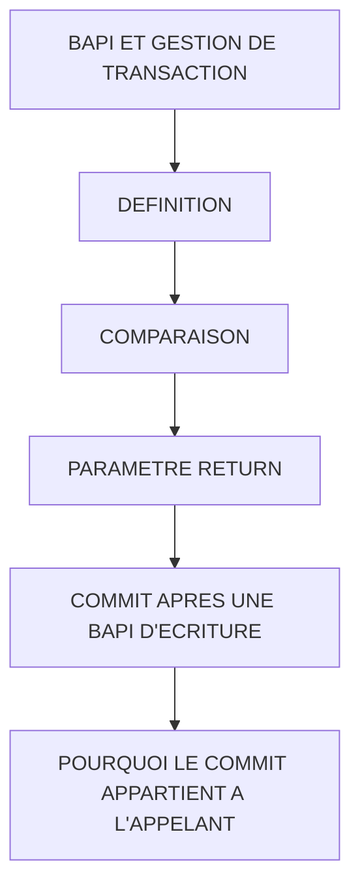

# 🌸 BAPI ET GESTION DE TRANSACTION

## 🌺 OBJECTIFS

- [ ] Définir une BAPI
- [ ] Distinguer BAPI et module fonction quelconque
- [ ] Lire un paramètre `RETURN`
- [ ] Comprendre le contrôle du commit par l’appelant
- [ ] Utiliser `BAPI_TRANSACTION_COMMIT` et `BAPI_TRANSACTION_ROLLBACK`

## 🌺 VUE D'ENSEMBLE

## 🌺 DÉFINITION

> Une BAPI est une API métier standardisée liée au modèle d’objet métier SAP. Son implémentation technique repose généralement sur un module fonction compatible RFC, mais tout module fonction RFC n’est pas une BAPI.

## 🌺 COMPARAISON

| 🍧 Critère            | 🍧 Module fonction     | 🍧 BAPI                                                             |
| --------------------- | ---------------------- | ------------------------------------------------------------------- |
| Nature                | Procédure ABAP globale | API métier standardisée                                             |
| RFC obligatoire       | Non                    | Généralement oui pour le module sous-jacent                         |
| Convention de retour  | Variable               | Paramètre `RETURN` standard fréquent                                |
| Modèle transactionnel | Dépend du contrat      | Contrôle du commit par l’appelant pour les BAPI modernes d’écriture |
| Référencement métier  | Non obligatoire        | Associée à un objet et une méthode métier                           |

## 🌺 PARAMETRE RETURN

Gabarit d’appel à adapter à la BAPI réelle documentée dans le système :

    DATA ls_return TYPE bapiret2.

    CALL FUNCTION 'BAPI_<OBJET>_<METHODE>'
      EXPORTING
        input_data = ls_input
      IMPORTING
        return     = ls_return.

    IF ls_return-type CA 'AEX'.
      " Erreur ou arrêt
    ENDIF.

Pour une table de retours :

    DATA lt_return TYPE STANDARD TABLE OF bapiret2 WITH EMPTY KEY.

    LOOP AT lt_return ASSIGNING FIELD-SYMBOL(<ls_return>)
      WHERE type CA 'AEX'.
      " Traiter les erreurs
    ENDLOOP.

> [!NOTE]
> Les types `A`, `E` et `X` sont généralement considérés comme bloquants. Le contrat exact doit être lu dans la documentation de la BAPI appelée.

## 🌺 COMMIT APRES UNE BAPI D'ECRITURE

Gabarit transactionnel courant :

    CALL FUNCTION 'BAPI_<OBJET>_<METHODE>'
      ...
      IMPORTING
        return = ls_return.

    IF ls_return-type CA 'AEX'.
      CALL FUNCTION 'BAPI_TRANSACTION_ROLLBACK'.
    ELSE.
      CALL FUNCTION 'BAPI_TRANSACTION_COMMIT'
        EXPORTING
          wait = abap_true.
    ENDIF.

> [!IMPORTANT]
> Les noms entre chevrons sont des emplacements de gabarit, pas des objets SAP réels. Le programme appelant doit d’abord vérifier les messages de retour. Il ne doit pas exécuter un commit automatique après une BAPI en erreur.

## 🌺 POURQUOI LE COMMIT APPARTIENT A L'APPELANT

L’appelant peut enchaîner plusieurs opérations dans une même unité logique :

1. créer ou modifier un objet ;
2. créer une donnée liée ;
3. vérifier les retours ;
4. valider l’ensemble ;
5. annuler l’ensemble si une étape échoue.

Un commit caché dans la première opération empêcherait l’annulation cohérente de l’ensemble.

## 🌺 EXEMPLE DE CONTROLE D'UNE TABLE RETURN

    DATA lv_has_error TYPE abap_bool VALUE abap_false.

    LOOP AT lt_return ASSIGNING FIELD-SYMBOL(<ls_return>).
      IF <ls_return>-type CA 'AEX'.
        lv_has_error = abap_true.
        EXIT.
      ENDIF.
    ENDLOOP.

    IF lv_has_error = abap_true.
      CALL FUNCTION 'BAPI_TRANSACTION_ROLLBACK'.
      RETURN.
    ENDIF.

    CALL FUNCTION 'BAPI_TRANSACTION_COMMIT'
      EXPORTING
        wait = abap_true.

## 🌺 PRECAUTIONS

- Lire la documentation de la BAPI et de chaque paramètre.
- Respecter les structures `X` de marquage lorsqu’elles existent.
- Ne pas supposer qu’une valeur non initiale est automatiquement prise en compte.
- Contrôler tous les retours, pas seulement la première ligne.
- Ne pas appeler une BAPI de modification dans une boucle avec un commit à chaque ligne sans analyse transactionnelle et de performance.
- Ne pas confondre le succès technique de `CALL FUNCTION` avec le succès fonctionnel de la BAPI.

## 🌺 BONNES PRATIQUES

- Centraliser l’analyse des messages `BAPIRET2` dans une méthode ou classe utilitaire testable.
- Exécuter un seul commit au niveau responsable de la transaction.
- Utiliser `WAIT = ABAP_TRUE` lorsque le traitement suivant dépend de la fin de la mise à jour.
- Journaliser les messages complets en cas d’échec.
- Tester succès, avertissement, erreur et rollback.

## 🌺 EXERCICES

1. Préparer une table interne de type `BAPIRET2`.
2. Ajouter une erreur, un avertissement et un succès.
3. Détecter les types bloquants `AEX`.
4. Appeler le commit seulement en absence d’erreur.
5. Expliquer pourquoi tout module RFC n’est pas une BAPI.

## 🌺 RÉSUMÉ

> - Une BAPI est une API métier standardisée.
> - Son module technique est généralement RFC-enabled.
> - Les erreurs sont souvent retournées dans `BAPIRET2`.
> - L’appelant contrôle la validation ou l’annulation de la transaction.
> - Le succès de l’appel technique ne garantit pas le succès métier.

🍧 Afficher l’auto-évaluation

- [ ] Je peux définir **BAPI ET GESTION DE TRANSACTION** avec mes propres mots.
- [ ] Je peux expliquer **definition** sans relire le chapitre.
- [ ] Je peux appliquer ou illustrer **comparaison** dans un exemple simple.
- [ ] Je peux identifier au moins une erreur fréquente ou une limite liée à cette notion.

## 🌺 SOURCES OFFICIELLES

- SAP Help Portal — Implementing the Function Module for a BAPI : https://help.sap.com/docs/ABAP_PLATFORM_NEW/166400f6be7b46e8adc6b90fd20f3516/4d4f424ab3ee468de10000000a42189c.html
- SAP Help Portal — Transaction Model for Developing BAPIs : https://help.sap.com/docs/SAP_NETWEAVER_AS_ABAP_752/166400f6be7b46e8adc6b90fd20f3516/4d5b102ba1483d8fe10000000a42189e.html
