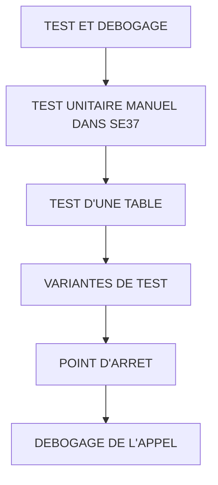

# 🌸 TEST ET DEBOGAGE

## 🌺 OBJECTIFS

- [ ] Tester un module dans `SE37`
- [ ] Sauvegarder et réutiliser des données de test
- [ ] Poser un point d’arrêt
- [ ] Déboguer un appel local, RFC ou Update Task
- [ ] Contrôler les résultats et exceptions

## 🌺 VUE D'ENSEMBLE

## 🌺 TEST UNITAIRE MANUEL DANS SE37

Dans `SE37` :

1. afficher le module fonction ;
2. choisir **Test/Exécuter** ;
3. renseigner les imports ;
4. renseigner les changing ou tables si nécessaire ;
5. exécuter ;
6. contrôler les exports et exceptions.

> [!IMPORTANT]
> Le test `SE37` est un test manuel du module. Il ne remplace pas un test automatisé ni un test du processus complet.

## 🌺 TEST D'UNE TABLE

Pour une table interne :

1. ouvrir l’éditeur de la table ;
2. ajouter plusieurs lignes ;
3. tester une ligne valide ;
4. ajouter une ligne invalide ;
5. contrôler le résultat complet.

## 🌺 VARIANTES DE TEST

Préparer au minimum :

| 🍧 Cas               | 🍧 Objectif                                 |
| -------------------- | ------------------------------------------- |
| Nominal              | Vérifier le résultat attendu                |
| Limite basse         | Tester zéro, vide ou première valeur valide |
| Limite haute         | Tester valeur maximale ou volume important  |
| Erreur fonctionnelle | Vérifier l’exception ou le retour           |
| Donnée inexistante   | Vérifier la branche `SY-SUBRC <> 0`         |
| Répétition           | Détecter un état global résiduel            |

## 🌺 POINT D'ARRET

Dans le code :

    BREAK-POINT.

Ou point d’arrêt externe/utilisateur depuis l’éditeur.

> [!WARNING]
> Ne pas transporter un `BREAK-POINT` temporaire dans un environnement partagé ou productif.

## 🌺 DEBOGAGE DE L'APPEL

Contrôles utiles :

- valeurs avant `CALL FUNCTION` ;
- mapping réel des paramètres ;
- entrée dans le module ;
- résultat des contrôles ;
- contenu des exports avant `ENDFUNCTION` ;
- valeur de `SY-SUBRC` immédiatement après l’appel.

## 🌺 DEBOGAGE RFC

Un appel RFC peut s’exécuter dans un autre système ou contexte utilisateur.

Points à vérifier :

- destination utilisée ;
- utilisateur technique ;
- autorisations ;
- point d’arrêt externe dans le système cible ;
- erreurs `SYSTEM_FAILURE` et `COMMUNICATION_FAILURE` ;
- traces et journaux RFC autorisés par l’exploitation.

## 🌺 DEBOGAGE UPDATE TASK

Un module appelé `IN UPDATE TASK` n’est pas exécuté à la ligne d’enregistrement.

Il faut :

- activer le mode de débogage de mise à jour ;
- poursuivre jusqu’au `COMMIT WORK` ;
- analyser le contexte de mise à jour ;
- consulter `SM13` en cas d’annulation.

## 🌺 TEST AUTOMATISE

Un module fonction ne constitue pas naturellement une unité orientée objet isolée.

Une stratégie fréquente consiste à :

1. placer la logique métier dans une classe ;
2. tester la classe avec ABAP Unit ;
3. garder le module fonction comme adaptateur d’interface ;
4. tester manuellement ou par intégration le mapping du module.

Exemple :

    FUNCTION z_aelion_calculate_total.

      ev_total = zcl_aelion_calculator=>calculate_total(
        iv_quantity   = iv_quantity
        iv_unit_price = iv_unit_price ).

    ENDFUNCTION.

## 🌺 BONNES PRATIQUES

- Tester chaque exception déclarée.
- Contrôler les sorties après succès uniquement.
- Répéter le test pour détecter les données globales résiduelles.
- Tester avec l’utilisateur et les autorisations du contexte réel.
- Ne pas limiter le test à `SE37` pour un module RFC ou transactionnel.
- Automatiser la logique métier dans une classe lorsque possible.

## 🌺 EXERCICES

1. Définir cinq cas de test pour un calcul de remise.
2. Exécuter chaque cas dans `SE37`.
3. Placer un point d’arrêt sur le premier contrôle.
4. Observer `SY-SUBRC` dans le programme appelant.
5. Tester deux appels successifs pour vérifier l’absence d’état global résiduel.

## 🌺 RÉSUMÉ

> - `SE37` permet le test manuel direct.
> - Les cas limites et d’erreur sont obligatoires.
> - Le débogage doit tenir compte du contexte RFC ou Update Task.
> - `SY-SUBRC` doit être contrôlé immédiatement après l’appel.
> - La logique métier placée dans une classe est plus simple à tester automatiquement.

🍧 Afficher l’auto-évaluation

- [ ] Je peux définir **TEST ET DEBOGAGE** avec mes propres mots.
- [ ] Je peux expliquer **test unitaire manuel dans se37** sans relire le chapitre.
- [ ] Je peux appliquer ou illustrer **test d'une table** dans un exemple simple.
- [ ] Je peux identifier au moins une erreur fréquente ou une limite liée à cette notion.

## 🌺 SOURCES OFFICIELLES

- SAP Help Portal — Working with ABAP Function Groups and Modules : https://help.sap.com/docs/ABAP_PLATFORM_NEW/c238d694b825421f940829321ffa326a/5b3370ee088a4e2b9579da3f6e994456.html
- SAP Help Portal — Update Debugging : https://help.sap.com/docs/abap-cloud/abap-development-tools-user-guide/update-debugging
