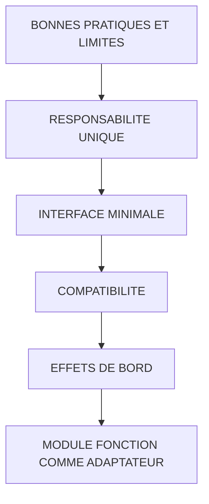

# 🌸 BONNES PRATIQUES ET LIMITES

## 🌺 OBJECTIFS

- [ ] Concevoir une interface stable
- [ ] Éviter les effets de bord cachés
- [ ] Comprendre les limites du modèle
- [ ] Encapsuler la logique métier dans une classe lorsque pertinent
- [ ] Maintenir la compatibilité des appelants

## 🌺 VUE D'ENSEMBLE

## 🌺 RESPONSABILITE UNIQUE

Un module doit répondre à une finalité claire.

Bon découpage :

    Z_AELION_MATERIAL_READ
    Z_AELION_MATERIAL_VALIDATE
    Z_AELION_MATERIAL_UPDATE

Découpage ambigu :

    Z_AELION_PROCESS_ALL

Le second nom ne permet pas de connaître :

- les entrées nécessaires ;
- les données modifiées ;
- le résultat attendu ;
- les erreurs possibles ;
- la transaction contrôlée.

## 🌺 INTERFACE MINIMALE

Une interface stable contient uniquement les données nécessaires.

Éviter :

- une structure géante dont trois champs seulement sont utilisés ;
- des paramètres techniques inutiles exposés aux appelants ;
- plusieurs paramètres représentant la même notion ;
- des sorties remplies seulement dans certains cas non documentés.

## 🌺 COMPATIBILITE

Modifier un module global peut casser :

- rapports ;
- interfaces ;
- jobs ;
- formulaires ;
- exits ;
- applications Fiori ;
- appels externes RFC.

Avant une modification :

1. rechercher les utilisations ;
2. lire la documentation ;
3. identifier les appels dynamiques éventuels ;
4. analyser la compatibilité des types ;
5. prévoir les tests de non-régression.

## 🌺 EFFETS DE BORD

Un effet de bord est une modification non évidente depuis le résultat principal.

Exemples :

- écriture en base ;
- commit ;
- modification d’une donnée globale ;
- verrouillage ;
- message écran ;
- appel distant ;
- lancement d’un traitement asynchrone.

> [!IMPORTANT]
> Tout effet de bord nécessaire doit être visible dans le nom, la documentation ou le contrat transactionnel.

## 🌺 MODULE FONCTION COMME ADAPTATEUR

Pour un nouveau traitement nécessitant un module fonction imposé par un framework, une architecture maintenable consiste à déléguer la logique à une classe.

    FUNCTION z_aelion_order_validate.

      TRY.
          zcl_aelion_order_service=>validate(
            EXPORTING
              is_order = is_order
            IMPORTING
              et_return = et_return ).
        CATCH zcx_aelion_order INTO DATA(lx_order).
          APPEND VALUE #(
            type    = 'E'
            message = lx_order->get_text( ) )
            TO et_return.
      ENDTRY.

    ENDFUNCTION.

Avantages :

- logique testable avec ABAP Unit ;
- dépendances encapsulées ;
- interface du module conservée ;
- réutilisation depuis d’autres technologies ;
- migration future facilitée.

## 🌺 LIMITES DU MODELE

- pas de paramètre `RETURNING` comme une méthode fonctionnelle ;
- dépendance à un groupe de fonctions ;
- état global possible dans le fonction pool ;
- exceptions classiques fréquentes ;
- appels dynamiques possibles donc usages difficiles à recenser complètement ;
- test automatisé moins naturel lorsque toute la logique reste dans le module.

## 🌺 TABLES OBSOLETES

Règle :

- savoir lire et appeler les paramètres `TABLES` existants ;
- ne pas les introduire par défaut dans un nouveau module ;
- utiliser des paramètres typés avec des types de table DDIC.

## 🌺 CHECKLIST DE REVUE

- [ ] Nom explicite
- [ ] Description renseignée
- [ ] Groupe cohérent
- [ ] Interface minimale
- [ ] Types stables
- [ ] Paramètres `TABLES` évités
- [ ] Entrées contrôlées
- [ ] Sorties déterministes
- [ ] Erreurs documentées
- [ ] Aucun commit caché
- [ ] Aucun écran ou popup caché
- [ ] Données globales limitées
- [ ] Autorisations contrôlées si nécessaire
- [ ] Cas de test définis
- [ ] Appelants identifiés

## 🌺 BONNES PRATIQUES

- Préférer une classe pour la logique métier nouvelle.
- Utiliser le module comme frontière technique lorsqu’un framework l’impose.
- Rendre le traitement déterministe : mêmes entrées, même résultat, hors dépendances explicitement injectées.
- Éviter les accès base répétés dans une boucle.
- Ne pas intercepter une erreur pour retourner un faux succès.
- Documenter la propriété du commit.

## 🌺 EXERCICES

1. Auditer un module fonction existant avec la checklist.
2. Identifier trois effets de bord.
3. Extraire un calcul dans une classe statique.
4. Conserver le module comme adaptateur.
5. Rechercher les programmes appelants avant de modifier son interface.

## 🌺 RÉSUMÉ

> - Une interface globale doit rester stable et minimale.
> - Les effets de bord doivent être explicites.
> - `TABLES` doit rester limité au code historique.
> - La logique métier nouvelle est plus testable dans une classe.
> - Le module fonction peut rester une frontière technique ou de compatibilité.

🍧 Afficher l’auto-évaluation

- [ ] Je peux définir **BONNES PRATIQUES ET LIMITES** avec mes propres mots.
- [ ] Je peux expliquer **responsabilite unique** sans relire le chapitre.
- [ ] Je peux appliquer ou illustrer **interface minimale** dans un exemple simple.
- [ ] Je peux identifier au moins une erreur fréquente ou une limite liée à cette notion.

## 🌺 SOURCES OFFICIELLES

- SAP ABAP Keyword Documentation — Modern ABAP : https://help.sap.com/doc/abapdocu_latest_index_htm/latest/en-US/ABENMODERN_ABAP_GUIDL.html
- SAP ABAP Keyword Documentation — Obsolete `TABLES` Parameters : https://help.sap.com/doc/abapdocu_latest_index_htm/latest/en-US/ABAPTABLES_PARAMETERS_OBSOLETE.html
- SAP Help Portal — Creating New Function Modules : https://help.sap.com/docs/ABAP_PLATFORM_NEW/bd833c8355f34e96a6e83096b38bf192/d1801ee8454211d189710000e8322d00.html
