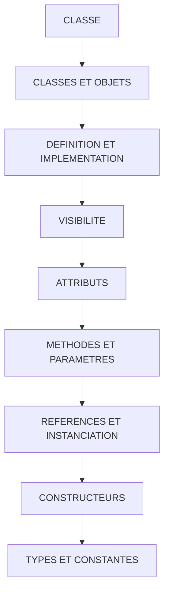

# 🌸 SOMMAIRE — CLASSE

## 🌺 OBJECTIFS DU COURS

- [ ] Comprendre la progression générale du cours.
- [ ] Identifier l’ordre conseillé des chapitres.
- [ ] Retrouver rapidement une notion précise.

## 🌺 PARCOURS

> [!IMPORTANT]
> Suivre les chapitres dans l’ordre numérique, sauf révision ciblée d’une notion déjà étudiée.

## 🌺 CHAPITRES

- [CLASSES ET OBJETS](<./01 - 🍧 CLASSES ET OBJETS.md>)
- [DEFINITION ET IMPLEMENTATION](<./02 - 🍧 DEFINITION ET IMPLEMENTATION.md>)
- [VISIBILITE](<./03 - 🍧 VISIBILITE.md>)
- [ATTRIBUTS](<./04 - 🍧 ATTRIBUTS.md>)
- [METHODES ET PARAMETRES](<./05 - 🍧 METHODES ET PARAMETRES.md>)
- [REFERENCES ET INSTANCIATION](<./06 - 🍧 REFERENCES ET INSTANCIATION.md>)
- [CONSTRUCTEURS](<./07 - 🍧 CONSTRUCTEURS.md>)
- [TYPES ET CONSTANTES](<./08 - 🍧 TYPES ET CONSTANTES.md>)
- [ENCAPSULATION](<./09 - 🍧 ENCAPSULATION.md>)
- [COMPOSANTS STATIQUES](<./10 - 🍧 COMPOSANTS STATIQUES.md>)
- [SINGLETON](<./11 - 🍧 SINGLETON.md>)
- [HERITAGE ET POLYMORPHISME](<./12 - 🍧 HERITAGE ET POLYMORPHISME.md>)
- [INTERFACES](<./13 - 🍧 INTERFACES.md>)
- [EXCEPTIONS DE CLASSE](<./14 - 🍧 EXCEPTIONS DE CLASSE.md>)
- [CLASSE DE MESSAGES DANS UNE CLASSE ABAP](<./15 - 🍧 CLASSE DE MESSAGES DANS UNE CLASSE ABAP.md>)
- [MÉTHODES STATIQUES STANDARD](<./16 - 🍧 METHODES STATIQUES STANDARD.md>)
- [ARCHITECTURE OBJET D'UN IMPORT](<./17 - 🍧 ARCHITECTURE OBJET D'UN IMPORT.md>)

Afficher la méthode de travail

1. Lire les objectifs du chapitre.
2. Étudier le schéma Mermaid.
3. Reproduire les exemples.
4. Réaliser l’exercice sans consulter la correction.
5. Valider l’auto-évaluation.

## 🌺 RÉSUMÉ

> - Ce sommaire représente le parcours du cours **CLASSE**.
> - Les liens pointent vers les chapitres conservés dans leur emplacement d’origine.
