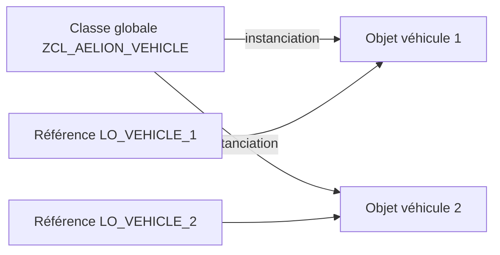

# 🌸 CLASSES GLOBALES ET OBJETS

## 🌺 OBJECTIFS

- [ ] Distinguer une classe globale, un objet et une référence objet.
- [ ] Créer une classe globale avec la transaction `SE24`.
- [ ] Identifier les composants d’une classe.
- [ ] Instancier la classe depuis un programme ABAP.

## 🌺 DÉFINITION

Une **classe globale** est un objet du référentiel ABAP. Elle décrit un type d’objet réutilisable par plusieurs programmes, modules fonction, services ou autres classes.

Une classe regroupe notamment :

- des **attributs**, qui représentent l’état ;
- des **méthodes**, qui représentent le comportement ;
- des **types** et des **constantes** ;
- éventuellement des **événements** et des **interfaces**.

Un **objet** est une instance créée à partir de cette classe. Une **référence objet** est la variable utilisée pour accéder à cette instance.

> [!IMPORTANT]
> La classe est le modèle. L’objet est l’instance en mémoire. La référence permet d’atteindre cet objet.

## 🌺 VUE D'ENSEMBLE



## 🌺 CRÉATION DANS SE24

1. Ouvrir la transaction `/nSE24`.
2. Saisir `ZCL_AELION_VEHICLE`.
3. Sélectionner **Classe**, puis **Créer**.
4. Renseigner une description claire.
5. Conserver une instanciation **publique** pour ce premier exemple.
6. Affecter la classe à un package et à un ordre de transport.
7. Enregistrer puis activer.

> [!NOTE]
> `SE24` crée une classe globale. Le système gère le class pool associé ; le stagiaire travaille principalement dans les onglets de la classe et dans l’éditeur des méthodes.

## 🌺 PREMIER COMPOSANT

Dans l’onglet **Méthodes**, créer une méthode publique `DISPLAY_MESSAGE`, sans paramètre. Ouvrir ensuite son implémentation et saisir :

```abap
METHOD display_message.
  WRITE / 'Je suis une instance de ZCL_AELION_VEHICLE'.
ENDMETHOD.
```

## 🌺 UTILISATION DEPUIS UN PROGRAMME

```abap
REPORT zaelion_oo_01.

START-OF-SELECTION.
  DATA lo_vehicle TYPE REF TO zcl_aelion_vehicle.

  lo_vehicle = NEW zcl_aelion_vehicle( ).
  lo_vehicle->display_message( ).
```

| Élément | Rôle |
|---|---|
| `TYPE REF TO zcl_aelion_vehicle` | Déclare une référence compatible avec la classe |
| `NEW zcl_aelion_vehicle( )` | Crée une instance |
| `lo_vehicle->display_message( )` | Appelle une méthode d’instance |

## 🌺 EXERCICE

Créer la classe globale `ZCL_AELION_PERSON`, ajouter une méthode publique `SAY_HELLO`, puis l’appeler depuis un report.

<details>
<summary>Afficher la correction et les points de contrôle</summary>

- [ ] La classe est créée et active dans SE24.
- [ ] La méthode SAY_HELLO est publique et implémentée.
- [ ] Le report crée une référence puis une instance.
- [ ] L’appel utilise le sélecteur ->.

</details>

## 🌺 RÉSUMÉ

> - Une classe globale est créée et maintenue dans `SE24`.
> - Un objet est une instance de cette classe.
> - Une référence objet permet d’accéder à l’instance.
> - Les méthodes décrivent les comportements et les attributs décrivent l’état.

## 🌺 SOURCES OFFICIELLES

- [Documentation SAP — Builder](https://help.sap.com/doc/abapdocu_latest_index_htm/latest/en-US/ABENCLASS_BUILDER_GLOSRY.html)
- [Documentation SAP — Classes](https://help.sap.com/doc/abapdocu_cp_index_htm/CLOUD/en-US/ABENCLASSES.html)
