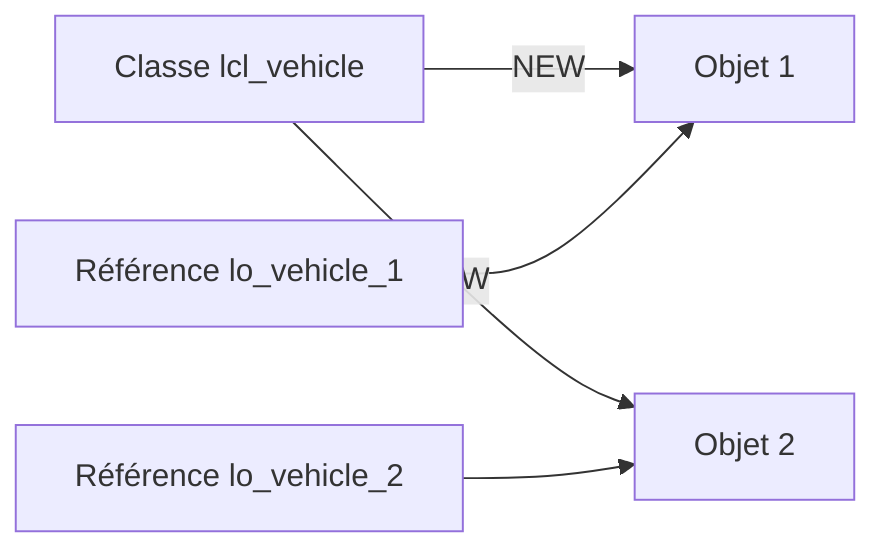

# 🌸 CLASSES ET OBJETS

## 🌺 OBJECTIFS

- [ ] Comprendre ce qu’est une `CLASSE`
- [ ] Comprendre ce qu’est un `OBJET`
- [ ] Comprendre ce qu’est une `REFERENCE OBJET`
- [ ] Distinguer le modèle de l’élément créé à partir de ce modèle
- [ ] Identifier l’état et le comportement d’un objet

## 🌺 DEFINITION D'UNE CLASSE

> Une `CLASSE` décrit un type d’objet.
> Elle regroupe des données et les traitements qui agissent sur ces données.

Une classe contient principalement :

- des `ATTRIBUTS` : données décrivant l’état ;
- des `METHODES` : traitements décrivant le comportement ;
- des `TYPES` : modèles de données propres à la classe ;
- des `CONSTANTES` : valeurs fixes ;
- éventuellement des `EVENEMENTS` et des interfaces.

> [!TIP]
> Une classe peut être comparée au plan de fabrication d’une voiture.
> Le plan décrit les caractéristiques et les actions possibles, mais il n’est pas lui-même une voiture utilisable.

## 🌺 DEFINITION D'UN OBJET

> Un `OBJET` est une occurrence concrète créée à partir d’une classe.
> Cette occurrence est aussi appelée `INSTANCE`.

A partir d’une même classe `VEHICULE`, il est possible de créer plusieurs objets :

- un véhicule rouge à 20 km/h ;
- un véhicule bleu à 50 km/h ;
- un véhicule blanc à l’arrêt.

Chaque objet possède son propre état si les attributs sont des attributs d’instance.

> [!IMPORTANT]
> Une classe est un modèle.
> Un objet est une instance créée à partir de ce modèle.

## 🌺 DEFINITION D'UNE REFERENCE OBJET

> Une `REFERENCE OBJET` est une variable qui permet d’accéder à un objet.

    DATA lo_vehicle TYPE REF TO lcl_vehicle.

- `DATA` déclare une variable.
- `lo_vehicle` est le nom de la référence.
- `TYPE REF TO` indique qu’elle peut référencer un objet.
- `lcl_vehicle` est la classe attendue.

> [!TIP]
> L’objet peut être comparé à une maison.
> La référence objet peut être comparée à son adresse.
> L’adresse permet de retrouver la maison, mais elle n’est pas la maison.

## 🌺 ETAT ET COMPORTEMENT

| 🍧 Notion       | 🍧 Élément ABAP | 🍧 Exemple                   |
| --------------- | --------------- | ---------------------------- |
| Etat            | Attribut        | vitesse, couleur, numéro     |
| Comportement    | Méthode         | accélérer, arrêter, afficher |
| Modèle          | Classe          | `lcl_vehicle`                |
| Élément concret | Objet           | véhicule créé avec `NEW`     |
| Accès à l’objet | Référence       | `lo_vehicle`                 |

## 🌺 REPRESENTATION GLOBALE

Lecture textuelle :

1. La classe `lcl_vehicle` sert de modèle.
2. `NEW` crée deux objets distincts.
3. Chaque objet est accessible par une référence différente.

## 🌺 PREMIER EXEMPLE

    REPORT zaelion_oo_01.

    CLASS lcl_vehicle DEFINITION.
      PUBLIC SECTION.
        METHODS display_message.
    ENDCLASS.

    CLASS lcl_vehicle IMPLEMENTATION.
      METHOD display_message.
        WRITE: / 'Je suis un objet de type véhicule'.
      ENDMETHOD.
    ENDCLASS.

    START-OF-SELECTION.

      DATA lo_vehicle TYPE REF TO lcl_vehicle.

      lo_vehicle = NEW lcl_vehicle( ).
      lo_vehicle->display_message( ).

## 🌺 EXPLICATION

1. `CLASS lcl_vehicle DEFINITION` décrit la classe.
2. `METHODS display_message` déclare une méthode d’instance.
3. `CLASS lcl_vehicle IMPLEMENTATION` contient le code de la méthode.
4. `TYPE REF TO lcl_vehicle` déclare une référence objet.
5. `NEW lcl_vehicle( )` crée une instance.
6. `->` appelle un composant d’instance.

## 🌺 VOCABULAIRE A RETENIR

| 🍧 Mot        | 🍧 Définition                                 |
| ------------- | --------------------------------------------- |
| Classe        | Modèle décrivant des objets                   |
| Objet         | Instance concrète d’une classe                |
| Instance      | Synonyme d’objet créé                         |
| Référence     | Variable permettant d’accéder à un objet      |
| Attribut      | Donnée appartenant à une classe ou à un objet |
| Méthode       | Traitement appartenant à une classe           |
| Instanciation | Création d’un objet                           |

## 🌺 BONNES PRATIQUES

- Utiliser le préfixe `lcl_` pour une classe locale.
- Utiliser le préfixe `lo_` pour une référence objet locale.
- Donner à la classe un nom correspondant à une responsabilité précise.
- Eviter les classes qui gèrent plusieurs domaines sans lien.
- Distinguer systématiquement la classe, l’objet et la référence.

## 🌺 EXERCICES

1. Déclarer une classe locale `lcl_person`.
2. Ajouter une méthode publique `say_hello`.
3. Créer une référence `lo_person`.
4. Instancier la classe.
5. Appeler la méthode pour afficher `Bonjour`.

## 🌺 RESUME

> - Une classe est un modèle.
> - Un objet est une instance de cette classe.
> - Une référence permet d’accéder à l’objet.
> - Les attributs représentent l’état.
> - Les méthodes représentent le comportement.
> - `->` permet d’accéder aux composants d’une instance.

## 🌺 SOURCE OFFICIELLE

- SAP ABAP Keyword Documentation — Classes : https://help.sap.com/doc/abapdocu_latest_index_htm/latest/en-US/abenclass_interface_definition.htm
