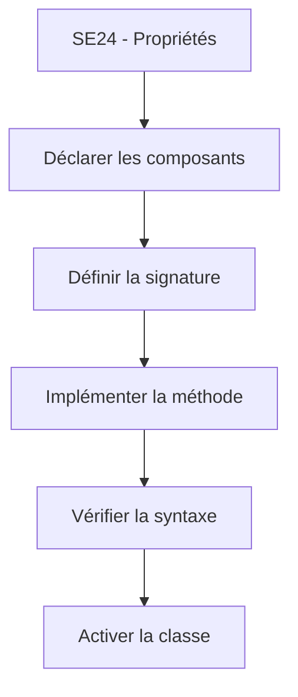

# 🌸 DÉFINITION ET IMPLÉMENTATION DANS SE24

## 🌺 OBJECTIFS

- [ ] Comprendre la séparation entre déclaration et code d’une méthode.
- [ ] Utiliser les onglets du Class Builder.
- [ ] Créer et implémenter une méthode globale.
- [ ] Activer correctement une classe.

## 🌺 PRINCIPE

Dans une classe globale, la **définition** correspond aux composants décrits dans les onglets de `SE24` : méthodes, attributs, types, événements et interfaces. L’**implémentation** correspond au code ABAP des méthodes.

> [!IMPORTANT]
> La signature d’une méthode et son implémentation sont deux éléments différents. Modifier l’interface peut impacter tous les programmes appelants.

## 🌺 VUE D'ENSEMBLE



## 🌺 ONGLETS PRINCIPAUX

| Onglet     | Utilité                                                    |
| ---------- | ---------------------------------------------------------- |
| Propriétés | Description, instanciation, statut abstrait ou final       |
| Interfaces | Interfaces implémentées par la classe                      |
| Friends    | Classes ou interfaces amies, à utiliser exceptionnellement |
| Attributs  | Données d’instance ou statiques                            |
| Méthodes   | Signatures, visibilité et implémentations                  |
| Événements | Événements publiés par la classe                           |
| Types      | Types internes publics, protégés ou privés                 |

## 🌺 EXEMPLE GUIDÉ

Créer `ZCL_AELION_MESSAGE_SERVICE`, puis dans l’onglet **Méthodes** :

1. ajouter `DISPLAY` ;
2. choisir la visibilité **publique** ;
3. ajouter le paramètre d’import `IV_TEXT` de type `STRING` ;
4. ouvrir l’implémentation ;
5. saisir le code suivant ;
6. vérifier et activer.

```abap
METHOD display.
  WRITE / iv_text.
ENDMETHOD.
```

Appel depuis un programme :

```abap
DATA(lo_service) = NEW zcl_aelion_message_service( ).
lo_service->display( iv_text = 'Bonjour depuis une classe globale' ).
```

## 🌺 ERREURS FRÉQUENTES

| Erreur              | Cause probable                  | Correction                               |
| ------------------- | ------------------------------- | ---------------------------------------- |
| Méthode inconnue    | Classe ou méthode non active    | Activer les objets                       |
| Paramètre inconnu   | Signature différente de l’appel | Contrôler l’onglet Paramètres            |
| Implémentation vide | Méthode créée sans code         | Ouvrir l’éditeur de la méthode           |
| Incohérence de type | Type réel incompatible          | Utiliser un type DDIC ou ABAP compatible |

## 🌺 EXERCICE

Créer `ZCL_AELION_CALCULATOR` avec une méthode publique `ADD` recevant deux entiers et retournant leur somme.

<details>
<summary>Afficher la correction et les points de contrôle</summary>

- [ ] La méthode ADD existe dans l’onglet Méthodes.
- [ ] Les deux entrées sont définies en IMPORTING.
- [ ] Le résultat est défini en RETURNING.
- [ ] La méthode est implémentée et la classe activée.

</details>

## 🌺 RÉSUMÉ

> - Les onglets de `SE24` portent la définition de la classe.
> - Le code est placé dans l’implémentation de chaque méthode.
> - Une modification de signature doit être contrôlée avant activation.
> - La vérification de syntaxe ne remplace pas un test fonctionnel.

## 🌺 SOURCES OFFICIELLES

- [Documentation SAP — Builder](https://help.sap.com/doc/abapdocu_latest_index_htm/latest/en-US/ABENCLASS_BUILDER_GLOSRY.html)
- [Documentation SAP — Methods](https://help.sap.com/doc/abapdocu_cp_index_htm/CLOUD/en-US/ABENCLASS_METHODS.html)
