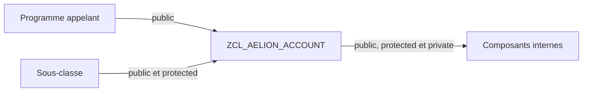

# 🌸 VISIBILITÉ DES COMPOSANTS

## 🌺 OBJECTIFS

- [ ] Distinguer les visibilités publique, protégée et privée.
- [ ] Configurer la visibilité dans `SE24`.
- [ ] Concevoir une interface publique minimale.
- [ ] Comprendre l’impact de l’héritage.

## 🌺 DÉFINITION

La visibilité détermine quels consommateurs peuvent accéder à un composant de classe.

| Visibilité SE24 | Accessible depuis la classe | Depuis une sous-classe | Depuis un programme appelant |
|---|---:|---:|---:|
| Publique | Oui | Oui | Oui |
| Protégée | Oui | Oui | Non |
| Privée | Oui | Non | Non |

> [!IMPORTANT]
> Un composant public constitue un contrat pour les appelants. Il doit rester stable, cohérent et documenté.

## 🌺 VUE D'ENSEMBLE



## 🌺 CONFIGURATION DANS SE24

Dans les onglets **Attributs**, **Méthodes**, **Événements** ou **Types**, renseigner la colonne de visibilité du composant.

Exemple de conception pour `ZCL_AELION_ACCOUNT` :

- `DEPOSIT` : publique ;
- `GET_BALANCE` : publique ;
- `VALIDATE_AMOUNT` : privée ;
- `MV_BALANCE` : privée.

## 🌺 POURQUOI PRIVATISER

Un attribut privé ne peut pas être modifié directement depuis l’extérieur. La classe conserve donc le contrôle des règles métier.

```abap
DATA(lo_account) = NEW zcl_aelion_account( ).
lo_account->deposit( iv_amount = '100.00' ).
DATA(lv_balance) = lo_account->get_balance( ).
```

L’appelant ne doit pas écrire directement dans `MV_BALANCE`.

## 🌺 BONNES PRATIQUES

- Déclarer les attributs privés par défaut.
- Exposer uniquement les méthodes nécessaires.
- Réserver `PROTECTED` aux besoins réels des sous-classes.
- Éviter les attributs publics modifiables.
- Documenter le contrat des méthodes publiques.

## 🌺 EXERCICE

Dans `ZCL_AELION_ACCOUNT`, créer un attribut privé `MV_BALANCE`, une méthode publique `DEPOSIT` et une méthode privée `VALIDATE_AMOUNT`.

<details>
<summary>Afficher la correction et les points de contrôle</summary>

- [ ] MV_BALANCE est privé.
- [ ] DEPOSIT est accessible depuis un report.
- [ ] VALIDATE_AMOUNT est appelable uniquement dans la classe.
- [ ] Le montant est contrôlé avant modification du solde.

</details>

## 🌺 RÉSUMÉ

> - `PUBLIC` expose un composant à tous les appelants autorisés.
> - `PROTECTED` réserve l’accès à la classe et à ses sous-classes.
> - `PRIVATE` limite l’accès à la classe elle-même.
> - L’encapsulation repose sur une interface publique réduite.

## 🌺 SOURCES OFFICIELLES

- [Documentation SAP — Visibility](https://help.sap.com/doc/abapdocu_cp_index_htm/CLOUD/en-US/ABENCLASS_VISIBILITY.html)
