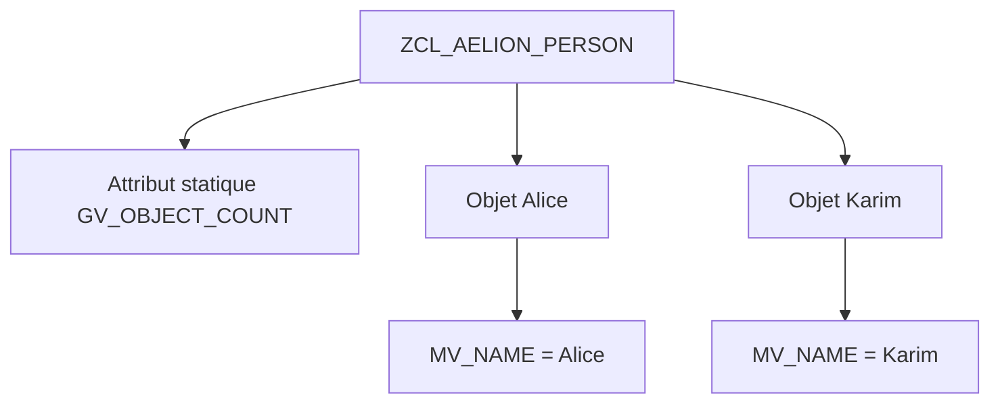

# 🌸 ATTRIBUTS D’INSTANCE ET STATIQUES

## 🌺 OBJECTIFS

- [ ] Créer un attribut dans `SE24`.
- [ ] Distinguer un attribut d’instance d’un attribut statique.
- [ ] Choisir une visibilité cohérente.
- [ ] Accéder aux attributs depuis les méthodes.

## 🌺 DÉFINITION

Un attribut représente une donnée appartenant à un objet ou à la classe entière.

| Catégorie | Déclaration conceptuelle | Nombre de valeurs |
|---|---|---|
| Instance | `DATA` | Une valeur par objet |
| Statique | `CLASS-DATA` | Une valeur partagée par la classe dans la session interne |

## 🌺 VUE D'ENSEMBLE



## 🌺 CRÉATION DANS SE24

Dans l’onglet **Attributs** :

1. créer `MV_NAME` ;
2. sélectionner un attribut d’instance ;
3. choisir le type `STRING` ;
4. définir la visibilité privée ;
5. créer `GV_OBJECT_COUNT` ;
6. sélectionner un attribut statique ;
7. choisir le type `I` et la visibilité privée.

> [!WARNING]
> Un attribut statique introduit un état partagé. Il ne doit pas servir à contourner une transmission normale des données entre objets.

## 🌺 ACCÈS DEPUIS LES MÉTHODES

```abap
METHOD constructor.
  mv_name = iv_name.
  gv_object_count = gv_object_count + 1.
ENDMETHOD.

METHOD get_name.
  rv_name = mv_name.
ENDMETHOD.

METHOD get_object_count.
  rv_count = gv_object_count.
ENDMETHOD.
```

Appel :

```abap
DATA(lo_person) = NEW zcl_aelion_person( iv_name = 'Alice' ).
DATA(lv_name) = lo_person->get_name( ).
DATA(lv_count) = zcl_aelion_person=>get_object_count( ).
```

## 🌺 CONVENTIONS

- `MV_` : attribut d’instance privé ;
- `GV_` : attribut statique privé, selon convention projet ;
- `MO_` : référence objet d’instance ;
- `MT_` : table interne d’instance.

## 🌺 EXERCICE

Créer `ZCL_AELION_PRODUCT` avec les attributs privés `MV_NAME`, `MV_PRICE` et l’attribut statique privé `GV_PRODUCT_COUNT`.

<details>
<summary>Afficher la correction et les points de contrôle</summary>

- [ ] Chaque objet possède son propre nom et son propre prix.
- [ ] Le compteur est partagé.
- [ ] Les attributs sont privés.
- [ ] Les valeurs sont accessibles par des méthodes publiques.

</details>

## 🌺 RÉSUMÉ

> - Un attribut d’instance appartient à un objet.
> - Un attribut statique appartient à la classe.
> - Les attributs privés protègent l’état interne.
> - `->` cible une instance ; `=>` cible un composant statique.

## 🌺 SOURCES OFFICIELLES

- [Documentation SAP — Attributes](https://help.sap.com/doc/abapdocu_latest_index_htm/latest/en-US/ABENCLASS_ATTRIBUTES.html)
- [Documentation SAP — Classes](https://help.sap.com/doc/abapdocu_cp_index_htm/CLOUD/en-US/ABENCLASSES.html)
