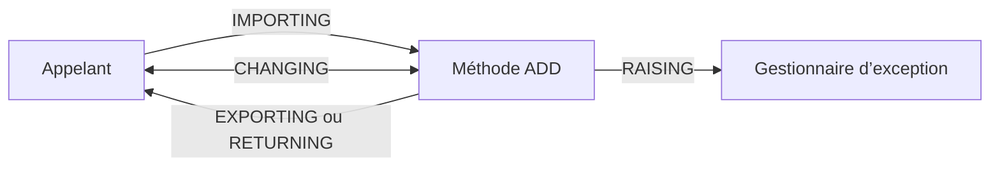

# 🌸 MÉTHODES ET PARAMÈTRES

## 🌺 OBJECTIFS

- [ ] Créer une méthode d’instance ou statique dans `SE24`.
- [ ] Configurer `IMPORTING`, `EXPORTING`, `CHANGING` et `RETURNING`.
- [ ] Comprendre la direction des paramètres.
- [ ] Tester une méthode depuis un report.

## 🌺 DÉFINITION

Une méthode est un traitement appartenant à une classe. Sa signature définit les données reçues, modifiées ou retournées.

| Paramètre dans SE24 | Rôle                                                       |
| ------------------- | ---------------------------------------------------------- |
| Import              | Entrée de la méthode                                       |
| Export              | Sortie de la méthode                                       |
| Changing            | Entrée puis sortie                                         |
| Returning           | Valeur fonctionnelle unique                                |
| Exception           | Exception classique ou classe d’exception selon conception |

> [!IMPORTANT]
> Dans la syntaxe d’appel classique, les mots-clés sont vus depuis l’appelant : un paramètre `IMPORTING` de la méthode apparaît dans la section `EXPORTING` de l’appel.

## 🌺 VUE D'ENSEMBLE



## 🌺 CRÉATION DANS SE24

Dans `ZCL_AELION_CALCULATOR` :

1. créer la méthode publique `ADD` ;
2. ouvrir l’onglet **Paramètres** ;
3. créer `IV_FIRST` et `IV_SECOND`, catégorie Import, type `I` ;
4. créer `RV_RESULT`, catégorie Returning, type `I` ;
5. ouvrir l’implémentation.

```abap
METHOD add.
  rv_result = iv_first + iv_second.
ENDMETHOD.
```

## 🌺 APPEL FONCTIONNEL

```abap
DATA(lo_calculator) = NEW zcl_aelion_calculator( ).
DATA(lv_result) = lo_calculator->add(
  iv_first  = 10
  iv_second = 5 ).
```

## 🌺 MÉTHODE STATIQUE

Dans l’onglet **Méthodes**, sélectionner le niveau statique pour `CALCULATE_VAT`.

```abap
DATA(lv_vat) = zcl_aelion_tax=>calculate_vat( iv_amount = '100.00' ).
```

Une méthode statique ne nécessite aucune instance et ne peut accéder directement qu’aux composants statiques.

## 🌺 BONNES PRATIQUES

- Préférer une valeur `RETURNING` pour une opération fonctionnelle simple.
- Limiter les paramètres `CHANGING`.
- Utiliser des noms indiquant la direction : `IV_`, `IS_`, `IT_`, `EV_`, `ES_`, `ET_`, `CV_`, `RV_`.
- Employer des types stables, de préférence DDIC quand l’interface est partagée.

## 🌺 EXERCICE

Ajouter à `ZCL_AELION_CALCULATOR` une méthode `CALCULATE_MULTIPLE` qui reçoit une valeur et exporte son double et son triple.

<details>
<summary>Afficher la correction et les points de contrôle</summary>

- [ ] La signature possède une entrée et deux sorties.
- [ ] Les types sont cohérents.
- [ ] L’implémentation ne modifie pas l’entrée.
- [ ] Le report récupère les deux résultats.

</details>

## 🌺 RÉSUMÉ

> - La signature d’une méthode est définie dans `SE24`.
> - Les paramètres décrivent les échanges avec l’appelant.
> - Une méthode d’instance utilise `->` ; une méthode statique utilise `=>`.
> - Une interface simple réduit les erreurs d’appel.

## 🌺 SOURCES OFFICIELLES

- [Documentation SAP — Builder](https://help.sap.com/doc/abapdocu_latest_index_htm/latest/en-US/ABENCLASS_BUILDER_GLOSRY.html)
- [Documentation SAP — Methods](https://help.sap.com/doc/abapdocu_cp_index_htm/CLOUD/en-US/ABENCLASS_METHODS.html)
