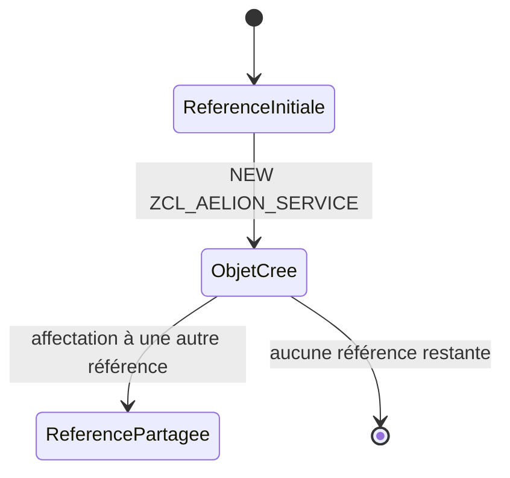

# 🌸 RÉFÉRENCES ET INSTANCIATION

## 🌺 OBJECTIFS

- [ ] Déclarer une référence vers une classe globale.
- [ ] Créer un objet avec `NEW`.
- [ ] Distinguer référence initiale et objet existant.
- [ ] Comprendre l’affectation entre références.

## 🌺 DÉFINITION

Une référence objet contient l’accès à une instance. Avant l’instanciation, elle est initiale et ne désigne aucun objet.

```abap
DATA lo_service TYPE REF TO zcl_aelion_service.
```

## 🌺 VUE D'ENSEMBLE



## 🌺 INSTANCIATION PUBLIQUE

La propriété d’instanciation de la classe est configurée dans `SE24`.

```abap
DATA(lo_service) = NEW zcl_aelion_service( ).
```

L’expression réalise deux opérations : création de l’objet et affectation de sa référence.

> [!CAUTION]
> Appeler une méthode d’instance sur une référence initiale provoque une exception d’exécution liée à une référence objet non affectée.

## 🌺 TEST DE LA RÉFÉRENCE

```abap
IF lo_service IS BOUND.
  lo_service->execute( ).
ENDIF.
```

`IS BOUND` vérifie que la référence désigne un objet valide.

## 🌺 DEUX RÉFÉRENCES, UN OBJET

```abap
DATA(lo_first) = NEW zcl_aelion_counter( ).
DATA lo_second TYPE REF TO zcl_aelion_counter.

lo_second = lo_first.
lo_second->increment( ).
```

Les deux références désignent la même instance. Une modification effectuée par l’une est visible par l’autre.

## 🌺 EXERCICE

Créer deux instances de `ZCL_AELION_COUNTER`, puis une troisième référence désignant la première instance. Comparer les effets des appels.

<details>
<summary>Afficher la correction et les points de contrôle</summary>

- [ ] Deux appels à NEW créent deux objets distincts.
- [ ] Une affectation de référence ne duplique pas l’objet.
- [ ] IS BOUND est utilisé avant un appel incertain.
- [ ] Les sélecteurs -> et => ne sont pas confondus.

</details>

## 🌺 RÉSUMÉ

> - Une référence n’est pas l’objet lui-même.
> - `NEW` crée une instance et retourne sa référence.
> - Plusieurs références peuvent désigner le même objet.
> - `IS BOUND` protège les appels lorsque l’affectation n’est pas garantie.

## 🌺 SOURCES OFFICIELLES

- [Documentation SAP — Classes](https://help.sap.com/doc/abapdocu_cp_index_htm/CLOUD/en-US/ABENCLASSES.html)
