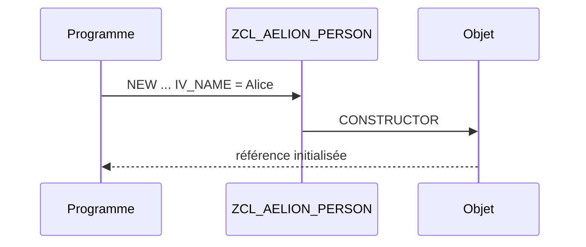

# 🌸 CONSTRUCTEURS

## 🌺 OBJECTIFS

- [ ] Comprendre le rôle de `CONSTRUCTOR` et `CLASS_CONSTRUCTOR`.
- [ ] Définir les paramètres du constructeur dans `SE24`.
- [ ] Garantir un état initial valide.
- [ ] Distinguer initialisation d’objet et initialisation de classe.

## 🌺 DÉFINITION

Le constructeur d’instance `CONSTRUCTOR` est exécuté automatiquement lors de la création d’un objet. Le constructeur statique `CLASS_CONSTRUCTOR` est exécuté automatiquement avant le premier accès pertinent à la classe dans une session interne.

## 🌺 VUE D'ENSEMBLE



## 🌺 CONSTRUCTEUR D’INSTANCE DANS SE24

Dans l’onglet **Méthodes**, sélectionner la méthode prédéfinie `CONSTRUCTOR`, puis ajouter le paramètre d’import `IV_NAME`.

```abap
METHOD constructor.
  IF iv_name IS INITIAL.
    RAISE EXCEPTION TYPE zcx_aelion_invalid_name.
  ENDIF.

  mv_name = iv_name.
ENDMETHOD.
```

Appel :

```abap
DATA(lo_person) = NEW zcl_aelion_person( iv_name = 'Alice' ).
```

> [!IMPORTANT]
> Un constructeur doit établir un état cohérent. Une instance invalide ne doit pas être créée puis réparée ultérieurement.

## 🌺 CONSTRUCTEUR STATIQUE

La méthode prédéfinie `CLASS_CONSTRUCTOR` ne possède pas de paramètres.

```abap
METHOD class_constructor.
  gv_default_country = 'FR'.
ENDMETHOD.
```

Elle convient à l’initialisation de données statiques déterministes. Éviter les traitements lourds ou imprévisibles.

## 🌺 ERREURS FRÉQUENTES

- exécuter des accès base de données inutiles dans chaque construction ;
- accepter des paramètres incohérents ;
- masquer les erreurs d’initialisation ;
- confondre constructeur et méthode de traitement métier.

## 🌺 EXERCICE

Ajouter à `ZCL_AELION_PRODUCT` un constructeur recevant le nom et le prix, puis refuser un prix négatif.

<details>
<summary>Afficher la correction et les points de contrôle</summary>

- [ ] Le constructeur est la méthode prédéfinie de SE24.
- [ ] Les paramètres obligatoires garantissent l’état initial.
- [ ] Une erreur empêche la création de l’objet.
- [ ] CLASS_CONSTRUCTOR n’est pas appelé manuellement.

</details>

## 🌺 RÉSUMÉ

> - `CONSTRUCTOR` initialise chaque nouvelle instance.
> - `CLASS_CONSTRUCTOR` initialise les composants statiques.
> - Les constructeurs sont appelés automatiquement.
> - L’objet doit être valide dès la fin du constructeur.

## 🌺 SOURCES OFFICIELLES

- [Documentation SAP — Constructor](https://help.sap.com/doc/abapdocu_cp_index_htm/CLOUD/en-US/ABENCONSTRUCTOR.html)
