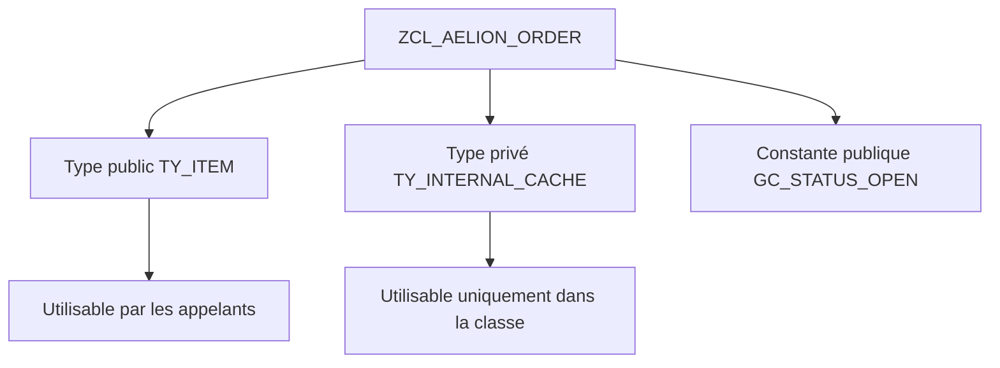

# 🌸 TYPES ET CONSTANTES DE CLASSE

## 🌺 OBJECTIFS

- [ ] Expliquer ce qu’est un type défini dans une classe ABAP ;
- [ ] Distinguer un type de données d’une variable contenant des données ;
- [ ] Créer un type élémentaire, un type structure et un type table dans une classe globale ;
- [ ] Choisir une visibilité `PUBLIC`, `PROTECTED` ou `PRIVATE` ;
- [ ] Créer un type table public utilisable par les programmes appelants ;
- [ ] Créer un type table privé réservé à l’implémentation de la classe ;
- [ ] Utiliser un type public dans la signature d’une méthode publique ;
- [ ] Utiliser un type privé pour un attribut ou une méthode privée ;
- [ ] Choisir une catégorie de table et une clé explicite ;
- [ ] Créer et utiliser une constante de classe ;
- [ ] éviter d’exposer inutilement les structures internes de la classe.

## 🌺 VUE D'ENSEMBLE



## 🌺 DÉFINITION

Une classe ABAP peut définir ses propres types avec l’instruction :

```abap
TYPES
```

Un type décrit la forme d’une donnée.

Il ne contient pas lui-même de valeur.

Exemple :

```abap
TYPES ty_amount TYPE decfloat34.
```

Le type :

```text
TY_AMOUNT
```

décrit une donnée de type `DECFLOAT34`.

Une variable utilisant ce type contient une valeur :

```abap
DATA mv_total TYPE ty_amount.
```

Il faut donc distinguer :

```text
TYPES
→ définition d’une forme de donnée

DATA
→ création d’une variable contenant une valeur
```

## 🌺 TYPES DÉFINISSABLES DANS UNE CLASSE

Une classe peut notamment contenir :

- un type élémentaire ;
- un type structure ;
- un type table ;
- un type référence ;
- un type basé sur un type DDIC ;
- un type basé sur un autre type public.

### TYPE ÉLÉMENTAIRE

```abap
TYPES ty_status TYPE c LENGTH 1.
```

### TYPE STRUCTURE

```abap
TYPES:
  BEGIN OF ty_s_item,
    item_id     TYPE i,
    description TYPE string,
    quantity    TYPE decfloat34,
    unit_price  TYPE decfloat34,
  END OF ty_s_item.
```

### TYPE TABLE

```abap
TYPES ty_t_items TYPE STANDARD TABLE OF ty_s_item
  WITH EMPTY KEY.
```

Le type table s’appuie ici sur le type de ligne :

```text
TY_S_ITEM
```

### TYPE RÉFÉRENCE

```abap
TYPES ty_r_order TYPE REF TO zcl_aelion_order.
```

---

## 🌺 VISIBILITÉ D’UN TYPE DE CLASSE

Comme les méthodes et attributs, les types appartiennent à une section de visibilité.

```abap
PUBLIC SECTION.
PROTECTED SECTION.
PRIVATE SECTION.
```

### TYPE PUBLIC

Un type public fait partie du contrat externe de la classe.

Il peut être utilisé depuis un programme, une autre classe ou une interface autorisée avec :

```abap
zcl_aelion_order=>ty_t_items
```

Exemple :

```abap
DATA lt_items TYPE zcl_aelion_order=>ty_t_items.
```

### TYPE PROTECTED

Un type protected est accessible :

- dans la classe ;
- dans ses sous-classes.

Il n’est pas accessible directement depuis un programme externe ordinaire.

### TYPE PRIVATE

Un type private est accessible uniquement dans l’implémentation de la classe qui le déclare.

Il peut être utilisé pour :

- un attribut privé ;
- une méthode privée ;
- une structure de travail ;
- une table de journal interne ;
- une donnée technique qui ne doit pas faire partie de l’API publique.

Exemple interne :

```abap
DATA mt_log TYPE ty_t_log.
```

Exemple interdit depuis un programme externe :

```abap
" Ne doit pas être utilisable hors de la classe
DATA lt_log TYPE zcl_aelion_order=>ty_t_log.
```

## 🌺 TABLEAU RÉCAPITULATIF

| Visibilité  | Classe elle-même | Sous-classe | Programme externe |
| ----------- | ---------------- | ----------- | ----------------- |
| `PUBLIC`    | Oui              | Oui         | Oui               |
| `PROTECTED` | Oui              | Oui         | Non               |
| `PRIVATE`   | Oui              | Non         | Non               |

## 🌺 CRÉATION DANS SE24

### OUVRIR LA CLASSE

1. Ouvrir la transaction `SE24`.
2. Renseigner le nom de la classe :

```text
ZCL_AELION_ORDER
```

3. Choisir **Modifier**.
4. Ouvrir l’onglet **Types**.

Selon la version SAP, le Class Builder peut être présenté :

- sous forme de formulaires ;
- sous forme de source de définition ;
- via ADT dans Eclipse.

Le résultat technique reste une déclaration `TYPES` dans la section de visibilité choisie.

### CRÉER UN TYPE STRUCTURE PUBLIC

Créer :

```text
TY_S_ITEM
```

Visibilité :

```text
Public
```

Composants :

| Composant     | Type         |
| ------------- | ------------ |
| `ITEM_ID`     | `I`          |
| `DESCRIPTION` | `STRING`     |
| `QUANTITY`    | `DECFLOAT34` |
| `UNIT_PRICE`  | `DECFLOAT34` |

Équivalent ABAP :

```abap
PUBLIC SECTION.

  TYPES:
    BEGIN OF ty_s_item,
      item_id     TYPE i,
      description TYPE string,
      quantity    TYPE decfloat34,
      unit_price  TYPE decfloat34,
    END OF ty_s_item.
```

### CRÉER UN TYPE TABLE PUBLIC

Créer :

```text
TY_T_ITEMS
```

Visibilité :

```text
Public
```

Type de ligne :

```text
TY_S_ITEM
```

Catégorie :

```text
STANDARD TABLE
```

Clé :

```text
EMPTY KEY
```

Équivalent ABAP :

```abap
PUBLIC SECTION.

  TYPES ty_t_items TYPE STANDARD TABLE OF ty_s_item
    WITH EMPTY KEY.
```

### CRÉER UN TYPE STRUCTURE PRIVATE

Créer :

```text
TY_S_LOG
```

Visibilité :

```text
Private
```

Composants :

| Composant | Type         |
| --------- | ------------ |
| `LINE_NO` | `I`          |
| `TYPE`    | `BAPI_MTYPE` |
| `MESSAGE` | `BAPI_MSG`   |

Équivalent ABAP :

```abap
PRIVATE SECTION.

  TYPES:
    BEGIN OF ty_s_log,
      line_no TYPE i,
      type    TYPE bapi_mtype,
      message TYPE bapi_msg,
    END OF ty_s_log.
```

### CRÉER UN TYPE TABLE PRIVATE

Créer :

```text
TY_T_LOG
```

Visibilité :

```text
Private
```

Type de ligne :

```text
TY_S_LOG
```

Catégorie :

```text
STANDARD TABLE
```

Clé :

```text
EMPTY KEY
```

Équivalent ABAP :

```abap
PRIVATE SECTION.

  TYPES ty_t_log TYPE STANDARD TABLE OF ty_s_log
    WITH EMPTY KEY.
```

### 4.6 Activer

Après la création :

1. vérifier la définition ;
2. vérifier la visibilité ;
3. activer la classe ;
4. contrôler la liste d’erreurs ;
5. tester l’utilisation du type public depuis un programme.

## 🌺 EXEMPLE COMPLET : TYPES PUBLICS ET PRIVÉS

```abap
CLASS zcl_aelion_order DEFINITION
  PUBLIC
  FINAL
  CREATE PUBLIC.

  PUBLIC SECTION.

    TYPES:
      BEGIN OF ty_s_item,
        item_id     TYPE i,
        description TYPE string,
        quantity    TYPE decfloat34,
        unit_price  TYPE decfloat34,
      END OF ty_s_item.

    TYPES ty_t_items TYPE STANDARD TABLE OF ty_s_item
      WITH EMPTY KEY.

    CONSTANTS:
      gc_status_new    TYPE c LENGTH 1 VALUE 'N',
      gc_status_closed TYPE c LENGTH 1 VALUE 'C'.

    METHODS set_items
      IMPORTING
        it_items TYPE ty_t_items.

    METHODS get_items
      RETURNING
        VALUE(rt_items) TYPE ty_t_items.

    METHODS calculate_total
      RETURNING
        VALUE(rv_total) TYPE decfloat34.

  PRIVATE SECTION.

    TYPES:
      BEGIN OF ty_s_log,
        line_no TYPE i,
        type    TYPE bapi_mtype,
        message TYPE bapi_msg,
      END OF ty_s_log.

    TYPES ty_t_log TYPE STANDARD TABLE OF ty_s_log
      WITH EMPTY KEY.

    DATA:
      mt_items TYPE ty_t_items,
      mt_log   TYPE ty_t_log.

    METHODS add_log
      IMPORTING
        iv_line_no TYPE i
        iv_type    TYPE bapi_mtype
        iv_message TYPE bapi_msg.

ENDCLASS.
```

## 🌺 IMPLÉMENTATION

```abap
CLASS zcl_aelion_order IMPLEMENTATION.

  METHOD set_items.

    mt_items = it_items.

    add_log(
      iv_line_no = 0
      iv_type    = 'S'
      iv_message = 'Les postes ont été enregistrés dans l’objet'
    ).

  ENDMETHOD.

  METHOD get_items.

    rt_items = mt_items.

  ENDMETHOD.

  METHOD calculate_total.

    LOOP AT mt_items INTO DATA(ls_item).

      rv_total =
        rv_total
        + ( ls_item-quantity * ls_item-unit_price ).

    ENDLOOP.

  ENDMETHOD.

  METHOD add_log.

    APPEND VALUE #(
      line_no = iv_line_no
      type    = iv_type
      message = iv_message
    ) TO mt_log.

  ENDMETHOD.

ENDCLASS.
```

## 🌺 UTILISATION DU TYPE TABLE PUBLIC

Le type public peut être référencé depuis un programme.

```abap
REPORT zaelion_type_test.

DATA lt_items TYPE zcl_aelion_order=>ty_t_items.

lt_items = VALUE #(
  ( item_id     = 10
    description = `Clavier`
    quantity    = 2
    unit_price  = '50.00' )

  ( item_id     = 20
    description = `Souris`
    quantity    = 3
    unit_price  = '25.00' )
).

DATA(lo_order) =
  NEW zcl_aelion_order( ).

lo_order->set_items(
  it_items = lt_items
).

DATA(lv_total) =
  lo_order->calculate_total( ).

WRITE / lv_total.
```

Résultat attendu :

```text
175
```

Calcul :

```text
2 × 50 = 100
3 × 25 = 75
Total  = 175
```

## 🌺 UTILISATION DU TYPE TABLE PRIVATE

Le type :

```text
TY_T_LOG
```

est utilisé uniquement dans la classe :

```abap
DATA mt_log TYPE ty_t_log.
```

La méthode privée :

```text
ADD_LOG
```

alimente cette table.

Le programme externe ne connaît pas le détail technique du journal.

Il ne peut pas déclarer :

```abap
DATA lt_log TYPE zcl_aelion_order=>ty_t_log.
```

Cette protection permet de modifier ultérieurement la structure interne du journal sans casser les programmes qui utilisent la classe.

## 🌺 TYPE PUBLIC DANS UNE SIGNATURE PUBLIQUE

Une méthode publique peut utiliser un type public de la même classe :

```abap
METHODS set_items
  IMPORTING
    it_items TYPE ty_t_items.
```

L’appelant connaît le type :

```abap
DATA lt_items TYPE zcl_aelion_order=>ty_t_items.
```

Un type privé ne doit pas être exposé par une méthode publique.

Contrat incorrect :

```abap
PUBLIC SECTION.

  METHODS get_log
    RETURNING
      VALUE(rt_log) TYPE ty_t_log.
```

alors que :

```text
TY_T_LOG
```

est private.

Deux corrections sont possibles :

1. conserver le type private et garder le journal interne ;
2. créer un type public distinct destiné à la restitution.

## 🌺 CHOISIR LA CATÉGORIE ET LA CLÉ

### STANDARD TABLE

```abap
TYPES ty_t_items TYPE STANDARD TABLE OF ty_s_item
  WITH EMPTY KEY.
```

Adaptée notamment à :

- une liste parcourue séquentiellement ;
- un ordre d’insertion utile ;
- des ajouts fréquents en fin de table.

### SORTED TABLE

```abap
TYPES ty_t_items_by_id TYPE SORTED TABLE OF ty_s_item
  WITH UNIQUE KEY item_id.
```

Adaptée lorsque :

- la table doit rester triée par clé ;
- les accès par clé sont fréquents ;
- les doublons de clé doivent être refusés.

### HASHED TABLE

```abap
TYPES ty_t_items_hash TYPE HASHED TABLE OF ty_s_item
  WITH UNIQUE KEY item_id.
```

Adaptée lorsque :

- les accès exacts par clé sont fréquents ;
- l’ordre des lignes n’est pas requis ;
- une clé unique complète est définie.

### RULES

Ne pas utiliser systématiquement :

```text
WITH DEFAULT KEY
```

sans comprendre la clé générée.

Préférer une clé explicite :

```text
WITH EMPTY KEY
WITH UNIQUE KEY ...
WITH NON-UNIQUE KEY ...
```

### CONSTANTES DE CLASSE

Une constante représente une valeur fixe.

```abap
CONSTANTS:
  gc_status_new    TYPE c LENGTH 1 VALUE 'N',
  gc_status_closed TYPE c LENGTH 1 VALUE 'C'.
```

Utilisation externe :

```abap
DATA(lv_status) =
  zcl_aelion_order=>gc_status_new.
```

Accès :

```text
Nom de classe => constante
```

Une constante ne nécessite aucune instance.

## 🌺 PUBLIC OU PRIVATE

Constante publique :

```text
fait partie du contrat de la classe
```

Constante private :

```text
détail d’implémentation
```

Exemple private :

```abap
PRIVATE SECTION.

  CONSTANTS gc_log_success TYPE bapi_mtype VALUE 'S'.
```

## 🌺 TYPES DE CLASSE OU TYPES DDIC

### TYPE PUBLIC DE CLASSE

Pertinent lorsque le type appartient clairement au contrat de cette classe.

Exemple :

```text
ZCL_AELION_ORDER=>TY_T_ITEMS
```

### TYPE PRIVATE DE CLASSE

Pertinent pour une structure technique interne.

Exemple :

```text
TY_T_LOG
```

## 🌺 TYPE DDIC

Pertinent lorsque le type doit être partagé largement entre :

- plusieurs classes indépendantes ;
- des modules fonction ;
- des interfaces RFC ;
- des tables de base ;
- des services ;
- des objets nécessitant une définition Repository autonome.

## 🌺 TABLEAU DE DÉCISION

| Besoin                                               | Emplacement recommandé           |
| ---------------------------------------------------- | -------------------------------- |
| Type technique interne                               | `PRIVATE SECTION`                |
| Type utilisé par les méthodes publiques d’une classe | `PUBLIC SECTION`                 |
| Type commun à plusieurs API indépendantes            | DDIC ou interface globale dédiée |
| Type utilisé par une table transparente              | DDIC                             |
| Type d’interface RFC/BAPI personnalisée              | DDIC compatible                  |

## 🌺 ERREURS FRÉQUENTES

### ERREUR 1 — TYPE PRIVATE UTILISÉ DEPUIS UN PROGRAMME

```abap
DATA lt_log TYPE zcl_aelion_order=>ty_t_log.
```

Cause :

```text
TY_T_LOG appartient à la PRIVATE SECTION.
```

Correction :

```text
utiliser un type public
ou
ne pas exposer le journal
```

### ERREUR 2 — TYPE PUBLIC INUTILEMENT TECHNIQUE

Un type représentant une structure de travail interne est placé en public.

Conséquence :

- contrat public inutilement large ;
- dépendances externes ;
- évolution plus difficile.

Correction :

```text
déplacer le type en private
```

### ERREUR 3 — TYPE DE TABLE SANS TYPE DE LIGNE ADAPTÉ

```abap
TYPES ty_t_items TYPE STANDARD TABLE OF string
  WITH EMPTY KEY.
```

alors que chaque ligne doit contenir quatre champs.

Correction :

```text
créer d’abord TY_S_ITEM
puis TY_T_ITEMS
```

### ERREUR 4 — CLÉ IMPLICITE NON MAITRISÉE

```abap
WITH DEFAULT KEY
```

utilisé sans connaître les composants participant à la clé.

Correction :

```text
choisir explicitement EMPTY KEY ou une clé nommée
```

### ERREUR 5 — TYPE PRIVATE DANS UNE INTERFACE PUBLIQUE

Une méthode publique expose un type que l’appelant ne peut pas nommer.

Correction :

```text
rendre le type public
ou
reconcevoir l’interface
```

### ERREUR 6 — CONFUSION ENTRE TYPE ET ATTRIBUT

```text
TY_T_ITEMS
```

est un type.

```text
MT_ITEMS
```

est une variable d’instance contenant une table.

## 🌺 BONNES PRATIQUES

- Préfixer les structures par `TY_S_`.
- Préfixer les types tables par `TY_T_`.
- Déclarer le type de ligne avant le type table.
- Utiliser une visibilité minimale.
- Ne rendre public que ce qui appartient au contrat.
- Utiliser une clé explicite.
- Documenter la catégorie et la clé de la table.
- Ne pas exposer les types purement techniques.
- Vérifier les utilisations avant de rendre un type private.
- Éviter de dupliquer la même structure dans plusieurs classes.
- Déplacer vers le DDIC un type réellement partagé par plusieurs API.
- Activer et tester après chaque modification.

## 🌺 SYNTHÈSE

```text
Type public
→ utilisable par la classe et les appelants

Type protected
→ utilisable par la classe et ses sous-classes

Type private
→ utilisable uniquement dans la classe
```

```text
TY_S_ITEM
→ type structure

TY_T_ITEMS
→ type table public basé sur TY_S_ITEM

TY_S_LOG
→ type structure private

TY_T_LOG
→ type table private basé sur TY_S_LOG
```

```text
ZCL_AELION_ORDER=>TY_T_ITEMS
→ accès externe à un type public

MT_LOG TYPE TY_T_LOG
→ utilisation interne d’un type private
```

## 🌺 VALIDATION DU CHAPITRE

Le chapitre est maîtrisé lorsque le stagiaire peut :

- créer un type structure public ;
- créer un type table public basé sur cette structure ;
- utiliser ce type depuis un programme ;
- créer un type structure private ;
- créer un type table private ;
- utiliser le type private dans un attribut interne ;
- expliquer pourquoi le type private est inaccessible à l’appelant ;
- utiliser un type public dans une méthode publique ;
- choisir une clé explicite ;
- distinguer type, attribut et constante ;
- choisir entre type de classe et type DDIC.

## 🌺 SOURCES TECHNIQUES

- SAP SE, **Creating Types**, documentation Class Builder  
  https://help.sap.com/docs/ABAP_PLATFORM_1909/bd833c8355f34e96a6e83096b38bf192/65a103f4f3c211d194d900a0c94260a5.html

- SAP SE, **CLASS — DEFINITION**, ABAP Keyword Documentation  
  https://help.sap.com/doc/abapdocu_latest_index_htm/latest/en-US/ABAPCLASS_DEFINITION.html

- SAP SE, **TYPES — TABLE OF**, ABAP Keyword Documentation  
  https://help.sap.com/doc/abapdocu_latest_index_htm/latest/en-US/abaptypes_itab.html

- SAP SE, **Data Types**, concepts ABAP  
  https://help.sap.com/docs/abap-cloud/abap-concepts/data-types

- SAP SE, **Declaration of Local Data Types**, concepts ABAP  
  https://help.sap.com/docs/abap-cloud/abap-concepts/declaration-of-local-data-types

- Consultation : 6 août 2026.
