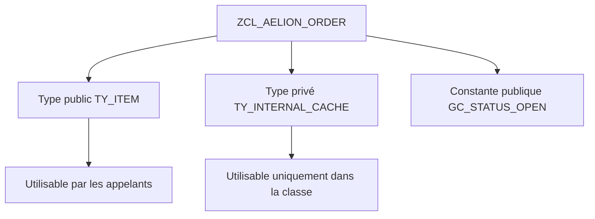

# 🌸 TYPES ET CONSTANTES DE CLASSE

## 🌺 OBJECTIFS

- [ ] Créer un type interne dans `SE24`.
- [ ] Choisir une visibilité publique, protégée ou privée.
- [ ] Déclarer une constante de classe.
- [ ] Utiliser un type public depuis un programme.

## 🌺 DÉFINITION

Les types internes décrivent des structures de données propres à la responsabilité de la classe. Les constantes représentent des valeurs immuables.

## 🌺 VUE D'ENSEMBLE



## 🌺 CRÉATION DANS SE24

Dans l’onglet **Types**, créer :

- `TY_ITEM`, type structuré public ;
- `TT_ITEM`, type table public basé sur `TY_ITEM` ;
- `TY_INTERNAL_CACHE`, type privé.

Dans l’onglet **Attributs**, créer une constante publique `GC_STATUS_OPEN` de type `CHAR1`, valeur `O`.

> [!NOTE]
> Selon la version du Class Builder, les types structurés complexes peuvent être maintenus dans l’éditeur source de la section correspondante. La classe reste globale et créée dans `SE24`.

## 🌺 UTILISATION D’UN TYPE PUBLIC

```abap
DATA ls_item TYPE zcl_aelion_order=>ty_item.
DATA lt_item TYPE zcl_aelion_order=>tt_item.

ls_item-product_id = 'P100'.
APPEND ls_item TO lt_item.
```

Utilisation d’une constante :

```abap
IF lv_status = zcl_aelion_order=>gc_status_open.
  " Traitement
ENDIF.
```

## 🌺 CHOIX DE VISIBILITÉ

- public : le type fait partie du contrat de la classe ;
- protected : le type sert à la classe et à ses sous-classes ;
- private : le type est un détail d’implémentation.

## 🌺 EXERCICE

Créer dans `ZCL_AELION_ORDER` un type public de ligne de commande, un type table public et deux constantes de statut.

<details>
<summary>Afficher la correction et les points de contrôle</summary>

- [ ] Les types publics sont accessibles avec =>.
- [ ] Le type privé n’est pas utilisable dans le report.
- [ ] Les constantes ont une valeur fixe.
- [ ] Les noms expriment clairement leur usage.

</details>

## 🌺 RÉSUMÉ

> - Les types de classe structurent les données propres à un service.
> - La visibilité détermine si le type appartient au contrat public.
> - Les constantes sont des composants statiques immuables.
> - Les composants publics s’utilisent avec `=>`.

## 🌺 SOURCES OFFICIELLES

- [Documentation SAP — Classes](https://help.sap.com/doc/abapdocu_cp_index_htm/CLOUD/en-US/ABENCLASSES.html)
