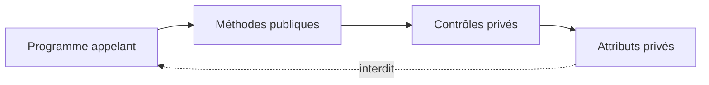

# 🌸 ENCAPSULATION

## 🌺 OBJECTIFS

- [ ] Protéger l’état interne d’une classe globale.
- [ ] Concevoir une interface publique minimale.
- [ ] Centraliser les contrôles dans les méthodes.
- [ ] Éviter les dépendances directes aux attributs.

## 🌺 DÉFINITION

L’encapsulation consiste à masquer les détails internes et à exposer uniquement les opérations nécessaires. Elle repose principalement sur les visibilités de `SE24`.

## 🌺 VUE D'ENSEMBLE



> [!IMPORTANT]
> Un getter et un setter automatiques ne constituent pas toujours une bonne encapsulation. La méthode publique doit exprimer une intention métier et faire respecter les règles associées.

## 🌺 EXEMPLE

Pour `ZCL_AELION_ACCOUNT`, éviter une méthode générique `SET_BALANCE`. Exposer plutôt :

- `DEPOSIT` ;
- `WITHDRAW` ;
- `GET_BALANCE`.

```abap
METHOD withdraw.
  validate_amount( iv_amount ).

  IF iv_amount > mv_balance.
    RAISE EXCEPTION TYPE zcx_aelion_insufficient_funds.
  ENDIF.

  mv_balance = mv_balance - iv_amount.
ENDMETHOD.
```

La méthode privée `VALIDATE_AMOUNT` centralise la validation commune.

## 🌺 BÉNÉFICES

- état toujours cohérent ;
- règles regroupées à un seul endroit ;
- appelants moins dépendants de l’implémentation ;
- tests plus ciblés ;
- évolutions internes moins risquées.

## 🌺 ANTI-PATTERNS

- attributs publics modifiables ;
- classe ne contenant que des getters et setters sans règle ;
- méthode publique exposant une structure interne instable ;
- duplication des contrôles dans chaque appelant.

## 🌺 EXERCICE

Concevoir `ZCL_AELION_STOCK` avec une quantité privée et des méthodes publiques `ADD_STOCK`, `REMOVE_STOCK` et `GET_QUANTITY`.

<details>
<summary>Afficher la correction et les points de contrôle</summary>

- [ ] Aucun appelant ne modifie directement la quantité.
- [ ] REMOVE_STOCK refuse un résultat négatif.
- [ ] Les contrôles communs sont privés.
- [ ] Les méthodes publiques expriment une intention métier.

</details>

## 🌺 RÉSUMÉ

> - L’état interne doit être protégé.
> - L’interface publique décrit ce que la classe permet de faire.
> - Les règles métier appartiennent à la classe responsable.
> - Une bonne encapsulation réduit le couplage.

## 🌺 SOURCES OFFICIELLES

- [Documentation SAP — Visibility](https://help.sap.com/doc/abapdocu_cp_index_htm/CLOUD/en-US/ABENCLASS_VISIBILITY.html)
- [Documentation SAP — Classes](https://help.sap.com/doc/abapdocu_cp_index_htm/CLOUD/en-US/ABENCLASSES.html)
